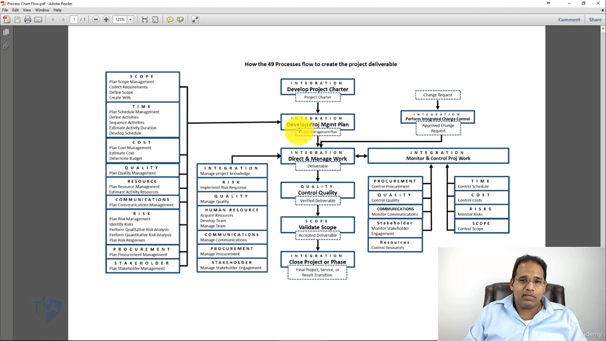

[00:02:05](https://www.udemy.com/course/pmp-certification-exam-prep-course-pmbok-6th-edition/learn/lecture/13041388#overview)

# 專案管理特別報告：49 個流程如何協同運作？

本報告旨在拆解專案管理中的流程如何有機地流動，並最終創造出專案的終極產物——**最終的产品、服务或结果**（可交付成果）。

## 📌 一、 核心骨架：整合管理（Integration Management）

整合管理是專案管理的靈魂，它負責將所有分散的知識領域組合在一起，是一切流程的「黏著劑」。

1. **制定項目章程（Develop Project Charter）**
    
    - **核心輸出**：專案章程（Charter）。
        
    - **作用**：這是專案的「授權書」，沒有它專案就無法正式啟動。
        
2. **制定項目管理計畫（Develop Project Management Plan）**
    
    - **輸入來源**：專案章程會進入此流程。
        
    - **重要邏輯**：要完成這份最終的「專案管理計畫」，你**必須先完成規劃過程組中的所有其他子流程**。
        

## 🛠️ 二、 龐大的基石：規劃過程組（Planning Processes）

所有的規劃流程最終都會聚集成流，匯入「制定專案管理計畫」中，這些子流程包括：

- **範圍管理**：規劃範圍管理、收集需求、定義範圍、創建 WBS。
    
- **進度管理**：規劃進度管理、定義活動、活動排序、制定進度計劃。
    
- **成本與資源管理**：規劃成本管理、估算活動資源、計畫資源需求。
    
- **溝通與風險管理**：規劃溝通管理、識別風險、執行定性與定量風險分析、規劃風險應對。
    
- **採購與利益相關者**：規劃採購管理、規劃利益相關者參與。
    

> **💡 結論**：所有這些規劃過程結合起來，完成了「整合」過程，並產生了最終的 **專案管理計畫**。該計畫是後續所有執行工作的依據。

## 🔄 三、 雙軌並行：執行與監控的平行宇宙

在專案實際推動時，執行（Execution）**與**監控（Monitoring & Controlling）是雙軌並行、同時發生的：

### 1. 指導與管理項目工作（Direct and Manage Project Work）

- 這是執行階段的「整合流程」，是所有執行工作的總結。
    
- 在這個流程中，你同時在：管理專案知識、實施風險應對、管理質量、獲取並發展團隊資源、開展溝通、進行採購、管理利益相關者參與。
    

### 2. 監控項目工作（Monitor and Control Project Work）

- 這是監控階段的「整合流程」，總結了所有的監控子流程。
    
- 當你在「指導與管理專案工作」時，你**同時**必須「監控項目工作」。
    
- **核心任務**：對照「計畫」與「實際工作」。如果實際與計畫對齊，專案就成功了。
    
- **監控範疇**：控制採購、控制質量、監控溝通、監控利益相關者參與、控制資源、控制進度、控制成本、控制風險、控制範圍。
    

## 📦 四、 可交付成果（Deliverables）的生命流轉旅程

流程最終是如何變成產品的？請跟隨以下金三角路徑：

```
 [指導與管理專案工作] ──(輸出)──> 產出：可交付成果 (Deliverable)
                                         │
                                       (輸入)
                                         ▼
 [控制質量流程 (QC)]  ──(檢查)──> 產出：已驗證的交付項 (Verified Deliverables)
                                         │
                                       (輸入)
                                         ▼
 [確認範圍流程 (Validate Scope)] ──> 利益相關者/客戶正式驗收 ──> 產出：可接受的交付項 (Accepted Deliverables)
                                                                         │
                                                                       (輸入)
                                                                         ▼
                                                             [結束項目或階段 (Close Project)]
```

1. **第一步：誕生**
    
    - 在「指導與管理專案工作」的最後，其核心輸出就是 **可交付成果（Deliverables）**。
        
2. **第二步：內部質檢**
    
    - 可交付成果被輸入到 **控制質量（Control Quality）** 流程中，由團隊內部檢查它是否滿足質量要求。
        
    - 通過檢查後，它會轉變為 **已驗證的交付項（Verified Deliverables）**。
        
3. **第三步：外部驗收**
    
    - 已驗證的交付項被輸入到 **確認範圍（Validate Scope）** 流程中。
        
    - 此時，主要利益相關者或客戶（如發起人）會前來進行正式檢查與驗收。
        
    - 驗收通過後，它就變成了 **可接受的可交付成果（Accepted Deliverables）**。
        
4. **第四步：正式收尾**
    
    - 可接受的可交付成果進入最後一個流程：**結束項目或階段（Close Project or Phase）**。
        
    - 在這裡，你將最終的產品、服務或結果正式移交給客戶，編寫最終專案報告，資源釋放，專案圓滿完成。
        

## 🏠 實戰演練：用 49 個步驟「粉刷房間」的極簡專案

為了更好理解這套理論，以下將 49 個流程套用在一個簡單的日常專案中：

### 1. 啟動與授權階段（Initiation）

- **情境**：老婆要求我粉刷房間。
    
- **執行流程**：我去找她要授權。她雖然生氣，但還是為我簽署了專案的 **專案章程（Charter）**。有了這個章程，專案正式合法啟動。
    

### 2. 計畫擬定階段（Planning）

我開始閉門擬定我的 **專案管理計畫**：

- **收集需求與範圍**：確認她想要什麼顏色。
    
- **進度與成本估算**：預計需要 1 天時間，預算 1,000 元。
    
- **質量規劃**：為了避免牆面顏色深淺不一，我決定先上一層底漆（Primer），再刷面漆。
    
- **資源管理**：盤點需要多少油漆、膠帶、塑料防水布，是否需要雇人。
    
- **溝通計畫**：跟孩子和狗談話，警告他們在粉刷時不要進來弄亂牆壁。
    
- **風險管理**：
    
    - _識別風險_：調皮的狗可能會打翻油漆，或者油漆會滴到地毯上。
        
    - _定性定量評估_：油漆掉在地毯上是最高風險，可能要花費換地毯的代價（價值評估）。
        
    - _風險應對措施_：買塑料防水布（TARP）鋪滿整個房間的地板。
        
- **採購管理**：決定去離家最近、質量更好的供應商 A（家得寶）購買美國油漆。
    
- **利益相關者參與**：計畫在粉刷到一半時，主動邀請老婆來看並獲取反饋。
    

### 3. 執行與監控階段（Execution & Control）

一天早上我醒來，砰的一聲，專案開工！這時「指導管理工作」與「監控工作」同時開展：

- **管理專案知識**：我在粉刷中學到了新技巧（例如：必須用塑料防水布，如果用布質防水布，油漆還是會滲透過去），並記錄在我的經驗教訓登記冊（Lessons Learned Register）中。
    
- **實施風險應對**：不小心在地毯邊緣滴了一點漆，因為是水彩漆，我立刻實施應對措施：拿水把它洗乾淨。
    
- **管理溝通與利益相關者參與**：我一邊粉刷，一邊和進來看熱鬧的狗與小孩溝通。粉刷完一面牆後，我打電話給老婆：「妳看這個顏色會不會太深？」確保她充分參與並及時給予反饋。
    
- **控制進度與成本**：時時注意時間，確保能在 1 天內搞定；記下買材料的每一筆花費，不超支。
    
- **控制資源與採購**：確保供應商賣給我的是正確的顏色和型號，檢查油漆合同是否履行。
    

### 4. 質量控制與驗收階段（QC & Validation）

- **控制質量（內部檢查）**：油漆粉刷完畢後，我拿起防水布，環顧四週進行仔細檢查。看看有沒有漏掉的斑點？電燈開關有沒有被弄髒？確認這是一份高質量的成品。這時，房間變成了**已驗證的交付項**。
    
- **確認範圍（外部驗收）**：我把老婆、孩子和狗叫進房間。大家環顧四週，老婆點頭承認我做得很好，這顏色很棒！至此，房間變成了**可接受的可交付成果**。
    

### 5. 專案收尾（Closure）

- **結束專案或階段**：那天下午很晚了，我把房間鑰匙正式交還給老婆：「寶貝，這房間完全是妳的了。」
    
- **經驗總結**：我坐下來，喝著冰啤酒，在心裡默默寫下 **最終報告** 成果：思考這次做對了什麼、做錯了什麼、下次粉刷可以怎麼改善。
    

專案正式關閉。這就是粉刷房間的 49 道工序！