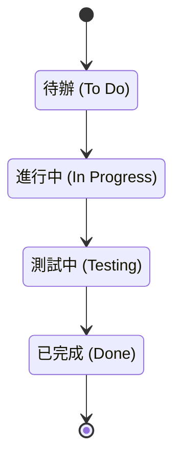

## Agile 專案工具選擇

- 優先選擇低成本或無成本的工具
    - 應盡量避免需要支付授權費用（licensing cost）的軟體
- 提倡「低科技、高接觸」（Low-tech, high-touch）優於複雜的電腦模型
    - **使用電腦模型可能產生的問題：**
        - 數據準確度的感知度增加（導致錯誤的精準感）
        - 缺乏利害關係人（stakeholder）的互動，導致只有少數幾個人在更新模型

### 低科技、高接觸 (Low-tech, high-touch)

- 這是 Agile 專案中的核心主題
- **推薦使用的工具：**
    - 白板（Whiteboard）
    - 便利貼（Sticky notes）
    - 紙張（Paper）
- **[為什麼選擇這些？]** 因為它們成本極低，且比起昂貴、複雜的專案管理軟體，更能有效實踐 Agile 的精神

### 使用電腦工具與模型的潛在問題

- **高昂的成本結構**
    - 複雜的專案管理軟體通常需要支付「每位使用者授權費」（per user license），這會大幅增加支出
    - 相較之下，白板只需幾百美元且能長期使用，麥克筆也只需幾美元，成本極低
- **數據準確度的感知偏差 (Perception of Data Accuracy)**
    - 當使用電腦模型（例如使用 Microsoft Project 建立進度表）時，人們會產生一種錯覺
    - 這種錯覺認為：因為數據是透過軟體輸入並以模型化方式呈現，所以數據本身就是精確且正確的
    - **[風險]** 這種對精準度的過度信任可能掩蓋了實際數據可能存在的誤差

### 使用電腦模型的風險：數據品質問題

- **「垃圾進，垃圾出」(Garbage In, Garbage Out) 原則**
    - 無論電腦模型多麼精密，如果輸入的數據是錯誤或不完整的，產出的進度表或預算也必然是錯誤的
    - **[風險]** 這種現象會導致人們對模型產生錯誤的信任
- **對模型的盲目信任**
    - 當團隊開始使用「財務模型」或「排程模型」時，人們往往會直覺地認為這些結果是正確且可靠的
    - 實際上，模型本身並不保證正確性，它只是處理數據的工具

### 使用電腦模型的缺點：缺乏互動

- **缺乏團隊互動 (No Interaction)**
    - 使用電腦工具（如在筆電上操作 Microsoft Project）時，使用者會將注意力集中在螢幕與數據輸入上
    - **[結果]** 使用者的頭部向下看著螢幕，而非看向團隊成員，導致與他人失去交流
    - 這直接違背了 Agile 的核心原則，因為 Agile 強調團隊間的持續互動與溝通

### 低科技、高接觸工具的實務應用

- **推薦使用的媒介：**
    - 卡片（Cards）
    - 圖表（Charts）
    - 白板（Whiteboards）
    - 牆面（Walls）
- **核心效益：**
    - 促進團隊間的溝通與協作（Promotes communication and collaboration）
- **工具轉換建議：**
    - **[不要使用]** 電腦上的甘特圖（Gantt chart，常見於 Microsoft Project）
        - **[原因]** 使用電腦時，人的注意力會集中在螢幕上（頭向下看），導致無法與團隊成員進行即時互動
    - **[改用]** 看板（Kanban board）
        - **[方式]** 使用實體的便利貼（Sticky notes）放在看板上，確保團隊成員能保持視覺上的連結與互動

### 看板與任務板 (Kanban/Task Board)

- **資訊輻射器 (Information Radiator)**
    - 確保資訊能夠高效地擴散到整個團隊
    - 可以直接畫在白板上，甚至直接利用牆面空間
- **核心功能：**
    - 使迭代待辦清單 (Iteration backlog) 視覺化，讓所有人一目了然
    - 作為每日站立會議 (Daily meeting) 的視覺焦點

### Kanban/Task Board

- **資訊輻射器 (Information Radiator)**
    - 確保資訊能高效地傳播與擴散
    - 讓團隊成員即使不主動詢問，也能隨時掌握專案現況
- **實作方式**
    - 可以繪製在白板上，甚至是整面牆上
    - 形式可以包含：玻璃牆、從天花板到地板的白板牆、或白板壁紙
- **核心功能與優勢**
    - **提高能見度**：讓迭代待辦清單 (Iteration Backlog) 與衝刺待辦清單 (Sprint Backlog) 變得清晰可見
    - **每日會議的焦點**：作為每日站立會議 (Daily Meeting) 的核心討論點

### 看板/任務板 (Kanban/Task Board)

- **作為「資訊輻射器」(Information Radiator)**
    - 確保資訊能夠高效地擴散與傳播
    - 讓團隊成員即便不主動去查閱，也能隨時察覺專案現況
- **提升視覺能見度 (Visibility)**
    - **[實作方式]** 可以繪製在白板上，甚至是整面牆壁（如玻璃牆或白板牆）
    - **[效益]** 讓迭代待辦清單（Iteration Backlog）與衝刺待辦清單（Sprint Backlog）變得極其直觀
    - **[對比電腦軟體]**
        - 軟體資訊往往是「眼不見，心不念」(Out of sight, out of mind)，因為數據隱藏在螢幕後方
        - 實體牆面則能讓成員只要抬頭就能立刻看到當前的任務
- **作為會議的核心焦點 (Focal Point)**
    - 在進行每日站立會議（Daily Meeting）時，看板提供了一個共同的討論中心，方便所有人圍繞著任務進行溝通