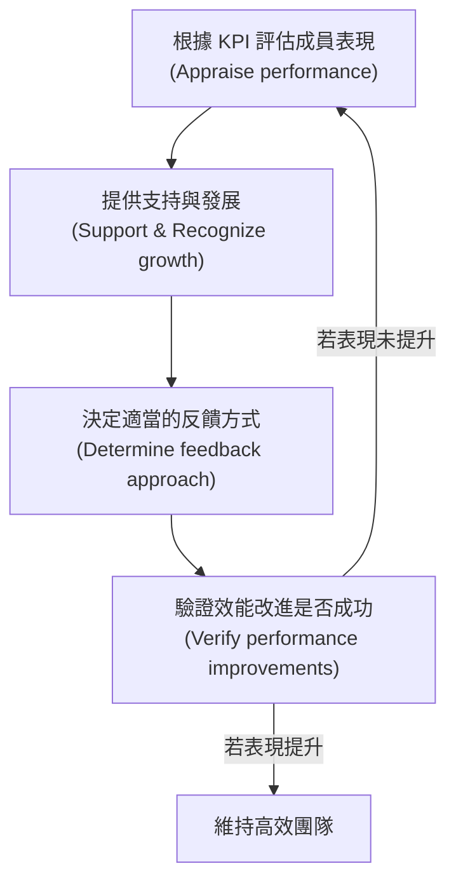

## Domain 1: People

### Task 3: Support team performance

- **仆人式領導 (Servant Leadership) 的核心原則**
    - 領導者的職責在於協助團隊完成工作
    - 移除障礙與阻礙 (Remove obstacles and impediments)
    - 提供必要的工具與空間，讓團隊能取得成功
- **管理目標**
    - 確保團隊表現達到預期水準
    - 確保專案工作能及時完成
    - 確保產出能滿足老闆、贊助商或客戶的需求
- **評估團隊成員表現**
    - 必須根據關鍵績效指標 (KPIs) 來評估團隊成員的表現

### 評估團隊成員表現的後續行動

- **支持並認可團隊成員的成長與發展**
    - 當成員遇到問題時，應採取以下對策：
        - 不知道如何執行某項任務 $\rightarrow$ 提供**培訓 (Training)**
        - 不理解某個概念 $\rightarrow$ 提供**教練指導 (Coaching)**
        - 不會使用工具 $\rightarrow$ 確保其接受正確的**培訓**
    - **[重要性]** 若成員因缺乏技能而卡住，會直接導致團隊的**開發速率 (Velocity)** 下降
    - 在敏捷專案中，團隊成員應具備主動向彼此尋求幫助的意願
- **確定適當的反饋方式與方法**

### 驗證效能改進 (Verify performance improvements)

- **[目的]** 在提供工具、培訓或教練指導後，必須確認這些行動是否真的有效
- **執行流程**：
    - 觀察並回顧 KPI 指標
    - 確認團隊表現是否如預期提升
    - **[若無改善]** 若表現未見好轉，則需要採取進一步行動來確保效能提升

---

### 任務 3 總結：支持團隊表現 (Task 3: Support team performance)

為了有效支持團隊，領導者應遵循以下循環：

- **核心目標**：透過評估、支持、指導與驗證，確保團隊擁有正確的工具、培訓、空間與環境，以維持並提升開發速率與產出品質。