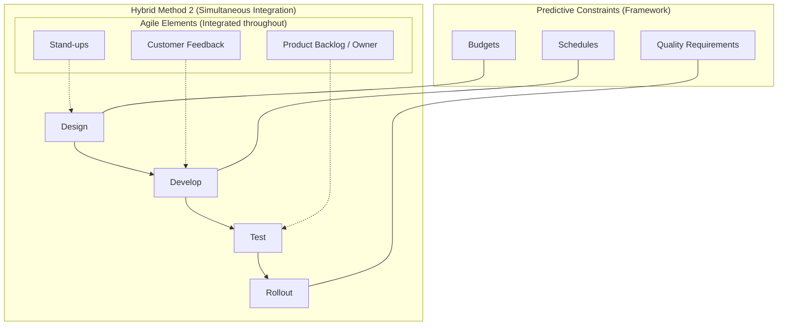

### Hybrid Method 2

- 同時使用敏捷與預測型方法（Combined Agile and Predictive Approach Used Simultaneously）
    - 這並非指一個團隊使用敏捷，另一個團隊使用預測型
    - 而是指同一個團隊在專案的不同階段中，同時融合了這兩種方法
    - 這通常發生在團隊正從傳統方法（Predictive）轉型至敏捷方法（Agile）的過程中

### Hybrid Method 2 的實際運作範例

- 在傳統預測型專案中融入敏捷實務（Incorporating Agile practices into a traditional predictive project）
    - **保留預測型的結構框架**：
        - 遵循傳統的階段流程：設計 (Design) $\rightarrow$ 開發 (Develop) $\rightarrow$ 測試 (Test) $\rightarrow$ 部署 (Rollout)
        - 維持預測型的管控要素：預算 (Budgets)、時程 (Schedules)、品質要求 (Quality requirements)
    - **融入敏捷的實務工具與溝通方式**：
        - 使用每日站立會議 (Stand-up meetings)
        - 更加頻繁地獲取客戶回饋 (Customer feedback)
        - 使用產品待辦清單 (Product Backlog) 與產品負責人 (Product Owner)

### Hybrid Method 2 的核心本質

- **流程組件的結合 (Combining Components)**
    - 將敏捷專案的流程 (Agile processes) 與預測型的流程 (Predictive processes) 結合在一起使用
- **常見的使用場景**
    - **轉型期 (Transition)**：這是最常見的情況，用於幫助組織從傳統模式逐步過渡到敏捷模式
    - **持續應用**：並非只能用於轉型，如果團隊發現這種混合模式能有效提升效能，也可以在任何專案階段持續使用

### 混合模式的實務應用範例

- **優化溝通效率**
    - 傳統專案常面臨過多且冗長的會議（例如每隔兩天就要開 3 到 4 小時的會議，或一週花費 8 小時在會議上）
    - **[解決方案]**：可以適度引入敏捷的「每日站立會議 (Daily Stand-up Meeting)」
        - 僅需 15 分鐘即可完成
        - 有助於減少不必要的會議時間，提升團隊在專案執行時的效率

### 更多混合模式的實務應用

- **引入敏捷實務與工具**
    - **使用資訊輻射器 (Information Radiators)**
        - 在傳統專案中使用視覺化工具來傳遞資訊
    - **結合看板 (Kanban) 與預測型方法**
        - 不需要完全遵守看板的所有規則（例如不一定要限制「在製品 (WIP limit)」）
        - 可以將看板用於劃分專案階段 (Phases)，利用其視覺化特性提升透明度
- **領導風格的轉變**
    - **引入僕人式領導 (Servant Leadership)**
        - 將敏捷中的領導概念推入預測型專案中
- **[核心目的]**
    - 透過將這些敏捷實務「推入」預測型模式，讓團隊在日常工作中能享受到敏捷方法所帶來的價值，而不需要完全改變專案的基礎結構
- **獲取敏捷的優點而不必完全放棄預測型模式**
    - 如果目前的預測型方法運作良好且能持續交付價值，不需要強行轉型
    - **[核心策略]**：在遵循預測型流程的同時，觀察並引入敏捷的優點，讓專案更具彈性
- **打破對敏捷的誤解**
    - 許多傳統專案經理常將敏捷視為「混亂 (Chaotic)」或「缺乏結構」
    - **事實證明**：許多大型軟體巨頭（如 Spotify、Facebook）都在運用敏捷方法來驅動開發

### 採取「擷取優點」的混合策略

- **不要排斥敏捷 (Don't be resistant to Agile)**
    - 許多價值數千億美元的大型科技公司都在使用敏捷方法，這證明了其帶來的實質效益。
    - 目標不是為了轉型而轉型，而是為了獲得敏捷所帶來的價值。
- **實踐方法：挑選適合的部分**
    - 如果現有的預測型流程運作良好，可以繼續保留。
    - 從敏捷方法中識別出能為專案帶來價值的特定實務，並將其整合至現有的預測型框架中。
    - **可以嘗試引入的敏捷元素範例**：
        - **會議方式**：改用更有效率的敏捷會議模式。
        - **敏捷空間 (Agile Spaces)**：創造能促進「滲透式溝通 (Osmotic Communication)」的環境，讓成員能隨時聽取資訊並解決問題。

### 實踐 Hybrid Method 2 的溝通策略

- **逐步導入的溝通方式**
    - 在遵循預測型階段的同時，向團隊提議引入新學到的敏捷實務。
    - **[溝通腳本範例]**：
        - 「我知道我們目前正遵循這些預測型階段，但我們能不能開始嘗試加入一些敏捷的實務做法？」
        - 「例如，我們可以試著實施每日站立會議，看看大家覺得如何？」
- **具體的實務轉換建議**
    - **會議模式**：
        - 引入**每日站立會議 (Daily Stand-up Meeting)**。
        - **[執行細節]**：確保大家真的「站著」開會，以避免會議時間過長。
    - **回饋機制**：
        - 增加**客戶回饋 (Customer Feedback)** 的頻率。
    - **文件與範疇管理**：
        - **[轉型思路]**：思考是否能用**產品待辦清單 (Product Backlog)** 來取代那種「一旦定案就無法更改」的沉重型**範疇說明書 (Scope Statement)**。
- **核心概念總結**
    - 這就是 **Hybrid Method 2** 的精髓：專案整體架構仍維持預測型 (Predictive)，但內部運作已融入了敏捷實務 (Agile practices)。