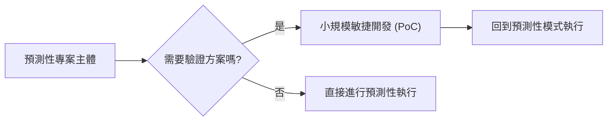

## 混合開發方法 (Hybrid Methods)

### 混合方法三 (Hybrid Method 3)

- 以**預測性（Predictive）**方法為主，並結合部分**敏捷（Agile）**開發
- **開發順序的靈活性**：
    - 可以是「預測性 $\rightarrow$ 敏捷"
    - 也可以是「敏捷 $\rightarrow$ 預測性"
    - **[關鍵點]**：應根據不同專案階段（Phases）所需的特性來決定組合方式

### 混合方法二 vs. 混合方法三

- **混合方法二 (Hybrid Method 2)**：同時運行兩種模式
    - 在預測性的開發生命週期中，於所有階段融入敏捷實踐
    - **[目的]**：結合兩者的優點
        - 例如：在敏捷開發的靈活性中，引入預測性方法的成本控制或進度控制能力
- **混合方法三 (Hybrid Method 3)**：以預測性為主導
    - 主要是預測性方法，僅在特定部分結合敏捷開發
    - 結構呈現如下：

### 混合方法三的特性

- **極小規模的敏捷應用**：
    - 這並非指整個開發階段（Phase）改用敏捷
    - 而是指在整個專案中，僅針對極小的一部分（tiny part）使用敏捷開發
- **實例說明**：
    - 假設一個組織擁有多棟建築需要更換屋頂
    - 在決定使用哪種屋頂材料之前，可以先進行一小段敏捷開發（Agile section）來進行測試或研究

### 混合方法三的實例：屋頂材料測試

- **敏捷部分的運作方式**：
    - 在專案的特定小部分採用敏捷開發，進行材料測試
    - 透過**迭代（iterations）**來試驗不同的材料
    - 運用敏捷工具，例如：
        - 收集需求（requirements）
        - 維護產品待辦清單（product backlog）
    - 例如：先在地面上安裝一小塊屋頂進行測試，確保效果符合預期
- **後續階段的轉變**：
    - 一旦測試完成並確認材料可行，整個專案就會轉回**預測性（predictive）**模式進行大規模安裝
    - **[關鍵洞察]**：像設施維護或建築工程這類專案，其核心執行過程通常並不符合敏捷開發的特性，因此僅在需要探索不確定性的階段使用敏捷。

### 預測性專案與敏捷開發的衝突

- 許多建築工程類專案並不符合敏捷開發的特性
    - **[原因]**：物理施工具有高度的不可逆性與限制
    - **[實例]**：在蓋屋頂時，無法在完成一半後因為不喜歡顏色或材質，就突然要求將瀝青改為瓦片
- **[解決策略]**：將敏捷僅應用於「決定方案」的極小部分
    - 在進入大規模、不可逆的預測性施工之前，先利用敏捷開發來測試與決定最終要使用的材料或設計方案

### 混合方法三的適用場景與價值

- **核心應用邏輯**：
    - 專案本質上仍是一個預測性專案
    - **[何時使用]**：當你認為專案中的某個部分可以透過「概念驗證」（Proof of Concept, PoC）來進行時
    - 透過在該特定部分引入敏捷開發，可以有效降低風險並驗證可行性

