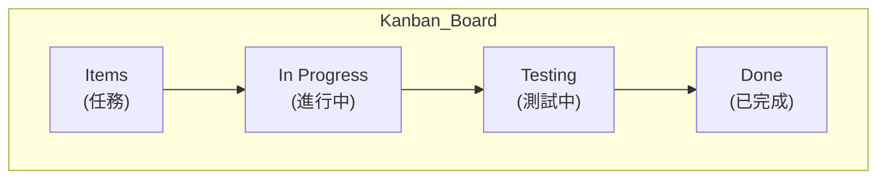
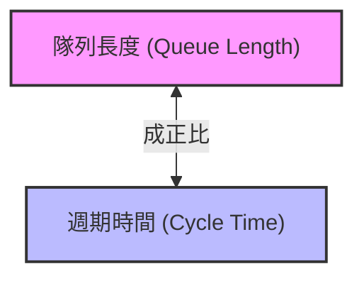

## Kanban 開發

- **定義與起源**
    - 「Kanban」是一個日文單字，意思是「看板（signboard）」
    - 這種開發模式源自於 Toyota 的精實生產系統（Lean Production System）
- **基本概念**
    - 本質上是一個視覺化的看板，通常使用便利貼（sticky notes）來代表任務
    - 透過看板上的卡片數量來直觀掌握各個階段的工作量

### Kanban 在敏捷開發中的應用

- **視覺化工作 (Visualize the work)**
    - 在敏捷專案中使用看板，最主要的原因是幫助團隊將工作內容視覺化
- **限制在製品 (Limit Work In Progress, WIP)**
    - 這是 Kanban 的核心概念之一
    - 透過限制每個階段正在進行的任務數量，來優化工作流
- **資訊輻射器 (Information Radiators)**
    - 這是一個關鍵術語，指那些能「輻射」資訊的圖表或看板
    - 當你走進一個房間，這些視覺化的圖表能讓你一眼就掌握目前的資訊狀態

### 限制在製品 (WIP) 的實作範例

- 透過在看板欄位下方標註數字，來實踐限制 WIP 的概念
- **範例解析**：
    - **In Progress (進行中)**：
        - 設定限制為 `6 cards`
        - 目前欄位中有 4 張卡片，符合規範（未超過 6 張）
    - **Testing (測試中)**：
        - 設定限制為 `4 cards`
        - 目前欄位中有 3 張卡片，符合規範（未超過 4 張）
- **目的**：確保團隊同時處理的任務數量維持在可控範圍內，避免過度負載。

### Kanban 的五大核心原則

- **Visualize the workflow (視覺化工作流程)**
    - 因為軟體專案本質上是在處理無形且不可見的「知識」，所以必須透過視覺化來呈現工作進度。
- **Limit WIP (限制在製品)**
    - **[目的]** 藉由保持低水平的在製品數量，可以增加問題與瓶頸（bottlenecks）的能見度。
- **Manage flow (管理工作流)**
    - 透過追蹤工作在系統中的流動情況，可以識別出問題，並衡量各種變動對成效的影響。
- **Make process policies explicit (明確化流程政策)**
    - 清楚說明工作是如何進行的，這對於團隊能針對如何改進進行開放式討論至關重要。
- **Improve collaboration (改善協作)**
    - 團隊應透過科學性的測量與實驗，共同擁有並持續改進所使用的流程。

### Kanban 的五大核心原則（續）

- **Limit WIP (限制在製品)**
    - **[目的]** 保持低水平的在製品數量，可以增加問題與瓶頸（bottlenecks）的能見度
    - **[風險]** 若將過多工作放入流程隊列（process queue），會導致團隊注意力分散，最終可能導致「什麼都沒在完成」
    - **[實作]** 團隊應共同決定適合自己的 WIP 限制值
- **Manage flow (管理工作流)**
    - 透過追蹤工作在系統中的流動情況，可以識別出問題
    - 藉此衡量各項變動對於流程成效的實際影響

### Kanban 的流程細節與拉動系統

- **工作流的靈活性**
    - 看板欄位的設計不一定要像範例那樣簡單（例如只有四個欄位）
    - 可以根據專案需求增加更多細分的欄位，例如：
        - 設計 (Design)
        - 編碼 (Coding)
        - 壓力測試 (Stress testing)
        - 程式碼測試 (Code testing)
        - 靜態測試 (Static testing)
        - 動態測試 (Dynamic testing)
- **拉動系統 (Pull System)**
    - 這是 Kanban 的另一個關鍵術語
    - 當任務完成並釋出空間時，工作會被「拉動」進入下一個階段，而非被強行「推入」
- **明確化流程政策 (Make process policies explicit)**
    - 這是五大原則之一
    - **[重要性]** 清楚說明工作是如何進行的，這對於團隊能針對如何改進進行開放式討論至關重要
- **Make process policies explicit (明確化流程政策)**
    - **[目的]** 清楚說明工作是如何進行的
    - **[效益]** 這能讓團隊針對如何改進流程，進行更有品質的開放式討論
- **Improve collaboration (改善協作)**
    - 透過科學性的測量與實驗，讓團隊共同擁有並持續改進所使用的流程
    - **[作法]** 利用各種衡量指標與實驗來找出問題或優化方法

### Kanban 的核心特性：拉動系統 (Pull System)

- Kanban 被稱為一種「拉動系統 (Pull System)」
- 這是其核心概念之一，工作是隨著需求被「拉動」進行，而非被強行推入流程
- **[重點]** 資料 (Data) 是被拉動的對象

### 拉動系統 (Pull System) vs. 推動系統 (Push System)

- **拉動系統 (Pull System)**
    - 根據當前階段的「可用空間」來決定是否進行下一步。
    - **範例解析**（基於 WIP 限制）：
        - **In Progress**：限制為 `6 cards`，目前已有 6 張，因此無法再拉入新任務。
        - **Testing**：限制為 `4 cards`，目前已有 3 張，因此還可以從前一階段「拉入」1 個項目。
    - **特性**：只有當後續階段有空位時，工作才會從前一階段被「拉」過來。
- **推動系統 (Push System)**
    - **[定義]** 無論下一個階段是否準備好，只要前一階段完成就直接將工作「推」過去。
    - **[範例]** 我完成了編碼 (Coding)，不顧測試 (Testing) 階段目前的負載，直接把任務丟給測試人員。
    - **[缺點]** 推動系統通常是不理想的，因為它會忽略流程中的瓶頸與容量限制，導致工作堆積。

### 推動系統 (Push System) 的風險

- **[核心問題]** 無論後續階段是否準備好，只要前一階段完成就直接將工作「推」給下一個人
- **[瓶頸的產生]**
    - 因為工作是「被推」過去的，而非根據後續階段的容量來「拉取」，會導致任務在某個階段無止盡地堆積
    - **範例情境**：
        - 假設開發人員完成編碼 (Coding) 後，不顧測試人員的負荷，直接將任務推給對方
        - 若測試階段（例如靜態測試/程式碼測試）所需的時間比編碼長，工作就會在測試階段開始堆積
        - 這會形成一個**瓶頸 (bottleneck)**，導致整個流程停滯

### 推動系統 (Push System) 的後續影響

- **[產生的浪費]** 當前一階段不斷地將工作「推」給後續階段，但後續階段卻無法跟上進度時，會產生「等待 (Waiting)」的情況
    - 在精實生產 (Lean) 的概念中，「等待」被視為一種**浪費 (Waste)**
- **[拉動系統 (Pull System) 的優勢]**
    - 工作是根據各個階段的「準備就緒程度」來流動的
    - 流程如下：

        1. 當你準備好時，你會從我這裡「拉取」工作
        2. 當下一個人準備好時，他們會從你這裡「拉取」工作

    - **[核心差異]** 透過這種方式，工作是循序漸進地被「拉」過整個系統，而不是被強行「推」過。

### Little's Law (利特爾法則)

- **核心定義**
    - 週期時間 (Cycle Times) 與隊列長度 (Queue Lengths) 成正比
- **[實務應用]**
    - 透過觀察隊列（正在等待或處理中的工作量）的大小，我們可以預測任務何時能完成
- **概念圖解**

### Little's Law 圖表解析

透過圖表可以視覺化地觀察工作量在不同狀態間的轉換：

- **顏色區域的定義**
    - **紅色區域**：代表尚未開始的工作量（例如專案初期待辦的 400 個功能）。
    - **黃色區域**：代表正在進行中 (In Progress / WIP) 的工作量。
    - **綠色區域**：代表已經完成的工作量。
- **工作流的動態變化**
    - 隨著時間推移，紅色區域（待辦工作）會進入黃色區域（In Progress / WIP）。
    - 接著，黃色區域的工作完成後，會進一步轉化為綠色區域（已完成）。
    - **[核心觀察]** 透過觀察這些區域隨時間的消長，可以直觀地看出專案的進度以及工作流的流動效率。

### Kanban 工作量流動視覺化

- 透過圖表可以觀察到工作量在不同狀態間的轉換過程
- **[狀態轉換]**：隨著時間推移，未完成的工作（紅區）會不斷「推入」進行中狀態，最終轉化為已完成的工作（綠區）
    - **紅區 (Red Area)**：代表尚未開始或待處理的工作量
    - **黃區 (Yellow Area)**：代表正在進行中的工作 (WIP)
    - **綠區 (Green Area)**：代表已完成的工作
- **[動態過程]**：隨著專案進行，紅區的面積會逐漸減少，並轉化為綠區的面積，這代表任務正從隊列中被消耗並完成

### Little's Law 的運作原理

- **[核心功能]**：透過分析「在製品 (WIP)」的隊列（Queue）來進行預測
- **[預測能力]**：藉由觀察隊列的大小與變化，可以分析出工作流的健康狀況，並進一步預測完成時間

### Little's Law 的預測邏輯

- **[分析維度]**：透過觀察圖表中的特定區域來進行預測
    - **Y 軸**：代表完成的工作量 (Amount of work done / Queue Length)
    - **X 軸**：代表時間 (Time / Duration)
- **[預測原理]**：藉由分析這兩個維度的關係，可以得知完成一定數量的任務需要花費多少時間

### Little's Law 的實際預測應用

- **[核心預測邏輯]**：透過觀察圖表線條的走勢，可以估算出完成特定工作量所需的時間
    - **[斜率與時間的關係]**：
        - 線條的斜率反映了工作的完成速度
        - 例如：如果線條走勢較平緩，可能代表完成這部分工作需要約一個半月的時間
    - **[實務操作步驟]**：

        1. 定義目標：觀察目前的隊列 (Queue) 規模
        2. 進行估算：觀察線條從目前位置到完成目標所需的水平距離（即時間長度）

- **[考試重點提示]**：
    - 不需要刻意背誦複雜的數學公式
    - **重點在於理解概念**：即「週期時間 (Cycle Time) 與隊列長度 (Queue Length) 成正比」，並能從圖表中讀取這種關係以進行預測