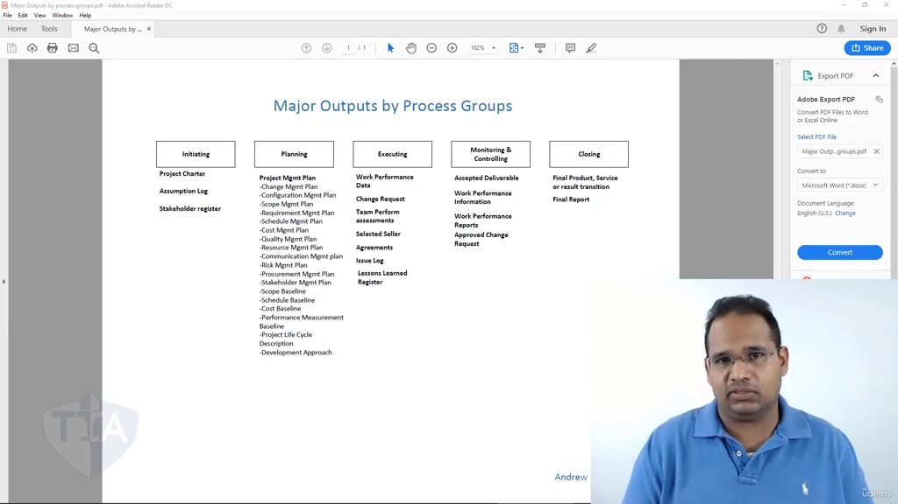

[00:00:19](https://www.udemy.com/course/pmp-certification-exam-prep-course-pmbok-6th-edition/learn/lecture/13092370#overview)

這是一段在 PMP（專案管理師）備考中**極致重要**的黃金總結。講師在片中提煉的正是 PMBOK 核心架構的靈魂——**「五大過程組的關鍵投入與產出（Outputs）及數據流轉邏輯」**。

為了幫助您徹底內化、不再死記硬背，我為您將這段口述精髓整理成結構清晰、邏輯分明的 **Markdown 知識圖譜報告**，並在文末為您精準點出考試的核心命題機關：

# 專案管理特別報告：五大過程組的核心成果與數據流轉

本報告旨在梳理專案從啟動、規劃、執行、監控到收尾的生命週期中，專案經理（PM）手中必須掌握的**核心交付物**，以及這些成果在過程組之間是如何像流水一樣有機串聯的。

## 🧭 一、 啟動過程組（Initiating）：專案的合法授權

在啟動階段結束時，專案經理手頭上必須擁有三大核心文件：

1. **專案章程（Project Charter）**
    
    - **核心作用**：正式授權專案存在，賦予專案經理動用組織資源的權力。
        
2. **假設設定日誌（Assumption Log）**
    
    - **創建時機**：在_制定專案章程_的過程中同步被創造。
        
    - **心態觀念**：包含專案初期所有的假設與限制條件。**「假設」是指在當下被認定為正確、真實的事，但它並非事實（Fact）**。如果 100% 確定是真，那就是事實；如果帶有不確定性（例如：假設升級網路時不需要更換交換機），它就是假設。
        
3. **利益關係人名冊（Stakeholder Register）**
    
    - **創建時機**：在_識別利益關係人_的過程中創建，記錄所有利益關係人的聯繫方式、評估資訊與溝通期望。
        

## 🗺️ 二、 規劃過程組（Planning）：專案的導航地圖

規劃階段的最大終極產出就是 **專案管理計畫（Project Management Plan）**。

- **大計計畫與子計畫的融合**： 這個大型計畫是由許多子計畫（範疇、需求、時程、成本、品質、資源、溝通、風險、採購、利益關係人、變更與組態管理計畫）以及三大基準（範疇、時程、成本基準）共同組合而成的。它會告訴你接下來如何執行、監控、控制和結束專案。
    
- **💡 講師獨家備考命名術**：
    
    - **想找「流程名稱」**：在輸入的開頭加上「**計畫**（Plan）」，例如：_計畫範圍管理（Plan Scope Management）_。
        
    - **想找「輸出計畫」**：將「**計畫/管理計畫**（Management Plan）」這個詞放在最後，例如：_範圍管理計畫（Scope Management Plan）_。
        

## 🏃 三、 執行過程組（Executing）：將計畫化為行動

當團隊開始動手做工，專案經理開始整合資源、實施計畫：

1. **工作績效數據（Work Performance Data, WPD）**
    
    - **來源**：來自_指導與管理專案工作_。
        
    - **本質**：這是最原始的、未經加工的數據（例如：實際花了多少錢、某個任務哪天做完的、具體做了什麼）。
        
2. **問題日誌（Issue Log）**
    
    - **觀念**：雖然在執行階段被正式創建或高頻更新，但它會**貫穿整個專案持續動態更新**。一旦專案出現實質問題，第一步永遠是更新問題日誌。
        
3. **經驗教訓登記冊（Lessons Learned Register）**
    
    - **來源**：PMBOK 第六版新增的核心流程——*管理專案知識（Manage Project Knowledge）*的產出。在執行過程中學到的新技巧（如油漆要用塑料布而非棉布）要立即記錄。
        
4. **其他重要執行產出**：
    
    - **團隊績效評估（Team Performance Assessments）**：源於_發展團隊_。
        
    - **選定的賣方與協議（Selected Sellers & Agreements）**：源於_實施採購_（包含開投標人會議、評估建議書、最終授予合同）。
        
    - **變更請求（Change Request）**：幾乎所有執行流程都會因為遇到阻礙而輸出變更請求（包含糾正措施、預防措施或缺陷修補）。
        

## 👁️ 四、 監控過程組（Monitoring & Controlling）：數據的淬煉與把關

監控的核心是「對照與決策」，這裡發生了 PMP 考試最愛考的**數據淬煉金字塔**與**品質把關鏈條**：

### 1. 核心數據流轉：數據 ➔ 資訊 ➔ 報告

```
 [執行階段] 產出原始數據 (WPD)
      │
      ▼
 [各領域控制流程] (如控制範圍、控制時程、控制成本)
      │ ➔ 將 WPD 與計畫對照，分析偏差
      ▼
 淬煉出：工作績效資訊 (WPI)
      │
      ▼ (所有 WPI 匯入整合流程：監控專案工作)
 [監控項目工作] (Monitor and Control Project Work)
      │ ➔ 將所有資訊統整、視覺化
      ▼
 最終產出：工作績效報告 (WPR) (如：專案狀態報告、進度燈號報告)
```

### 2. 品質與驗收的流轉鏈條

```
 [指導與管理專案工作] ──> 產出：可交付成果 (Deliverable)
                                │
                                ▼
 [控制質量流程 (QC)]  ──> 團隊內部質檢 ──> 產出：已驗證的可交付成果 (Verified Deliverables)
                                │
                                ▼
 [確認範圍流程 (Validate Scope)] ──> 客戶/利益關係人正式檢查 ──> 產出：已接受的可交付成果 (Accepted Deliverables)
```

### 3. 整體變更控制（PIC / Perform Integrated Change Control）

- **流程邏輯**：所有的變更請求（Change Requests）都會匯入這個整合流程進行評估與審批。
    
- **核心輸出**：**批准的變更請求（Approved Change Requests）**，隨後這個核准的變更會重新變成「執行階段」的輸入，交由團隊去實施。
    

## 🏁 五、 收尾過程組（Closing）：移交與功德圓滿

當專案走到終點，在 **結束項目或階段（Close Project or Phase）** 流程中，PM 必須完成最後兩件大事：

1. **移交最終產出**：將在監控階段已經獲得客戶正式簽字認可的 **已接受的可交付成果**（最終產品、服務或結果），正式移交給實際的客戶或發起人。
    
2. **編寫專案最終報告（Final Report）**：坐下來思考與總結：專案最終完成了多少？預算與時程有沒有按時達成？哪裡做對了？哪裡做錯了？下次怎麼做更好？完成總結報告後，專案才算正式圓滿結束。
    

## 🎯 備考終極敲黑板：三大必考核心題眼

講師特別強調，這張圖表「不只是死記硬背，而是要了解東西在哪裡」。在考試中，以下三個觀念是絕對會反覆改頭換面出現的題眼：

### 1. 題眼一：「WPD、WPI、WPR」的身份與流程判定

- **考法**：題目若問你「專案經理正在**對照計畫檢查**某個時程的偏差，並得出目前落後三天的結論，這個產出是什麼？」
    
- **答案**：這是 **工作績效資訊（WPI）**，它屬於*控制時程（Control Schedule）*等具體監控流程的輸出。
    
- **考法**：題目若問「PM 正在將各個團隊的進度與成本資訊**聚合成一份狀態報告**要呈報給高層，PM 處於什麼流程？」
    
- **答案**：PM 處於 **監控項目工作**，產出為 **工作績效報告（WPR）**。
    

### 2. 題眼二：Validate Scope 與 Control Quality 的先後順序

- **考法**：客戶抱怨交付的產品尺寸不對、有瑕疵，或是客戶拒絕在驗收單上簽字，PM 應該**事前**先做好哪一個流程？
    
- **答案**：**控制質量（Control Quality）**。請牢記：團隊必須先在內部進行_控制質量_，拿到**已驗證的可交付成果**後，才能帶去給客戶做_確認範圍_（Validate Scope）以獲得**已接受的可交付成果**。
    

### 3. 題眼三：批准的變更請求（Approved Change Request）流向何處？

- **考法**：變更控制委員會（CCB）已經正式批准了一項重大的範圍變更請求，專案經理**接下來**應該將這個「批准的變更請求」輸入到哪一個流程去執行？
    
- **答案**：**指導與管理專案工作（Direct and Manage Project Work）**。批准的變更必須回到執行階段，由團隊重新實施與更正。