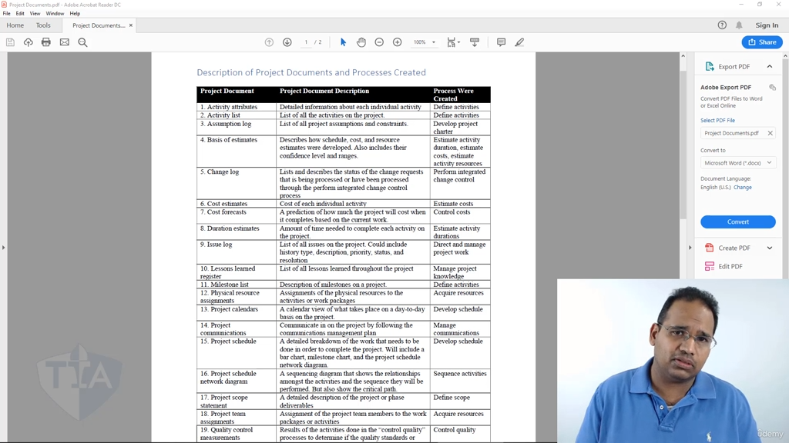

[00:00:18](https://www.udemy.com/course/pmp-certification-exam-prep-course-pmbok-6th-edition/learn/lecture/13092402#overview)

這是一份為您將 `Project+Documents.pdf` 原始教材內容重新排版與梳理的 **Markdown 格式專案文件總覽表**。

這份對照表詳細記錄了 PMP 考試中極其高頻出現的 **33 種項目文件（Project Documents）**、其核心定義描述，以及它們究竟是在**哪一個專案管理流程（Process）中被正式創建出來的** 。

# PMP 核心知識庫：33 種專案文件與創建流程總覽

## 📊 專案文件、描述與創建流程對照表

|**編號**|**專案文件 (Project Document)**|**專案文件描述 (Description)**|**創建該文件的流程 (Process)**|
|---|---|---|---|
|**1**|**活動屬性**      (Activity attributes)|記錄每個獨立活動的詳細關聯資訊（如前置活動、後置活動、資源需求等）。|**定義活動**      (Define activities)|
|**2**|**活動清單**      (Activity list)|包含專案所需執行的所有進度活動的完整清單。|**定義活動**      (Define activities)|
|**3**|**假設設定日誌**      (Assumption log)|記錄專案所有假設條件（Assumptions）與限制因素（Constraints）的清單。|**制定專案章程**      (Develop project charter)|
|**4**|**估算依據**      (Basis of estimates)|描述時程、成本及資源估算是如何被發展出來的，並包含其信心水準與區間範圍。|**估算活動持續時間** / **估算成本** / **估算活動資源**|
|**5**|**變更日誌**      (Change log)|記錄並描述所有處理中或已處理完畢的變更請求（Change Requests）之實時狀態。|**實施整體變更控制**      (Perform integrated change control)|
|**6**|**成本估算**      (Cost estimates)|針對專案中每個獨立活動或工作包所需耗費的成本評估。|**估算成本**      (Estimate costs)|
|**7**|**成本預測**      (Cost forecasts)|基於當前工作進展與績效，對專案完工時最終總成本（EAC）的預測。|**控制成本**      (Control costs)|
|**8**|**持續時間估算**      (Duration estimates)|完成專案中各項活動所需耗費的具體時間量/工時評估。|**估算活動持續時間**      (Estimate activity durations)|
|**9**|**問題日誌**      (Issue log)|記錄專案所有已發生問題的清單，包含問題歷史、描述、優先級、狀態與解決方案。|**指導與管理專案工作**      (Direct and manage project work)|
|**10**|**經驗教訓登記冊**      (Lessons learned register)|記錄整個專案生命週期中所提煉、累積出的所有經驗教訓。|**管理專案知識**      (Manage project knowledge)|
|**11**|**里程碑清單**      (Milestone list)|描述專案中所有里程碑（重大事件或時間點）的清單。|**定義活動**      (Define activities)|
|**12**|**實物資源分配**      (Physical resource assignments)|記錄專案實物資源（如設備、材料、場地等）具體分配給哪些活動或工作包。|**獲取資源**      (Acquire resources)|
|**13**|**專案日曆**      (Project calendars)|以日曆視角呈現專案日常各項活動與工作安排的具體工作日與非工作日。|**制定進度計畫**      (Develop schedule)|
|**14**|**專案溝通紀錄**      (Project communications)|遵循溝通管理計畫，在專案實際推動過程中產生的各項溝通與資訊發佈。|**管理溝通**      (Manage communications)|
|**15**|**專案時程表**      (Project schedule)|描述專案如何按部就班完成工作的詳細拆解，包含甘特圖/橫道圖、里程碑圖及網圖。|**制定進度計畫**      (Develop schedule)|
|**16**|**專案時程網路圖**      (Project schedule network diagram)|展現專案各活動間邏輯依賴關係與執行工序的順序圖，同時用以呈現關鍵路徑。|**排列活動順序**      (Sequence activities)|
|**17**|**專案範圍說明書**      (Project scope statement)|對專案或特定階段的範疇、主要可交付成果、假設條件與排除事項的詳細描述。|**定義範圍**      (Define scope)|
|**18**|**專案團隊派工單**      (Project team assignments)|記錄專案團隊人力資源（團隊成員）具體被分派至哪些工作包或活動上。|**獲取資源**      (Acquire resources)|
|**19**|**質量控制測量結果**      (Quality control measurements)|在「控制質量」流程中對產品執行各項測試、檢驗活動後所得到的客觀結果，用以判定是否符合質量標準。|**控制質量**      (Control quality)|
|**20**|**質量測量指標**      (Quality metrics)|用以專門測量專案或可交付成果，以驗證其是否符合既定質量要求及標準的特定屬性。|**規劃質量管理**      (Plan quality management)|
|**21**|**質量報告**      (Quality report)|包含專案質量問題、流程評估結果以及如何優化/改進專案流程之建議的報告。|**管理質量**      (Manage quality)|
|**22**|**需求文件**      (Requirements documentation)|詳細描述與記錄從各專案利益關係人處收集而來的所有商業、專案與技術需求。|**收集需求**      (Collect requirements)|
|**23**|**需求跟蹤矩陣**      (Requirements traceability matrix)|一張將需求從其源頭（如業務目標、客戶請求）一路連結、跟蹤至最終交付與測試產出的矩陣表格。|**收集需求**      (Collect requirements)|
|**24**|**資源分解結構**      (Resource breakdown structure)|依據專案資源的類別（如人力、設備、材料）與類型所進行的分類階層圖。|**估算活動資源**      (Estimate activity resources)|
|**25**|**資源日曆**      (Resource calendars)|呈現專案中特定實物資源與人力資源在何時具有可用性/空檔的日曆。|**獲取資源**      (Acquire resources)|
|**26**|**資源需求**      (Resource requirements)|描述完成各工作包或活動所需資源的具體數量、種類與類型。|**估算活動資源**      (Estimate activity resources)|
|**27**|**風險登記冊**      (Risk register)|記錄專案所有已識別的正向機會（Opportunities）與負面威脅（Threats），以及對應的回應策略與負責人。|**識別風險**      (Identify risks)|
|**28**|**風險報告**      (Risk report)|描述與評估專案整體風險（Overall project risks）來源與定性/定量宏觀狀況的報告。|**識別風險**      (Identify risks)|
|**29**|**時程數據**      (Schedule data)|用以創建專案時程表的底層支持資訊（如製作者、時程假設條件與約束因素）。|**制定進度計畫**      (Develop schedule)|
|**30**|**時程預測**      (Schedule forecasts)|基於當前的施工或開發工作進展，對專案何時能最終完工的未來進度預測。|**控制時程**      (Control schedule)|
|**31**|**利益關係人名冊**      (Stakeholder register)|包含所有專案利益關係人的清單，記錄其基本資訊、分類、潛在影響力及溝通需求。|**識別利益關係人**      (Identify stakeholders)|
|**32**|**團隊章程**      (Team charter)|團隊成員共同遵守的行為指南與約定，包含核心價值觀、決策流程、可接受行為、行為準則與禮儀。|**規劃資源管理**      (Plan resource management)|
|**33**|**測試與評估文件**      (Test and evaluation documents)|當可交付成果完成時，用以協助評估、測試並核對產品是否合規的工具文件。|**管理質量**      (Manage quality)|

## 🔍 三大 PMP 常考「核心混淆文件」辨析

在備考 TIA 或 PMP 官方考試時，這張表中有幾組文件名稱高度相似，但**功能與誕生流程截然不同**，請在刷題時特別留意：

### 1. 品質控制測量結果 (19) vs. 品質指標 (20) vs. 品質報告 (21)

- **品質指標 (Quality Metrics)**：在**規劃**階段被定出來（Plan Quality Management） ，代表「及格標準」（例如：牆面色差不能大於 5%）。
    
- **品質控制測量結果 (QC Measurements)**：在**監控**階段實地測試後得到的數值（Control Quality） ，是客觀的測試結果數據（例如：實測該牆面色差為 3%）。
    
- **品質報告 (Quality Report)**：在**執行/管理**階段被提煉（Manage Quality） ，是用來「改進組織流程」的綜合性體檢報告 。
    

### 2. 資源分解結構 (24) vs. 資源日曆 (25) vs. 資源需求 (26)

- 只要題目強調「分類與類型階層（Categorization and type）」 ➔ 選 **Resource Breakdown Structure (RBS)** 。
    
- 只要題目強調「何時有空、可用性（Availability）」 ➔ 選 **Resource Calendars** 。
    
- 只要題目強調「需要多少數量與特定型號才能開工（Number and type needed）」 ➔ 選 **Resource Requirements** 。
    

### 3. 風險登記冊 (27) vs. 風險報告 (28)

- 只要題目考單一、具體的「個別風險條目（Individual risks）」與應對措施 ➔ 查閱 **Risk Register** 。
    
- 只要題目考高層宏觀的「整體專案風險描述（Overall project risks）」 ➔ 查閱 **Risk Report** 。