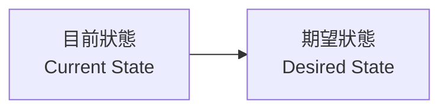

### 改變的必要性

- 必須願意在**企業每一個層面**及**個人生活**改變
    - 不改變正在做的事，就無法**進化**、變得更好、跟上時代步伐
- 例子：手機製造商（如**三星 S22/S23**、**蘋果**）
    - 隨著時間推移，不斷改變產品以留在商業領域
    - 改變的關鍵：**專案**（project）

### 營收成長實例（10M 到 15M）

- 公司從**現狀 $10 million** 營收轉到**期望狀態 $15 million**
    - 達成轉變需**改變某件事**
    - 透過實施**專案**實現
- 專案具體執行內容**依公司需求而定**
    - 開發全新產品
    - 改進或重整現有產品
    - 增加廣告
    - 流程改善
    - 產品開發
    - 削減開支專案（如分析現況以移除不必要費用）
- **重點**：為了從現狀轉變到期望狀態（或未來狀態），必須透過專案實現

### 個人層面的專案應用

- 個人也需從**現狀**轉向**期望狀態**
    - 例子：目前僅**學習專案管理**並在餐廳當收銀員
    - 目標：成為**專案經理**
- 實現方式：**改變**自己
    - 學習新產品
    - 取得新學位
    - 取得新證照
- 這些過程本身就是**一個專案**
- **變革必須發生**，否則無法生存
    - ==不改變，就無法生存==
    - 例子：**BlackBerry** 產品沒有改變，就**滅亡**了