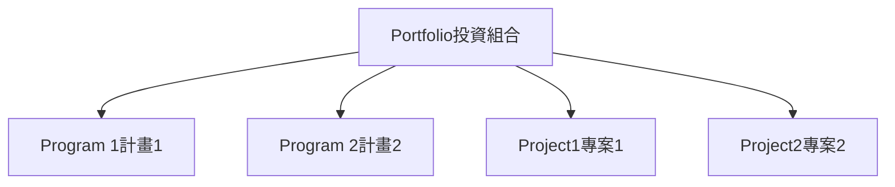
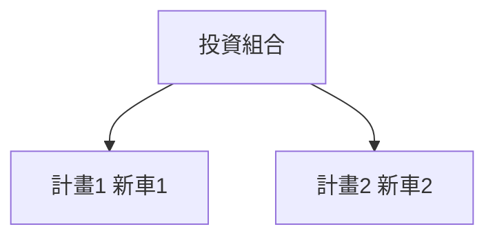

### 投資組合（Portfolio）

- 組織最頂端的概念：**投資組合**是**專案**、**計畫**、**附屬投資組合**和**營運**的集合
    - 以群體方式管理，達成**策略目標**
- **策略目標**：通常定義為3-5年內的長期目標
    - 範例：Toyota汽車製造商希望**營收提高50%**

### 達成策略目標的計畫範例

- Toyota 營收提高50%的策略目標，需要制定**計畫**來實現
    - 計畫範例：製造全新汽車
        - 包含全新**底盤**、**車架**等，並全球範圍獲准
        - 這是一件大事，因此組成**計畫**
    - 可能有多個計畫，如**計畫1**（一輛新車）、**計畫2**（另一輛新車）

- 為了達成**50%營收增加**的**策略目標**，Toyota需設立多個**計畫**和**專案**
    - **計畫**（Programs）：如**Program 1**、**Program 2**（例如製造全新汽車模型）
    - **專案**（Projects）：如**Project1**、**Project2**（支援計畫執行）