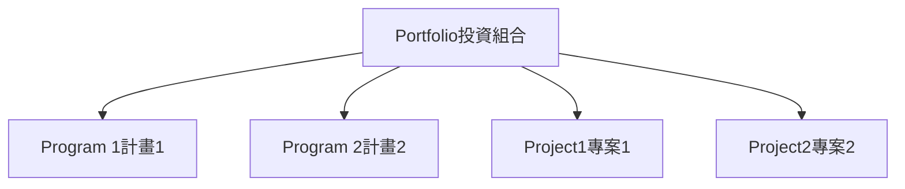

### 投資組合（Portfolio）

- 組織最頂端的概念：**投資組合**是**專案**、**計畫**、**附屬投資組合**和**營運**的集合
    - 以群體方式管理，達成**策略目標**
- **策略目標**：通常定義為3-5年內的長期目標
    - 範例：Toyota汽車製造商希望**營收提高50%**

### 達成策略目標的計畫範例

- 達成**50%營收提高**策略目標的具體方式
    - 製造全新汽車型號（全新**底盤**、**車架**等，並獲全球批准）
    - 改善現有車款
    - 提升銷售流程與獎勵計畫
    - 這些需透過**計畫**來組織執行
- **組合經理**的角色：檢視公司**策略目標**，決定「為了達成這個策略目標，需要哪些專案、計畫等」
    - 將這些元素集合成**組合**，作為整體進行管理

### 組合管理師（Portfolio Manager）的角色與層級

- **組合管理師**在**組織最高層級**工作
    - 可能**直接與執行長（CEO）**共事
    - 在**中小型企業**中，組合管理師可能就是**執行長**本人
    - 在**大型公司**中，與**高階管理層**合作，達成**公司策略目標**
- 現代許多組織皆有**組合管理師**
    - 當**執行長**或**董事會**制定**長期目標**時，組合管理師會說明：「這就是目標，讓我展示所有將實施的**專案**與**計畫**來達成。」