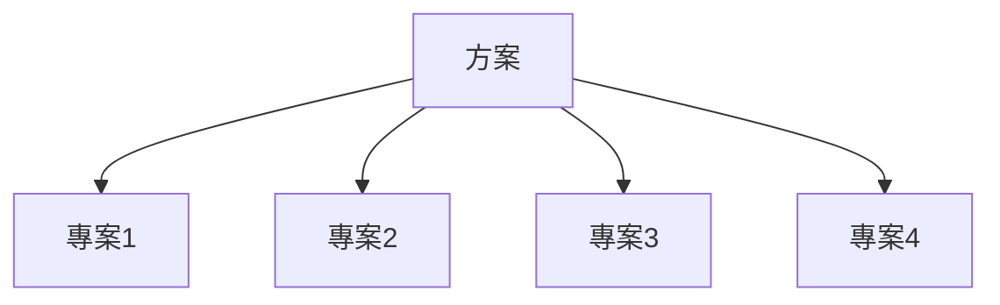

[00:00:36](https://www.udemy.com/course/pmp-certification-exam-prep-course-pmbok-6th-edition/learn/lecture/39346868#overview)

## 方案管理

- 將**相關專案**以**協調方式**進行管理
    - 獲得單獨管理無法取得的**效益與控制**
    - 作為一個方案一起管理必須帶來**額外的價值**
- 專案可能是一個方案的一部分，但一個方案一定會有專案
- 關注**專案之間的相互依賴性**
    - 有助於確定**最佳的管理方法**

### 建造大型橋樑例子

- 若作為**單一專案**管理會非常困難
    - 因為有太多**移動的組件**

- 龐大任務（如大型橋樑）有太多**龐大組成部分**
    - 最好**分解成個別、較小的專案**
    - 每個專案指派**自己的專案經理**
- **方案經理**負責管理所有**小專案**的**專案經理**
    - 將大型任務分解成**子專案**，指派個別**專案經理**
    - **方案經理**管理這些**專案經理**，專案經理再管理實際工作
- 帶來**多項好處**
    - 能**一次管理所有工作**
    - 等於**管理一群人**

### 方案管理的子類別管理好處

- **更容易定義範圍**：清楚**該做什麼與不該做什麼**
- 避免一次弄清楚**所有事情**
- **專案與方案的關係**：一個**專案**可能屬於**方案**或不屬於，但**方案**一定會包含**專案**
    - 這是重點要記住的
- **組織中的應用**
    - **大型、龐大專案**（如全新產品的**研發**或**研究開發**）通常是**大型方案**的一部分
    - **小型專案**（如**翻新辦公室**）則常獨立進行
- **專案間相互依賴性**是方案管理的核心
    - 專案彼此**獨立**但也**相互依賴**
    - 例如橋樑建造：若所有**個別專案**無法完成，整體任務就**無法達成**
- **方案的相互依賴性例子**（橋樑建造）
    - 研究決定**橋樑類型** → 決定**建築設計** → 決定**所需材料** → 決定**所需時間**
    - 各階段**相互連結**，決定整體方案進展
- **方案定義**（考試重點，如**PMP**、**PMI**、**Scrum**）
    - 技術上為**非常大型專案**，分解成**較小專案**以**更容易管理**
    - 就是**一群小專案**的集合