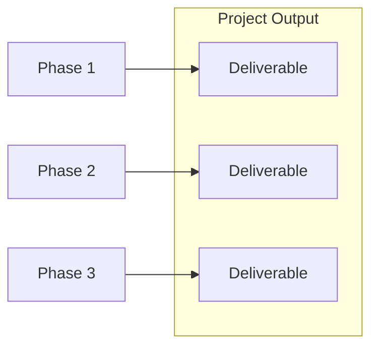
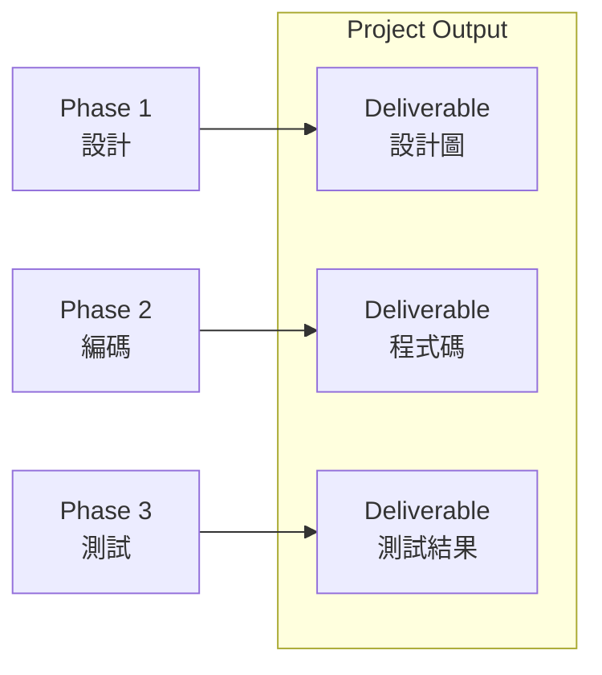

- **階段（phases）**：專案過程中的階段劃分
    - **可交付成果（deliverable）**：專案產出的具體成果

### 階段的定義與特性

- **階段（Phase）**：一系列邏輯相關的專案活動集合
    - 完成時產生一個或多個**交付成果**
    - 階段數量取決於產業類型、專案大小與複雜度

### 交付成果的定義

- **交付成果（Deliverable）**：任何獨特且可驗證的產品、服務或結果
    - 可有形或無形，需經客戶或贊助者接受，方可結束階段

### 專案與交付項目的關係

- 專案產出**交付項目**
    - 可為單一交付項目
    - 或多個交付項目
    - 有時多個交付項目構成單一產品
- **階段**用來創建交付項目
    - 階段幫助產生專案的輸出

### 階段的實際範例：軟體開發專案

- **五個典型階段**：收集需求、設計軟體、編寫程式碼、測試軟體、安裝軟體
    - 這些階段由**專案經理**依專案工作需求所建立
    - 每個階段皆產生**相關聯的交付成果**

### 階段交付成果的具體範例

- **軟體開發專案範例**
    - **設計階段（Phase 1）**：產出**設計圖（Design Schematics）**
        - 定義軟體編碼的方法
    - **編碼階段（Phase 2）**：產出**程式碼（Codes）**
        - 程式設計師鍵入程式碼
    - **測試階段（Phase 3）**：產出**測試結果（Test Results）**

- **專案產出**：所有階段交付成果的結合
    - 例如軟體開發中，設計圖 + 程式碼 + 測試結果 = 最終軟體產品
- **考試重點**
    - 交付成果提供給客戶驗收
    - 交付成果是階段的產出
- ==階段結束條件====：交付成果需經====客戶或贊助者====接受==
    - ==這是判斷階段完成的關鍵==