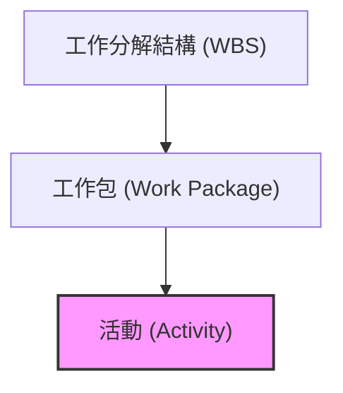

在專案管理中，**定義活動 (Define Activities)** 是將規劃轉向執行的關鍵轉折點。如果說 WBS 是專案的「骨架」，那麼活動就是專案的「肌肉」與「動作」。透過將工作包進一步細分，我們才能精確地估算時間、成本，並建立最終的進度表。

---

## 一、 從範疇到活動的演進路徑

要建立一個具備執行力的進度表，必須經過層層遞進的分解過程。這條路徑確保了專案的每一項具體動作都能追溯回最初的目標。

1. **專案範疇說明書 (Scope Statement)**：定義最終產出的**交付物 (Deliverables)**。
    
2. **工作分解結構 (WBS)**：將交付物分解為最小的管理單位——**工作包 (Work Packages)**。
    
3. **活動清單 (Activity List)**：將工作包分解為具體的執行**活動 (Activities)**。
    

---

## 二、 工作包 (Work Package) vs. 活動 (Activity)

雖然兩者都屬於工作分解的一環，但在專案管理實務中，它們的核心本質有顯著差異：

|**比較項目**|**工作包 (Work Package)**|**活動 (Activity)**|
|---|---|---|
|**描述對象**|**「任務目標」** (要做什麼？)|**「具體動作」** (怎麼做？)|
|**定義層級**|WBS 的最底層，用於成本與進度匯總。|排程的基礎，用於定義具體行動。|
|**範例 (粉刷牆壁)**|粉刷牆面、移動家具。|購買油漆、貼遮蔽膠帶、上底漆、刷兩層漆。|
|**識別方式**|擁有唯一的 WBS 編號。|擁有唯一的活動識別碼 (Activity ID)。|

> **核心原則：一對多關係**
> 
> 每個活動必須僅隸屬於一個工作包（確保職責明確，無重疊），而一個工作包通常會由多個具體的活動組成。

---

## 三、 定義活動的核心工具

### 1. 分解技術 (Decomposition)

這與建立 WBS 時使用的工具相同，但在本流程中，我們是將「高層級的工作包」拆解為「極其具體且單一」的行動。

### 2. 滾動式規劃 (Rolling Wave Planning)

這是一種**漸進式精確化 (Progressive Elaboration)** 的技術，強調「隨著時間推移而細化」。

- **近期工作**：已有完整細節，可直接分解為具體活動。
    
- **遠期工作**：由於資訊不足，暫時以高層級的「佔位符 (Placeholder)」存在。
    
- **動態演進**：隨著專案推進，原本模糊的遠期工作會隨時間接近而重新進行分解。
    

---

## 四、 流程的主要產出 (Outputs)

完成定義活動後，將會產生三份對後續排程至關重要的文件：

### 1. 活動清單 (Activity List)

專案中必須執行的所有行動清單。對於中大型專案（如建築工程或軟體系統開發），清單規模可能迅速增加至數百甚至上千項。

### 2. 活動屬性 (Activity Attributes)

這是活動清單的「擴展說明書」，記錄活動的額外資訊，包含：

- **執行者**：誰負責？ (例如：機電工程師、軟體開發員)。
    
- **地點與環境**：在哪裡執行？ (例如：工地、測試伺服器)。
    
- **邏輯關係**：緊前或緊後活動為何？
    

### 3. 里程碑清單 (Milestone List)

標註專案中的關鍵日期或重大成就。**里程碑本身沒有持續時間（Duration = 0）**，它代表的是一個「時刻」。

- _範例_：取得建築執照、系統模組開發完成、客戶簽收驗收報告。
    

---

掌握了這份詳細的活動清單後，專案經理就能開始決定活動之間的「先後關係」，這也就是邁向建立進度表的下一個階段：**排序 (Sequencing)**。