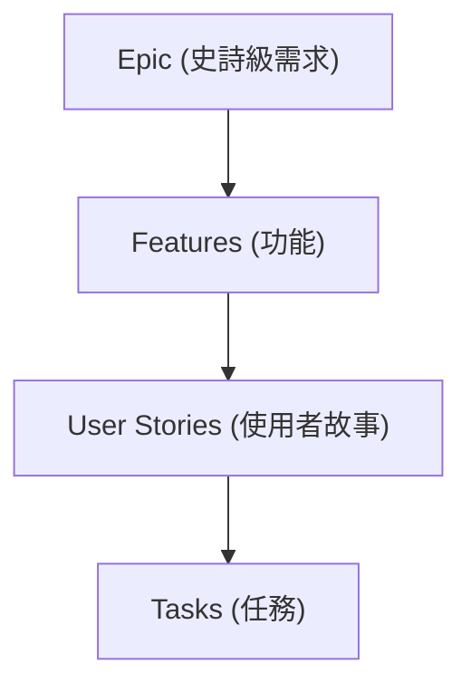

# 需求分解與使用者故事 (Decomposing & User Stories) 終極實戰指南

在敏捷專案管理中，範疇管理不是依靠厚重的規格書，而是透過需求分解（Decomposing Requirements）將大型戰略目標，層層拆解為高視覺化、可獨立交付的精實執行單位。

## 一、 典型的需求分解四個層級 (Decomposition Levels)

敏捷需求由宏觀到微觀，共分為四個經典的標準拆解層級：

```
 🎯 需求分解的四個核心層級（以會計軟體為例）：
 
 🛑【Epic (史詩級需求)】──► 整個專案或極大型模組 ➔ 範例：開發一套完整的「會計軟體」
 🛑【Features (功能)】   ──► 客戶可感知的完整模組 ➔ 範例：會計軟體中的「應收帳款」系統
 🟢【User Stories (故事)】──► 使用者視角的業務功能 ➔ 範例：應收帳款下，使用者「能製作發票」
 🟢【Tasks (任務)】     ──► 實際執行的最小工作單位 ➔ 範例：為了製作發票，工程師「串接特定 API」
```

1. **Epic (史詩級需求)**：代表整個軟體專案、或是極為龐大的功能模組集合。
    
2. **Features (功能)**：由 Epic 拆解而來，描述較為具體的軟體功能。這屬於客戶在商業上可以清晰感知、甚至可以直接用於版本發佈（Release）的完整模組。
    
3. **User Stories (使用者故事)**：由 Feature 拆解而成，從**使用者的視角**來描述具體的業務需求情境。通常工作量約控制在 **1 到 3 天** 左右。
    
4. **Tasks (任務)**：最底層的拆解單元，由 User Story 進一步切細而成。這是開發人員每天實際執行的**最小技術工作單位**（例如：輸入帳單、執行付款動作、附加特定代碼等）。
    

## 二、 使用者故事 (User Stories) 核心定義與語法結構

- **契約本質**：在敏捷開發中，每一個需求都應該以使用者故事的形式呈現（包含技術性的需求）。它不是死板的合約，而是**客戶與開發團隊之間的動態協議（Agreement）**。
    
- **價值的剛性約束**：每一則故事**都必須能產生實質的商業價值（Value）**。開發者必須嚴格區分「功能動作 (Goal)」與「真實價值 (Real Value)」。
    
    - _功能動作 (Goal)_：使用者想要執行的表面動作（如：查看潛在客戶清單）。
        
    - _真實價值 (Real Value)_：使用者真正想要達成的底層結果（如：快速回電跟進，以完成銷售）。_如果只做功能而不理解價值，開發團隊極易做出對使用者毫無用處的失敗產品。_
        

### 1. 標準 3 段式語法結構 (Common Structure)

為了精準捕獲價值，使用者故事通常遵循以下特定的標準句型模板：

$$\text{\textbf{As a} }\langle\text{user type}\rangle \ \ \mathbf{\longrightarrow}\ \ \text{\textbf{I want to} }\langle\text{goal}\rangle \ \ \mathbf{\longrightarrow}\ \ \text{\textbf{So that} }\langle\text{value}\rangle$$

> 🗣️ **標準語法範例**：
> 
> 「作為一個 **[使用者類型]**，我想要 **[目標動作]**，以便於 **[獲得的真實價值]**。」

### 2. 實務三大案例解構

- **財務場景**：
    
    「作為一個 **薪資管理員**，我想要 **能夠查看所有薪資稅務報告**，以便於 **準時繳納稅款、避免被罰**。」
    
- **銷售專業場景**：
    
    「作為一個 **銷售人員**，我想要 **能夠查看最新的潛在客戶清單**，以便於 **能快速回電跟進、提升轉化率**。」
    
- **備考/學習場景**：
    
    「作為一個 **本課程學生**，我想要 **能夠清晰理解考試的要求**，以便於 **確認自己是否符合參加資格**。」
    

## 三、 使用者故事的 3C 原則 (Three C's of Stories)

使用者故事不應該在期初就包含所有的規格細節，其**核心目的是為了促進面對面的溝通**。一個完整的故事生命週期包含以下三個 C 元素：

- **Card (卡片)**：建議引導使用者將故事簡短地寫在實體的**索引卡 (Index cards)** 上。卡片大小有限，能天然限制住需求的顆粒度。
    
- **Conversation (對話)**：故事不是丟給工程師就完事的交貨單，它是**用來啟動與促進團隊、PO、客戶之間溝通的活體工具**。透過高頻對話，進一步確認故事是否真正捕捉到了核心商業價值。
    
- **Confirmation (確認)**：由使用者定義驗收條件，用以確認交付的功能是否通過驗證。
    
- _⚙️ 撰寫大鐵律_：最重要的一點是，**使用者故事必須是由「使用者 (Users) / 客戶 / PO」來主導撰寫**，而非開發團隊代刀，這樣才能確保代表真實市場的聲音。
    

## 四、 高品質故事的黃金量尺：INVEST 原則

為了確保拆解出來的使用者故事是健康、有效率且高防禦力的，敏捷引導者必須使用 **INVEST 原則** 進行品質把關：

| **字母縮寫** | **🌟 INVEST 黃金核心特性**   | **🛠️ 實務管理含義與防禦機制**                                                                                                                             |     |
| -------- | ---------------------- | ----------------------------------------------------------------------------------------------------------------------------------------------- | --- |
| **I**    | **Independent (獨立性)**  | 故事與故事之間應該是**相互獨立、盡可能解耦的**。<br><br>  <br><br>⚠️ _為什麼重要_：如果故事間存在嚴重的依賴關係，當 PO 想要根據市場變化調整開發優先順序 (Prioritize) 或重新排序 (Reprioritize) 時，會面臨牽一髮動全身的癱瘓死局。 |     |
| **N**    | **Negotiable (可協商性)**  | 故事應保持彈性，**允許根據成本（時程產能）與功能範圍之間的權衡 (Trade-offs) 進行動態協商**，拒絕死板硬化。                                                                                  |     |
| **V**    | **Valuable (價值性)**     | 每一則故事都**必須清楚且直白地陳述出其能為客戶或組織帶來的核心商業價值**，不允許存在純粹為了好玩或自我感動的代碼。                                                                                     |     |
| **E**    | **Estimatable (可估算性)** | 故事的描述必須足夠清晰，使得執行團隊**有能力評估估算出完成該故事所需的時間、成本或故事點數**。                                                                                               |     |
| **S**    | **Small (小型化)**        | 故事的大小必須控制在精實合理的範圍內，建議工作量應**精準控制在 4 到 40 小時之間**。若大於 40 小時應視為 Epic 或 Feature 繼續切細。                                                                |     |
| **T**    | **Testable (可測試性)**    | 故事必須具備**可被測試與驗證的客觀屬性**，以確保功能在 Sprint 結束完成時能夠被精準驗收（DoD）。                                                                                         |     |

### 🔍 「可測試性 (Testable)」的臨床案例分析

以銷售人員的故事為例：「我想看到最新的潛在客戶清單，以便我能快速回電跟進。」

品質驗證的兩大測試點如下：

- **測試點 1 (功能動作層面)**：系統在技術上是否能即時提供一份包含電話號碼與時間資訊的最新清單？
    
- **測試點 2 (真實價值層面)**：當銷售人員拿到這份清單後，使用者是否在實務流程上，真的能夠順利達成「快速回電、跟進客戶」的核心商業目標？
    
- _⚙️ 驗收結論_：如果開發者能在評審會上，證明使用者可以流暢使用該軟體取得正確資訊、並順暢完成回電的業務閉環，則該故事即可宣告**通過驗收 (Acceptance Criteria)**。
    

## 💡 三點需要牢記的部分

1. **Independent（獨立性）是動態重排 prioritized 的命脈，解耦故事才能釋放速率**：在備考情境題與實務 Backlog 梳理時，必須死磕 INVEST 原則中的 **Independent（獨立性）**。如果題目情境提到「團隊因為功能 A 沒做好，導致功能 B、C、D 也全部卡死無法開工，問 PO 為何很難重新排序優先級（Reprioritize）」，其根本元兇就是故事缺乏獨立性。PM 必須引導跨職能團隊在梳理會（Grooming）上切斷過深的依賴鏈結，確保故事具備高獨立性，才能隨時應對適應性規劃的動態調整。
    
2. **故事是溝通的啟動器（Conversation），必須由 User 親自撰寫以消滅微管理**：高頻考點請務必鎖定 3C 原則中的 **Conversation** 與「主權歸屬」。使用者故事絕對不是寫滿 technical 語法、由 PM 或主管單向塞給工程師的指令（那是傳統工具導向的微管理）。故事必須由 **Users（使用者/客戶/PO）** 親自撰寫，其核心靈魂在於卡片（Card）背後的「往返對話」。透過互動提高利害關係人的參與度（Engagement），回歸底層的真實價值，這正是解決團隊衝突與需求模糊的終極解藥。
    
3. **INVEST 控制故事大小在 4 到 40 小時（Small），用可測試性（Testable）的雙層鏡頭粉碎虛假交付**：在進行時程預測與迭代規劃（Sprint Planning）時，必須精確識別故事的體積（Small）。一則合格的 User Story，工作量必須落在 **4 至 40 小時（約 1-3 天）** 的精實區間內，大於此區間則無法在單一時間盒內被靈活消化。同時，在定義驗收標準（Acceptance Criteria）時，必須同步執行「功能動作」與「真實價值」的雙重 Testable 驗證，拒絕任何「代碼寫完、但對客戶毫無實質產出」的虛假完成。