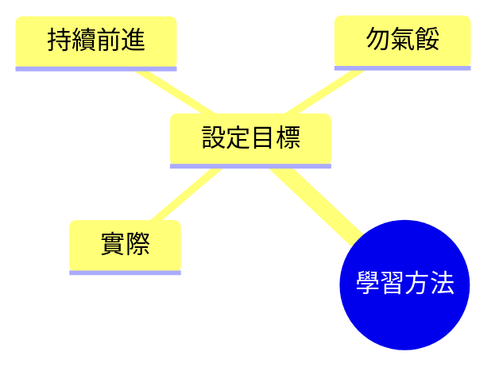

## 如何學習

- **學習方法**：雖然多數人自認已知，但需重申並提供個人觀點
- 擁有**62項認證**，已考取**超過100項**認證考試
    - 供應商包括 **Cisco**、**Microsoft**、**ISC²**、**PMI**、**CompTIA** 等眾多廠商
    - 持續考試，證明方法可靠
- **考證經驗**：每年**2-3張**證照，持續**20年**（**3×20** ≈ **62張**）
- **學習方法論**：適用所有證照課程（安全、專案管理等）
    - 給學生標準指導，也是自身準備考試方式
    - 今年考取一張複雜證照，目前正準備**滲透測試**證照

### 如何學習（續）

- **設定目標**：學習第一件事必須做
    - **實際設定**：課程有**35小時**內容，加上練習考、模擬考時間需預期更多
    - 若落後仍繼續，不要氣餒（人人都有失敗經驗）
- **今年挑戰**：考取**OSCP**（非常困難的滲透測試認證）來更新技能

| 學習要點 | 說明 |
| --- | --- |
| 多做練習考 | 來自不同作者 |
| 找朋友一起學 | - |
| 公開宣告目標 | 向世界告知 |

### 學習時間預估

- **設定實際目標**：預估**45小時**總工作量
    - 包含觀看影片（約**35小時**或略多）
    - 做練習考（**500多題**）
    - 最後模擬考（很重要）

| 學習清單 | 時數/量 |
| --- | --- |
| 影片 | ~35小時 |
| 練習考 | 500+題 |
| 模擬考 | 大型 |
| 總計 | 45小時 |

- **務實設定目標**：依個人生活與時間表調整
    - 學生常問「課程多久完成？」
    - 幽默回應：不睡不吃兩天（48小時）保證完成，但千萬別這樣做
        - 自己也無法連聽48小時
    - **重點**：了解自己進度，別瘋狂衝刺

| 常見問題 | 務實建議 |
| --- | --- |
| 課程多久完成？ | 依個人調整，勿不睡不吃 |

- **務實規劃範例**：了解個人日程後設定目標
    - 例如：工作8-10小時/天、有孩子、家務等
    - **六週完成48小時**：每週約8小時學習
        - 平日（週一到週五）：每天看影片1小時
        - 週末：多做一些，因無工作壓力

| 規劃範例 | 每日/週末 |
| --- | --- |
| 平日 | 1小時影片 |
| 週末 | 多一些 |
| 總計 | 六週48小時 |

- **避免一週衝刺**：密集學習（如看所有影片、做練習考）無法記住內容，保證失敗
    - 給自己幾週時間分散學習
- **訓練營經驗**：4天訓練、每天9.5小時、總**38小時**
    - 學生短期內多忘記大部分內容
    - 但回家重溫影片 + 使用學習指南後會成功

| 學習方式 | 結果 |
| --- | --- |
| 一週密集 | 無法記住 |
| 幾週分散 | 記住成功 |
| 訓練營後重溫 | 最終成功 |

- **學習時間範圍建議**：不會只需一週，**四週**為合理時間
    - 訓練營學生有內容熟悉優勢，但仍需回家重溫影片與學習指南
    - 僅觀看影片者需從頭學習，給自己足夠時間
- **個人化調整**：依生活決定每日學習時數
    - 確保獲得睡眠，不要過度學習

| 學習對象 | 時間建議 |
| --- | --- |
| 訓練營 | 重溫成功 |
| 僅影片 | 四週合理 |
| 共同 | 確保睡眠 |

- **避免疲勞學習**：若累了、快睡著就暫停，去睡覺
    - 不要像看YouTube或Netflix邊看邊睡，無法記住內容
    - **睡眠比PMP重要**，健康比證照重要

| 疲勞情況 | 建議 |
| --- | --- |
| 快睡著 | 關掉、去睡 |
| 邊看邊睡 | 無效、無記憶 |

- **若落後繼續前進**：預期會發生，大多數人會落後
    - 例如每週目標8小時，只做到4小時也沒關係
    - 不同週次表現不同，可給自己緩衝（如**六到八週**完成）
- **不要氣餒**：我們都會在某些事上失敗
    - 保持動力，持續學習

| 落後情況 | 應對 |
| --- | --- |
| 每週只做4小時 | 繼續、給緩衝 |
| 不同週次 | 正常現象 |

- **個人故事鼓勵**：講者承認人生中做過愚蠢決定（如經營TIA大校但有蠢事導致延誤好幾年）
    - 但從未氣餒，經歷後達成目標
    - **應用**：學習落後時告訴自己「這週只讀1小時，因生活太難」，下週補上就好

| 情境 | 心態 |
| --- | --- |
| 愚蠢決定延誤 | 經歷、不氣餒 |
| 學習只1小時 | 下週補上 |

- **考試失敗很常見**：有些人首次就失敗，但會發生
    - **經驗顯示**：**62張認證**、**超過100次考試**，失敗約**5%**
    - **最慘案例**：**ITIL專家中級考試**，連續失敗**3次**，第**4次**才過

| 失敗經驗 | 細節 |
| --- | --- |
| 總失敗率 | 約5% |
| ITIL專家 | 連3敗、第4勝 |

- **堅持再試**：失敗不是結束，多次嘗試最終成功
    - 適用困難考試如ITIL

| 心態 | 結果 |
| --- | --- |
| 首次失敗 | 再試成功 |

- **個人失敗轉動力故事**：缺乏經理心態，太過技術導向，連續三次考ITIL失敗
    - 開始自我質疑：這不是我的路、無法做ITIL講師
    - 但轉變成功：今年出版ITIL書籍

| 失敗階段 | 心態轉變 |
| --- | --- |
| 三次ITIL失敗 | 質疑自己 → 更投入 |
| 沮喪 | 變動力 |

- **失敗心態**：失敗時會生氣、不會難過
    - 太太知道：失敗後更專注投入
    - **應用**：考砸變沮喪，但轉為強大動力

| 情緒 | 結果 |
| --- | --- |
| 失敗生氣 | 更投入 |
| 考砸沮喪 | 強大動力 |

- **堅持再考心態**：不喜歡失敗，考砸立即重新排程再試
    - 不讓考試打敗自己，視為遊戲
    - 「這遊戲不可能贏我」
    - 變成戰爭：你對PMP
    - 一次失敗僅一場戰役
    - 贏戰爭須擊敗考試

| 失敗次數 | 行動 |
| --- | --- |
| 一次 | 重排再考 |
| 多次 | 持續挑戰 |

- **應用**：告訴自己「考砸了？再考就好」，持續直到成功
- **考試失敗後行動**：考砸後立即重考
    - 不買星巴克咖啡省錢（下個月省）
    - 重新學習、檢討錯誤
    - 查看考試報告找出弱點
    - 重新評估未理解部分

| 失敗行動 | 細節 |
| --- | --- |
| 重考 | 省錢、立即再試 |
| 檢討 | 報告、錯誤、知識 |

- **失敗即學習經驗**：失敗帶來學習
    - **關鍵心態**：不願失敗 = 不願成功
    - 因為**成功伴隨失敗**，這是遊戲一部分

| 心態 | 解釋 |
| --- | --- |
| 不願失敗 | 不願成功 |
| 成功 | 伴隨失敗 |

- **個人成功反思**：相當成功，但**失敗很多次**
    - 回應「你成功了嗎？」：希望如此
    - 證明堅持克服失敗

| 經驗 | 結果 |
| --- | --- |
| 失敗很多 | 相當成功 |

- **多做不同作者練習考試**：PMP考試來自不同提供者、不同人思維
    - 課程內所有考試由講者自製
    - 建議學生外出做多位作者練習考，但無法給特定名字（無許可）

| 練習來源 | 說明 |
| --- | --- |
| 課程內 | 全部自製 |
| PMP真考 | 不同作者 |

- **不同作者練習益處**：獲取不同觀點，知識庫相同（來自同一資源組）
    - 免費或成本效益高練習題多
    - 避免特定名稱宣傳（無許可、免爭議）

| 來源 | 特點 |
| --- | --- |
| 不同作者 | 多觀點 |
| PMP課程 | PMBOK第6版基底 |

- **和朋友一起學習**：互相激勵推動進度
    - 像準備**OSCP考試**時，與朋友（如Bob）合作
    - 特別適合實驗室密集考試
    - 互相督促，避免單獨學習易懈怠

| 方法 | 效果 |
| --- | --- |
| 單獨學習 | 易懈怠 |
| 與朋友 | 互相督促 |

### 學習小組討論益處

- **PMP特定應用**：組織內找對PMP感興趣者組成學習小組
    - 僅討論話題就學很多
    - 驚訝發現討論效益高
- **個人例子**：無法與妻子討論，因她完全不感興趣

| 小組特點 | 效果 |
| --- | --- |
| 組織內 | 討論學多 |
| 個人討論 | 妻子無興趣 |

- **公開宣告學習目標**：讓全世界知道你走在這條路上
    - 告訴周圍每個人（非字面全世界，而是身邊世界）
    - 產生責任感與動力

| 方法 | 效果 |
| --- | --- |
| 告訴大家 | 產生動力 |

- **個人應用**：考證照時告訴每個人，讓大家都知道
- **宣告目標的支援系統**：公開告訴大家學習計畫，建立考試所需支援
    - 考試需答多題、超過4小時，非常壓力大
    - 學習過程也壓力大，需要家裡人、同事支持
    - **例子**：妻子知情「今晚要學習」

| 對象 | 效果 |
| --- | --- |
| 妻子 | 知今晚學習 |
| 同事/家 | 提供支持 |

- **壓力管理**：宣告後，周圍人了解你的需求，提供推動力
- **實際生活例子**：太太知道平日每晚或隔晚學習1-2小時，週日休息
    - 她會在10點前完成所有事，因為10點要去學習
    - 產生實際支持：生活圍繞學習轉

| 支持對象 | 配合方式 |
| --- | --- |
| 太太 | 10點前完成家務 |
| 工作同事 | 知道8或10點要回家學習 |

- **與朋友學習應用**：10點與Bob一起學習，大家知道Andrew要回家
    - 專注安排生活：提前完成工作與家務
    - 強化責任感與推動力

| 時間 | 活動 |
| --- | --- |
| 每晚/隔晚 | 1-2小時學習 |
| 週日 | 休息 |
| 晚上8/10點 | 回家與Bob學習 |

- **全家皆知例子**：朋友、同事、家裡人、孩子甚至**狗都知道**在學習
    - 狗想抓腿時關房外，避免干擾

| 支持對象 | 細節 |
| --- | --- |
| 狗 | 關房外防抓腿 |

- **社交應用**：和朋友喝酒時，他們知道「這週別問我，太忙學習」
    - 自動避免邀約，不會打擾
    - **益處**：保持專注

| 情境 | 效果 |
| --- | --- |
| 朋友邀酒 | 自動避開 |
| 學習期 | 無打擾 |

- **總結**：讓全世界知道，建立支持系統
    - 影片結束，強調很有幫助