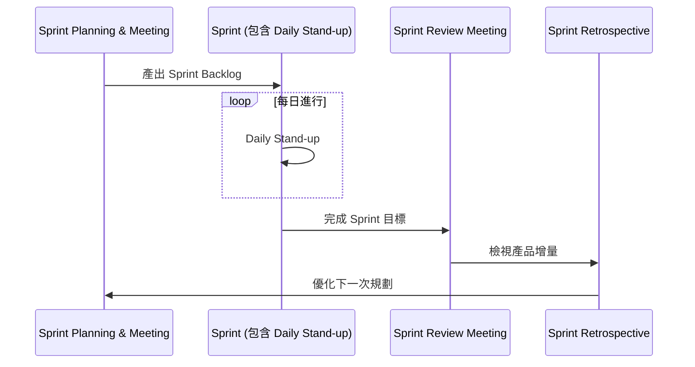

## Scrum 活動 (Scrum Activities)

- Scrum 框架包含一系列特定的活動，用以驅動開發流程
- 主要活動流程如下：

### Sprint Planning & Meeting

- 這是 Scrum 活動的起點
- 其主要產出為 **Sprint Backlog** (Sprint 待辦清單)

### Sprint Planning Meeting

- 用於決定該 Sprint 將要完成哪些工作，以及如何達成這些工作
- 開發團隊根據以下因素來預測可交付的內容，以定義 Sprint 目標：
    - 估計值 (estimates)
    - 預期產能 (projected capacity)
    - 過往表現 (past performance)
- 團隊接著會決定功能將如何構建，以及團隊將如何組織以達成 Sprint 目標
- **輸出結果**：Sprint Backlog（即下個 Sprint 要完成的工作清單）