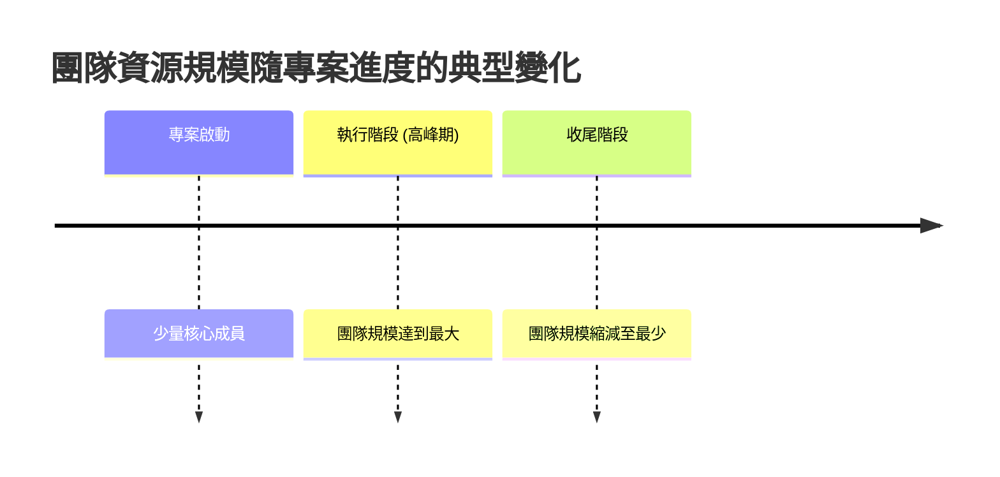

## 資源管理 (Resource Management)

- 專案經理的角色重點在於「管理」團隊，而非親自執行具體的技術任務。
- 根據 PMBOK/PMI 的定義，資源可分為兩大類：
    - **團隊資源 (Team Resources)**
        - 指參與專案並負責建立交付成果的人員（即所有團隊成員）。
    - **實體資源 (Physical Resources)**
        - 指專案所需的物質資源。

### 實體資源 (Physical Resources) 的範疇

- 除了人力以外的所有資源皆屬於實體資源
    - 包含供應品 (Supplies)
    - 材料 (Materials)
    - 服務 (Services)
    - 設施 (Facilities)
    - 設備 (Equipment)
- 這些資源必須經過測量 (Measured)、取得 (Acquired)、管理 (Managed) 與使用 (Used)

### 規劃資源管理 (Plan Resource Management)

- **核心目的**：制定如何估算、取得、管理及使用團隊與實體資源的方針
- **主要產出：資源管理計畫 (Resource Management Plan)**
    - 這是一份指導文件，用來規範以下流程：
        - 如何決定需要多少資源 (How to determine how much we need)
        - 如何取得這些資源 (How to acquire them)
        - 如何管理與使用這些資源 (How to manage and use them)

### 資源管理計畫的實務應用

- **組織差異性**：不同公司取得與管理資源的方法論 (Methodology) 截然不同
    - 專案經理應與所屬公司協作，以符合其獨特的資源配置流程
- **規劃資源管理 (Plan Resource Management) 的工具**
    - **數據呈現 (Data Representation)**：利用圖表與圖形來視覺化資源與責任關係
    - **層級圖 (Hierarchical Chart)**：
        - 即組織結構圖 (Organization Chart)
        - 用於展示組織內的層級與關係
    - **矩陣圖 (Matrix Chart)**：
        - **責任分配矩陣 (RAM, Responsibility Assignment Matrix)**：用於定義各項任務與成員之間的關係
        - **RACI 圖**：RAM 的一種常見形式，明確標示成員在特定任務中的角色

### 資源管理工具細節補充

- **層級圖 (Hierarchical Chart) 的權力結構**：
    - 呈現組織內的權力階層，位置越高權力越大。
    - **典型階層**：Sponsor (發起人/贊助者) $\rightarrow$ Project Manager (專案經理) $\rightarrow$ Team Members (團隊成員)。
- **RACI 圖的角色定義**：
    - **R (Responsible)**：負責執行任務的人。
    - **A (Accountable)**：對任務結果負最終責任的人。
    - **C (Consulted)**：在執行過程中需要諮詢的人。
    - **I (Informed)**：需要被告知任務進度或結果的人。
- **文字格式 (Text Format) 的應用**：
    - 最直觀的描述方式，常用於撰寫**職位描述 (Position Descriptions)**，例如明確要求工程師需精通特定程式語言以產出特定程式碼。

### RACI 圖 (RACI Chart) 的組成與應用

- **RACI 為縮寫**，定義了成員在特定任務中的四種角色：
    - **R (Responsible) 負責人**：實際執行該任務的人。
    - **A (Accountable) 認可人/問責人**：對任務結果負最終責任的人（通常是「出事時要找的人」；**注意：每個任務只能有一個 A**）。
    - **C (Consulted) 諮詢人**：可以提供建議或協助、在執行前需溝通的人。
    - **I (Informed) 知情者**：需要被告知進度或結果的人。
- **實務案例分析**：
    - **開發專案章程 (Develop Project Charter)**：
        - **Sponsor (發起人)**：負責人 (R)
        - **Project Manager (專案經理)**：認可人 (A)
        - **Team Members (團隊成員)**：知情者 (I)
    - **建立範圍說明書 (Create Scope)**：
        - **Team Members (團隊成員)**：認可人 (A)
        - **Project Manager (專案經理)**：諮詢人 (C)
        - **Sponsor & Customer (發起人與客戶)**：知情者 (I)
    - **驗證範圍 (Validate Scope)**：
        - **Customer (客戶)**：負責人 (R)
        - **Project Manager (專案經理)**：認可人 (A)
        - **Sponsor (發起人)**：諮詢人 (C)
        - **Team Members (團隊成員)**：知情者 (I)
- **使用原則**：
    - RACI 圖不需要在初始階段就達到完美，可以隨著專案進展隨時進行更新與補充。

### RACI 圖的核心原則

- **「唯一問責」原則 (The Single A Rule)**：
    - 在 RACI 圖中，**每個任務只能有一個 A (Accountable)**
    - **原因**：必須有一個明確的人對該任務的最終結果負責，避免責任分散或推諉。
    - 其他角色（R、C、I）則可以有多個：
        - 一個任務可以有多個 **R (Responsible)** 負責執行。
        - 一個任務可以有多個 **C (Consulted)** 或 **I (Informed)**。

### 資源管理計畫 (Resource Management Plan)

- **定義**：這是「規劃資源管理」流程的主要輸出，並會成為「專案管理計畫 (Project Management Plan)」的一部分。
- **核心功能**：作為指導文件，規範專案如何進行以下動作：
    - 如何選拔與取得資源 (How to select and acquire resources)
    - 如何管理與使用資源 (How to manage and use resources)
- **包含內容**：
    - 包含先前建立的**角色與責任分配圖 (如 RACI 圖)**。

### 團隊資源的動態特性

- **資源變動趨勢**：團隊規模並非固定不變，而是隨著專案進度呈現動態變化。
- **典型生命週期趨勢**：
    - **專案初期**：團隊成員較少。
    - **專案高峰期 (Ramp up)**：隨著工作量增加，團隊規模會逐漸擴大。
    - **專案後期**：隨著任務完成，團隊規模會逐漸縮減。

### 團隊章程 (Team Charter)

- **定義**：由專案團隊共同制定的一份文件，用於概述專案中「可接受的行為準則」。
- **核心目的**：確保團隊成員之間能夠和諧共處，建立良好的團隊凝聚力。
- **包含內容**：
    - **行為準則 (Rules of Conduct)**：規範成員在專案中的表現。
    - **決策機制**：如何進行即時決策或處理分歧。
    - **溝通規範**：例如在會議中不應互相咆哮、不應搶話，並確保每個人都有表達意見的機會。
- **制定方式**：
    - **最佳實踐**：應讓團隊成員**共同參與**制定這些規則。
    - **簽署認可**：所有成員都應該簽署該章程，以示對這些行為規範的認同與承諾。

### 資源管理計畫的引導作用

- **核心功能**：資源管理計畫不僅僅是一份文件，它更是後續所有資源管理流程的「指南針」。
- **引導後續流程**：計畫中定義的規則將指導如何執行以下關鍵動作：
    - **估算活動資源 (Estimate Activity Resources)**：確定完成任務需要多少資源。
    - **取得資源 (Acquire Resources)**：將資源納入專案中。
    - **開發團隊 (Develop Team)**：提升團隊能力與凝聚力。
    - **管理團隊 (Manage Team)**：追蹤成員表現、解決衝突並管理變動。
- **專案管理的核心本質**：
    - 雖然專案涉及預算、時間與範圍，但從本質上來說，**專案管理的核心就是「管理人」**。