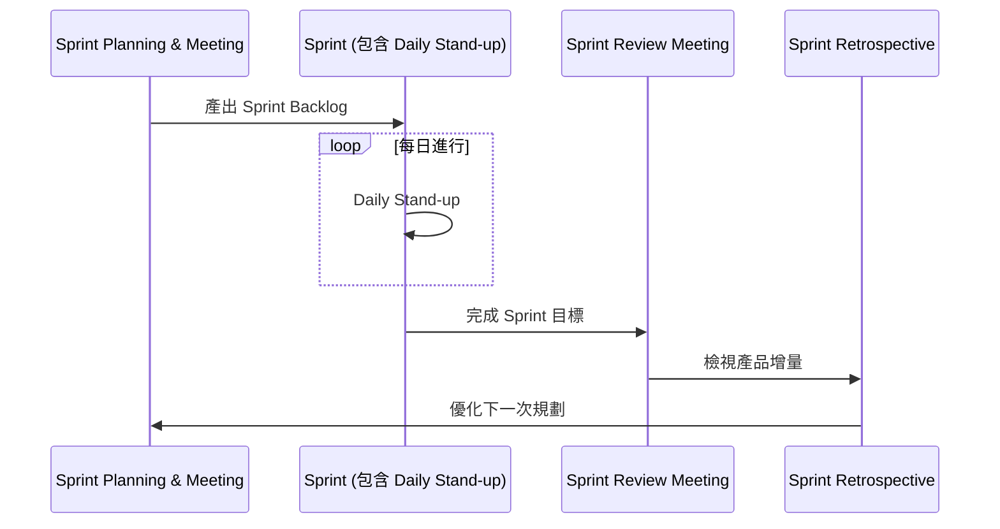

## Scrum 活動 (Scrum Activities)

- Scrum 框架包含一系列特定的活動，用以驅動開發流程
- 主要活動流程如下：

### Sprint Planning & Meeting

- 這是 Scrum 活動的起點
- 其主要產出為 **Sprint Backlog** (Sprint 待辦清單)

### Sprint Planning Meeting

- 用於決定該 Sprint 將要完成哪些工作，以及如何達成這些工作
- 開發團隊根據以下因素來預測可交付的內容，以定義 Sprint 目標：
    - 估計值 (estimates)
    - 預期產能 (projected capacity)
    - 過往表現 (past performance)
- 團隊接著會決定功能將如何構建，以及團隊將如何組織以達成 Sprint 目標
- **輸出結果**：Sprint Backlog（即下個 Sprint 要完成的工作清單）
- 預測 Sprint 目標的依據：
    - 開發團隊會參考過往 Sprint 的表現（past performance）
    - 根據過去完成的工作量（以點數 points 為單位）來評估
    - 從目前的 Product Backlog 中，預測出在該 Sprint 期間能實際完成的工作量

### Sprints

- Sprint 是一個 **Timeboxed**（有時間限制的）迭代過程
    - **[什麼是 Timebox?]** 想像一個盒子，空間是有限的，因此 Timebox 代表開發時間是受限且固定的
    - 每次 Sprint 的持續時間通常為 1 到 4 週
- **Sprint 的目標**：在該時段內建立一個「潛在可發佈」（potentially releasable）的產品

### Sprint 的執行原則與組成

- **Sprint 的組成要素**
    - Sprint Planning Meeting (規劃會議)
    - Daily Scrum (每日站立會議，亦稱為 Daily Stand-up)
    - Actual Work (實際開發工作)
    - Sprint Review Meeting (檢視會議)
    - Sprint Retrospective (回顧會議)
- **Sprint 期間的穩定性原則**
    - **[重要]** 在 Sprint 進行期間，不得進行任何會影響該 Sprint 的變更
        - 例如：如果團隊已決定要完成兩個特定功能，就不應該在 Sprint 中途去更改這些功能的要求

### Sprint 的穩定性原則

- **避免變動 Sprint 目標**
    - 在 Sprint 進行期間，不應進行會影響 Sprint 目標的變動
    - **[為什麼？]** 因為變動會破壞團隊的**開發速率 (Velocity)**，因為團隊已經根據既定計畫進行了工作規劃
    - 若有新的需求或變動，應將其加入 **Product Backlog**，等待下一個 Sprint 再由團隊重新評估
- **保持團隊成員穩定**
    - 在整個 Sprint 期間，開發團隊的成員應保持不變
    - **[為什麼？]** 頻繁更換團隊成員會嚴重打擊 Sprint 的開發速率 (Velocity)

### Daily Scrum (或 Standup)

- 一個 **15 分鐘** 的 Time-boxed 活動
    - **目的**：讓開發團隊同步活動，並為接下來的 24 小時制定計畫
- **執行規範**：
    - 應每天在**相同的時間**與**相同的地點**舉行
    - **[為什麼？]** 為了建立標準化的流程，避免因變動而造成混亂
- **核心內容**：每位團隊成員都應該回答以下三個問題：

    1. 你昨天做了什麼？ (What did you do yesterday?)
    2. 你今天打算做什麼？ (What will you do today?)
    3. 你的工作路徑上有任何阻礙嗎？ (Are there any impediments in your way?)

### Daily Scrum 的協作精神

- 除了回答上述三個問題外，Scrum 的核心精神在於團隊成員應**互相協助**
- **[關鍵]** 若遇到問題卻不說出來，團隊就無法提供幫助
- 因此，在會議中提出阻礙 (Impediments) 是啟動團隊協作與解決問題的關鍵步驟

### Sprint Review Meeting (檢視會議)

- 在 Sprint 結束時舉行
- **主要目的**：從利害關係人 (Stakeholders) 那裡收集回饋
- **核心活動**：
    - 團隊展示 (Demonstrate) 在該 Sprint 期間已完成的工作
    - 透過展示成果，引發團隊與利害關係人之間的對話
- **[為什麼要進行對話？]** 為了討論如何讓產品變得更好，或者確認利害關係人對目前產品的滿意度

### Sprint Retrospective (回顧會議)

- 這是一個從流程角度進行檢視，並從中學習經驗教訓 (lessons learned) 的過程
- **主要目的**：提供團隊一個機會去檢視目前的開發流程，並制定改進計畫，以應用在下一個 Sprint 中
- **團隊討論的核心議題**：
    - 哪些地方做得很好？ (What went well)
    - 哪些地方出了問題？ (What went wrong)
    - 我們應該多做什麼？ (What to do more of)
    - 我們應該少做什麼？ (What to do less of)