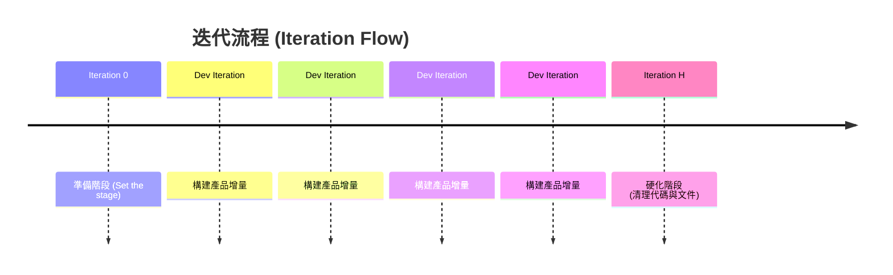

### 迭代的類型 (Types of Iterations)

- **Iteration 0 (零號迭代)**
    - 用於為開發工作奠定基礎 (Set the stage for development efforts)
    - 此階段並不進行實際產品的構建 (Doesn't build anything)
    - 團隊在此階段熟悉工作內容，例如：
        - 決定使用的編碼軟體
        - 確定專案的執行方法/方針

### 開發迭代與硬化迭代 (Development & Hardening Iterations)

- **Development Iteration (開發迭代)**
    - 用於實際構建產品增量 (Build the product increment)
    - 例如 Iteration 1, 2, 3, 4, 5 等
- **Iteration H (Hardening Sprint/Release)**
    - 位於專案末尾的階段
    - **[目的]** 進行代碼清理 (Clean up codes) 與編寫專案文件 (Producing documentation)
    - 強調進行重構 (Refactoring)，以避免專案中累積不良的編碼習慣

### Spikes

- 指的是在迭代結束前進行的短暫研究任務，可能僅需幾個小時的工作量
- **[兩種類型]**
    - **Architectural spike (架構尖峰)**
        - 專門用於進行概念驗證 (Proof of Concept, PoC) 的時段
    - **Risk-Based Spike (風險導向尖峰)**
        - 團隊用來調查並嘗試降低或消除特定風險的方法或技術

### Spikes 的深入理解

- **Architectural spike (架構尖峰)**
    - **[目的]** 用於在正式開始迭代前進行驗證
    - **[解決的問題]** 當團隊不確定某種編程方法是否能成功實現特定功能時使用
    - **[價值]** 在投入大量開發時間（例如兩週）後才發現方法行不通之前，先透過 PoC 確認可行性
- **Risk-Based Spike (風險導向尖峰)**
    - **[目的]** 調查並嘗試降低或消除可能導致專案脫軌 (derail) 的重大風險
    - **[應用場景]** 當專案中存在可能造成毀滅性影響的巨大風險時，團隊會開發出一種方法來應對並評估該風險是否可控

### Risk-Based Spike 的應用實例

- **[核心邏輯]** 在迭代開始前，先測試「應對風險的理論」是否可行
- **[具體場景]** 假設專案存在一個功能失效的重大風險：
    - **風險內容**：主要功能可能無法如預期運作。
    - **應對策略**：準備使用另一個替代函數來達成相同結果。
    - **尖峰任務**：在正式進入開發流程前，先進行風險導向尖峰，驗證這個「替代函數」是否真的能發揮作用。
- **[目的]** 防止在開發過程中，才發現原本預想的應對方案（Secondary function）也無法解決問題，進而導致開發卡關或專案脫軌

### 核心術語

- **Iteration 0** (準備階段)
- **Iteration H** (硬化階段)
- **Architectural Spike** (架構尖峰)
- **Risk-Based Spike** (風險導向尖峰)
- **[核心開發邏輯]** 在正式迭代 (Iteration) 開始前進行 Spike 研究
    - **[目的]** 驗證應對方案的可行性
    - **[流程]** 執行 Spike $

ightarrow$測試結果$

ightarrow$確認替代方案（例如：若主函數失效，確認替代函數確實能發揮作用）$

ightarrow$ 正式進入開發迭代