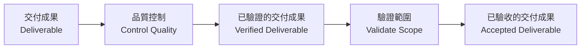

## 驗證範圍 (Validate Scope)

- 一個至關重要的程序，旨在取得專案成果的正式認可
    - 透過此程序，**贊助人 (Sponsor)** 或 **客戶 (Customer)** 會對交付成果進行測試
    - 最終目的是獲得對交付成果的**正式驗收 (Formal Acceptance)**
- **執行時機**
    - 通常發生在完成大部分開發流程之後
    - 包含：啟動 (Initiating)、規劃 (Planning)、執行 (Executing) 以及監控與控制 (Monitoring and Controlling) 的成果產出後

### 交付成果與驗證的關聯

- **直接管理的專案工作 (Directly Managed Project Work)**
    - 這是執行階段 (Executing) 的核心，專注於實際的「工作」內容
    - 此程序的直接產出即為**交付成果 (Deliverable)**
- **驗證範圍 (Validate Scope) 的位置**
    - 雖然在流程圖上可能看起來位置不同，但它是對執行階段產出成果的後續程序
    - 當「直接管理的專案工作」產生交付成果後，隨即進入「驗證範圍」程序，由贊助人或客戶進行測試並給予正式驗收

### 品質控制 (Control Quality) 與 驗證範圍 (Validate Scope) 的差異

- **品質控制 (Control Quality)**
    - **目的**：檢查交付成果是否符合品質要求（正確性、技術規格）。
    - **性質**：這是一個內部的檢查程序，確保工作做對了。
    - **產出**：**已驗證的交付成果 (Verified Deliverable)**
- **驗證範圍 (Validate Scope)**
    - **目的**：與客戶或贊助人一起檢查交付成果，以獲得正式認可。
    - **性質**：這是一個外部的檢查程序，確保成果符合客戶期望。
    - **輸入**：來自品質控制程序的「已驗證的交付成果」。
    - **產出**：**已驗收的交付成果 (Accepted Deliverable)**

#### 概念類比：粉刷房間

為了區分這兩個程序，可以用粉刷房間為例：

1. **品質控制 (Control Quality)**：

    - 當你粉刷完房間後，你會先自己檢查一遍：油漆塗得均勻嗎？有沒有漏掉角落？是否符合品質標準？
    - 這個「自我檢查」的過程就是品質控制。

2. **驗證範圍 (Validate Scope)**：

    - 在你確認自己刷得沒問題後（已驗證的交付成果），你才會請客戶進來檢查，並請他們簽字確認：「沒錯，這就是我想要的」。
    - 這個「請客戶確認」的過程就是驗證範圍。

### 驗證範圍的後續流程

- **已驗收的交付成果 (Accepted Deliverable) 的用途**
    - 作為「結束專案或階段 (Close Project or Phase)」程序的輸入值
    - 一旦獲得正式驗收，專案即可進入結案階段，或將成果移交給營運部門 (Operations) / 下一個階段
- **驗證範圍 (Validate Scope) 的執行時機與性質**
    - **並非全程執行**：雖然在流程圖中可能位於上方，但它實際上是專案末端才進行的程序
    - **執行順序**：通常與「品質控制 (Control Quality)」同時進行，或是緊隨其後
    - **核心任務**：與客戶或贊助人共同審查，確保他們對完成的交付成果感到完全滿意，並取得正式認可

### 流程總結

1. **品質控制 (Control Quality)**：檢查技術正確性 $\rightarrow$ 產出「已驗證的交付成果」。
2. **驗證範圍 (Validate Scope)**：與客戶確認滿意度 $\rightarrow$ 產出「已驗收的交付成果」。
3. **結束專案或階段 (Close Project or Phase)**：使用已驗收的成果進行結案或移交。

### 驗證範圍 (Validate Scope) 的核心工具：檢查 (Inspection)

- **檢查 (Inspection)** 是此程序的關鍵工具
    - 透過對交付成果進行一系列動作，來確認工作是否符合**範圍基準 (Scope Baseline)** 的要求
    - 包含以下具體行為：
        - **測量 (Measuring)**
        - **檢查 (Examining)**
        - **測試 (Testing)**
        - **驗證 (Verifying)**
- **執行者與方式**
    - 由**客戶 (Customer)** 或 **贊助人 (Sponsor)** 執行，因為只有他們能決定交付成果是否真正符合其需求
    - 檢查方式會根據交付成果的性質而異，例如：
        - 測試軟體應用程式的實際功能
        - 檢查牆面粉刷的視覺效果
        - 試駕新開發的汽車
        - 實際觸摸或操作產品的各個部分

### 驗證範圍 (Validate Scope) 的兩種可能結果

在驗證過程中，根據客戶或贊助人對交付成果的滿意程度，會產生截然不同的結果：

#### 1. 符合驗收標準：獲得正式驗收 (Formal Acceptance)

- 如果交付成果符合所有要求，客戶會提供正式的驗收簽署（Sign-off）。
- 這代表客戶承認該交付成果已完成，並符合其預期。

#### 2. 未符合驗收標準：產生變更請求 (Change Request)

- 如果交付成果未達到要求（例如：功能錯誤、速度太慢、顏色不對），則無法獲得驗收。
- **後續行動**：必須提出**變更請求 (Change Request)**，以進行**重做 (Rework)** 並修復產品。
- **影響**：修復過程可能會導致專案需要更多的時間或成本。

#### 變更請求的常見原因範例

- **功能問題**：產品無法正常運作或效能不佳。
- **規格偏差**：例如客戶要求「乳白色 (Off-white)」，但實際刷成「純白色 (White)」或「奶油色 (Cream)」。

### 驗證範圍的產出與追蹤

- **工作績效資訊 (Work Performance Information)**
    - 驗證程序必須產出工作績效資訊，用以更新專案目前的狀態。
    - 這能讓團隊知道：哪些交付成果已經獲得驗收，哪些還在等待或需要修復。
- **多重交付成果的處理**
    - 一個專案通常包含多個交付成果。
    - 驗收是逐一進行的：當其中一個交付成果獲得驗收後，專案即可繼續推進下一個交付成果的工作。
**&#32;**