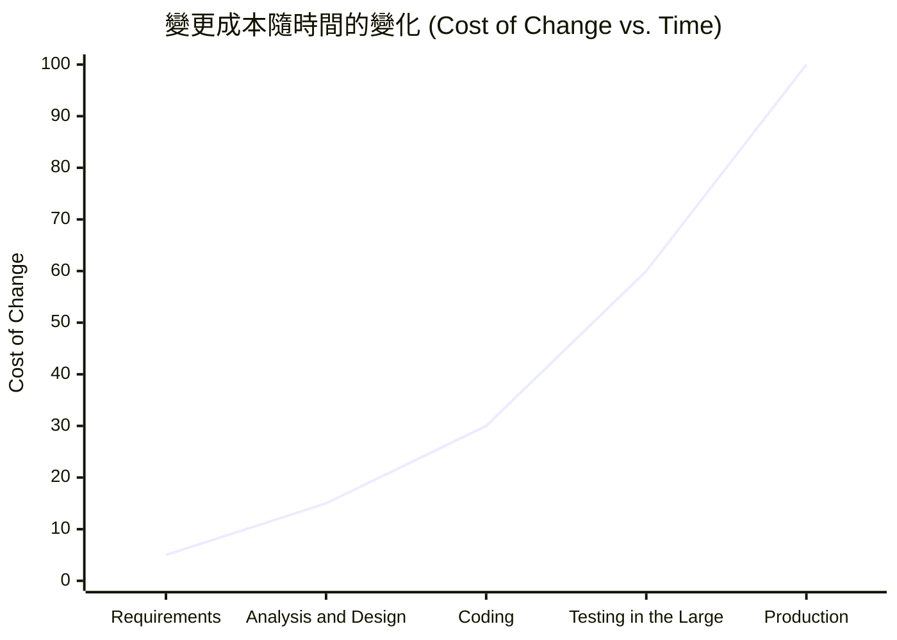
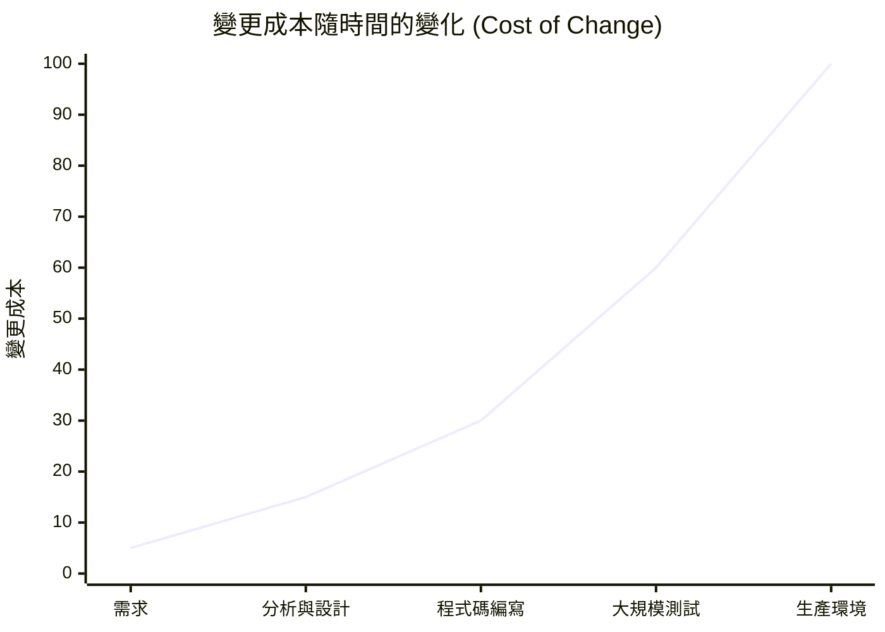

## 增量交付價值 (Delivering Value Incrementally)

- 增量交付是指在專案的整個生命週期中，持續部署產品中可運作的部分
    - 隨著專案進展，持續提供價值，而非等到專案結束才一次性交付
    - 例如：工作三個月後，就可以交付一部分軟體讓使用者開始使用並獲得價值
- **[軟體開發流程]** 交付路徑必須遵循特定順序，以確保品質
    - 首先交付至**測試環境 (Testing Environment)**
    - 接著才交付至**生產環境 (Production)**
- **[為什麼要這樣做？]** 透過這種方式可以儘早發現問題並進行修復，從而減少後續重工 (Rework) 的量
- **[為什麼必須測試？]** 絕對不能在未經測試的情況下發布任何組件、模組或功能
    - 若功能不符合客戶預期，會導致客戶不滿甚至憤怒
- **[測試與重工的關係]** 透過測試可以顯著減少重工 (Rework) 的量
    - 越早發現問題，就能越快進行修復
    - 系統問題發現得越快，修復的速度就越快

### 早期發現問題的效益

- **[案例分析]** 以會計軟體的「應收帳款系統 (Accounts Receivable System)」為例
    - 若在開發三個月後先交付該模組，使用者在幾週內發現 Bug 或功能不符需求，開發者可以立即修復
    - **[對比]** 若等到整個會計系統多年後才發現問題，修復難度會大幅提升
- **[為什麼後期修復更難？]** 因為系統已趨於完整，修改其中一個部分往往必須連帶修改其他已建構好的部分
- **[成本與複雜度的關係]** 隨著專案進度推移，修復問題的成本與難度會隨之增加

### 變更成本隨時間的變化

- **[核心概念]** 隨著專案從初始階段推進到生產階段，變更或修復錯誤的成本會顯著上升
- **[成本趨勢圖]**

- **各階段成本分析**
    - **需求階段 (Requirements)**
        - 成本最低，修改非常便宜
    - **分析與設計階段 (Analysis and Design)**
        - 成本仍維持在相對較低的水平
    - **編碼階段 (Coding)**
        - 成本開始隨著實作進度增加
    - **大規模測試階段 (Testing in the Large)**
        - 成本大幅上升，因為錯誤已被發現但已進入系統整合層面
    - **生產階段 (Production)**
        - 成本達到最高點，修復錯誤或進行變更的代價極其昂貴

### 敏捷開發的核心價值：降低變更成本

- 敏捷開發的核心理念之一，就是能夠更早發現問題與缺陷，並以較低的成本進行修復
- **[變更成本與時間的關係]** 隨著專案進入不同階段，修復錯誤或進行變更的成本會大幅增加

- **各階段成本特性：**
    - **需求階段 (Requirements)**：成本最低，因為此時僅涉及文件或概念的調整
    - **分析與設計 (Analysis and Design)**：成本依然相對較低
    - **程式碼編寫 (Coding)**：成本開始上升
    - **大規模測試 (Testing in the Large)**：成本顯著增加，因為錯誤可能已影響多個模組
    - **生產環境 (Production)**：成本最高，因為此時修復錯誤不僅涉及程式碼，還可能涉及數據損壞、客戶不滿及系統停機等複雜問題