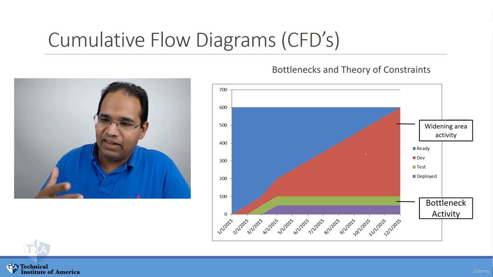
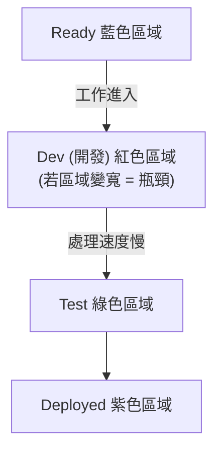

## 累積流向圖 (Cumulative Flow Diagrams, CFD's)

- 是一種堆疊圖表 (Stacked graphs)，用於展示專案工作的進度
- **[主要用途]** 視覺化呈現以下資訊：
    - 專案工作的進展過程
    - 已完成的點數 (Points completed)
    - 已完成的工作量
    - 專案中各個特定階段的工作量分布

### CFD 圖表結構範例

- 圖表縱軸代表工作量（例如範例中起始總量約為 600）
- 圖表橫軸代表時間線
- 透過不同顏色的堆疊區域來區分不同的工作狀態：
    - `Ready` (就緒)
    - `Dev` (開發)
    - `Test` (測試)
    - `Deployed` (已部署)

### 工作流的動態進展

- 隨著專案推進，總工作量會逐漸減少（即「切入」工作量並完成它）
- 工作會依序從各個階段流動：
    - `Ready` (就緒) $\rightarrow$ `Dev` (開發) $\rightarrow$ `Test` (測試) $\rightarrow$ `Deployed` (已部署)
- **[重要考試概念]** CFD 圖表與以下理論密切相關：
    - **瓶頸 (Bottlenecks)**
    - **限制理論 (Theory of Constraints)**

### CFD 的相關理論

- **利特爾法則 (Little's Law)**
    - 曾於 Domain 1 介紹過
    - **[在 CFD 中的應用]** 僅需觀察圖表中的「隊列 (Queue)」，即可判斷工作完成所需的時間
- **瓶頸與限制理論 (Bottlenecks and Theory of Constraints)**
    - 這是考試中必須能夠識別的重要概念
    - 需要透過仔細觀察 CFD 圖表的變化來進行判斷

### 識別瓶頸 (Bottlenecks)

- **[判斷方法]** 觀察圖表中各個顏色區域的「寬度」
    - 區域的寬度代表該階段目前累積的工作量
- **瓶頸的視覺特徵**
    - 當某個階段的區域（例如圖中的紅色 `Dev` 區域）變得越來越寬時
    - 這代表工作在該階段堆積，無法順利流向下一階段
    - **[根本原因]** 該階段的能力不足以處理進入的工作量，形成了限制 (Constraint)

[00:03:25](https://www.udemy.com/course/pmp-certification-exam-prep-course-pmbok-6th-edition/learn/lecture/23858744#questions)

### 識別限制與流動停滯

- **[觀察現象]** 當工作流在特定階段停滯時，代表系統中存在限制 (Constraint)
    - 例如：開發與測試階段仍有工作進行，但最終的部署 (Deployment) 產出卻停止增長
    - 這表示工作卡在測試階段，無法順利流向部署
- **[診斷方法]** 觀察各階段的流動狀態
    - 若上游階段（如 Dev/Test）持續有工作進入或堆積
    - 但下游階段（如 Deployed）的曲線變為水平或停滯
    - 這代表該處為瓶頸，導致整體流程受阻

### 確定瓶頸活動 (Bottleneck Activity)

- **[核心判斷邏輯]** 瓶頸 (Bottleneck) 是指圖表中**沒有變寬**、呈現平坦狀態的活動區域
    - **變寬的活動 (Widening area activity)**：代表工作正在此處堆積，這是瓶頸造成的**結果**
    - **瓶頸活動 (Bottleneck Activity)**：因為無法處理更多工作，導致上游工作被迫堆積，這是造成變寬的**原因**
- **[敏捷開發觀點]** 敏捷是一個「拉動系統 (Pull System)」
    - 當下游階段（瓶頸）無法處理更多工作時，它就不會向開發階段「拉取」新工作
    - 這會導致開發階段的工作量不斷增加，在圖表上呈現出區域不斷變寬的現象
- **範例分析**：
    - 若 `Dev` (開發) 區域不斷變寬 $\rightarrow$ 代表 `Test` (測試) 階段就是瓶頸
    - 因為測試人員無法處理更多工作，導致開發完成的工作無法進入測試階段，進而卡在開發階段。