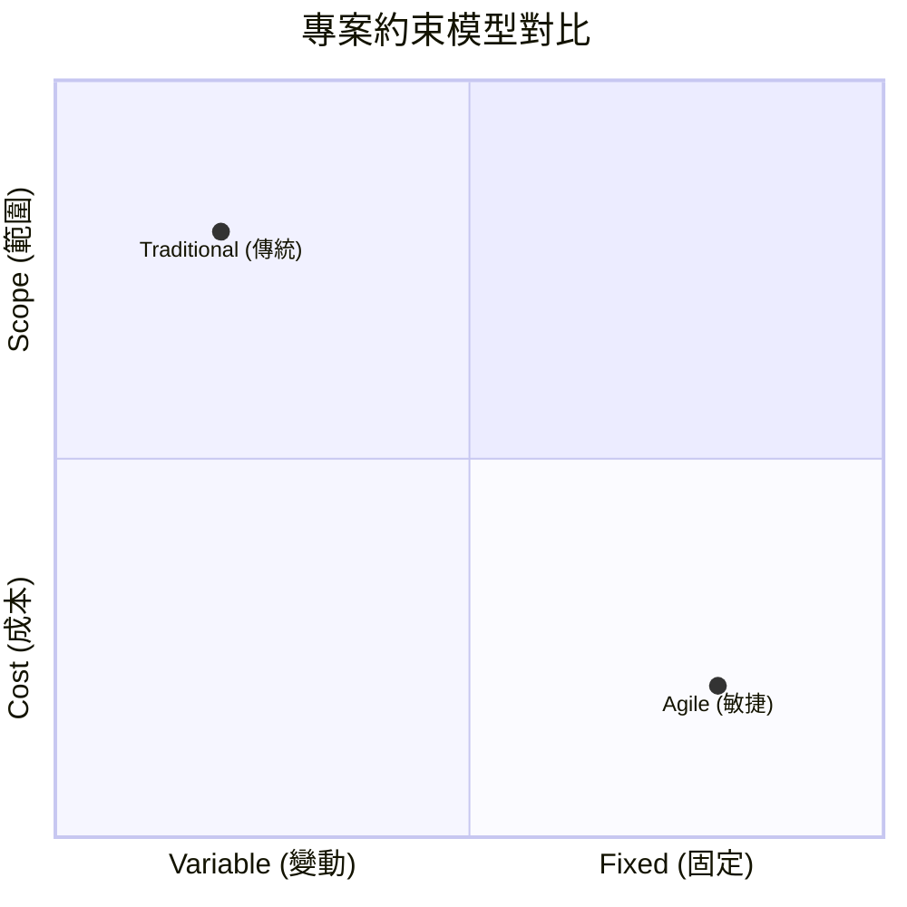

## 翻轉三角形 (Inverting the Triangle)

- 理解敏捷思維 (Agile Mindset) 的核心概念，需要對比傳統專案管理與敏捷開發在約束條件上的差異

### 傳統專案模式 (Traditional Project)

- 範疇 (Scope) 是固定的
- 時間 (Time) 與 成本 (Cost) 是變動的

### 敏捷專案模式 (Agile Scope)

- 範疇 (Scope) 是變動的
- 時間 (Time) 與 成本 (Cost) 是固定的