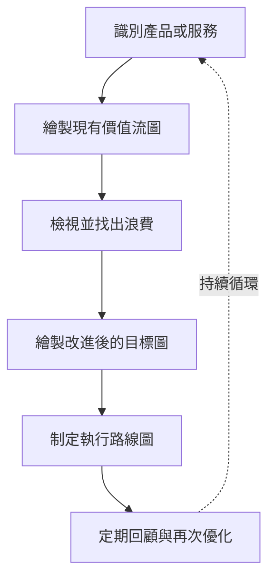
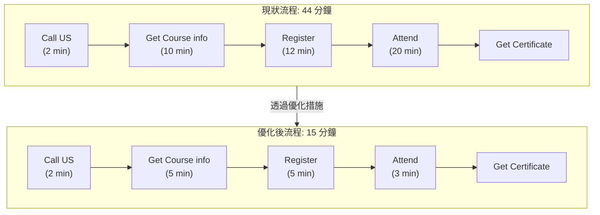

## 價值流圖 (Value Stream Map)

- **核心目的**
    - 優化完成流程時的資訊或材料流動
    - 減少浪費（如等待時間）或不必要的作業
- **基本邏輯**
    - 分析現有流程
    - 找出流程中的浪費或不必要的勞動
    - 移除這些浪費以達成流程優化

### 建立價值流圖的步驟

- **步驟流程**
    - 識別想要優化的產品或服務
    - 繪製現有的價值流圖 (Current State Map)
    - 檢視流程以找出浪費 (Waste)
    - 根據理想的改進目標，繪製新的價值流圖 (Future State Map)
    - 制定執行路線圖 (Roadmap) 以落實修復措施
    - 規劃定期回顧並再次進行優化循環

### 價值流圖實例：學生課程行政流程

透過觀察學生從打電話諮詢到獲得證書的整個行政流程，可以對比優化前後的效率差異。

#### 現狀流程 (Current State)

- **總耗時**：44 分鐘
- **各步驟細節**：
    - Call US：2 分鐘
    - Get Course info：10 分鐘
    - Register：12 分鐘
    - Attend：20 分鐘
    - Get Certificate：(包含在總時內)

#### 優化後流程 (Future State)

- **總耗時**：15 分鐘
- **各步驟細節**：
    - Call US：2 分鐘
    - Get Course info：5 分鐘
    - Register：5 分鐘
    - Attend：3 分鐘
    - Get Certificate：(包含在總時內)

### 流程優化實踐分析

- **優化策略與限制**
    - **無法變動的步驟**：例如「Call US」（撥打電話），因為受限於現有的電話系統運作方式，無法直接縮短時間。
    - **可優化的關鍵點**：例如「Get Course info」（獲取課程資訊）。
        - **改善方法**：與教育銷售人員溝通，要求他們精簡說明內容。
        - **執行邏輯**：避免提供過多冗餘資訊，僅針對學生的需求提供精確資訊，藉此降低溝通成本與等待時間。

### 流程優化實踐分析（續）

- **註冊流程 (Register) 的優化**
    - **優化方法**：將資訊從銷售人員端提前轉移給行政端，實現資訊預傳遞
    - **效果**：避免重複索取相同的資訊，將註冊時間從 12 分鐘縮短至 5 分鐘
- **出席與報到 (Attend) 的優化**
    - **優化方法**：預先填寫所有學生在出席課程時需要填寫的表格
    - **執行邏輯**：學生抵達後不再需要花時間填寫大量表單，只需簽名即可開始課程
    - **效果**：將原本 20 分鐘的行政作業時間大幅縮減至 3 分鐘

#### 優化成果對比

| 流程步驟 | 現狀耗時 (Current) | 優化後耗時 (Future) | 優化手段 |
| --- | --- | --- | --- |
| Call US | 2 min | 2 min | 無法變動 (受限於電話系統) |
| Get Course info | 10 min | 5 min | 精簡銷售人員說明的內容 |
| Register | 12 min | 5 min | 預先轉移資訊，避免重複索取 |
| Attend | 20 min | 3 min | 預填表單，學生僅需簽名 |
| 總計行政耗時 | 44 分鐘 | 15 分鐘 | 大幅提升效率 |