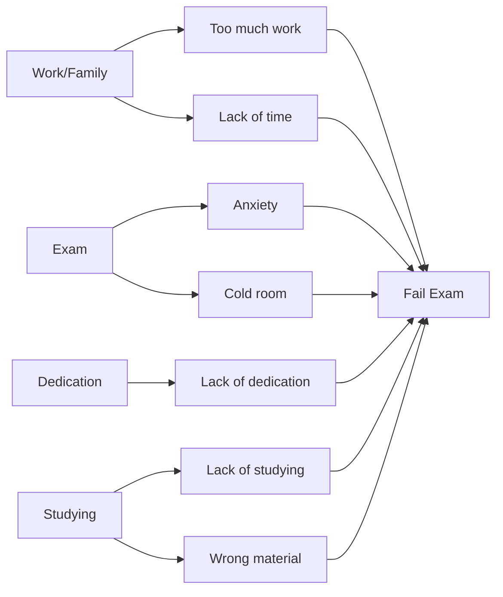
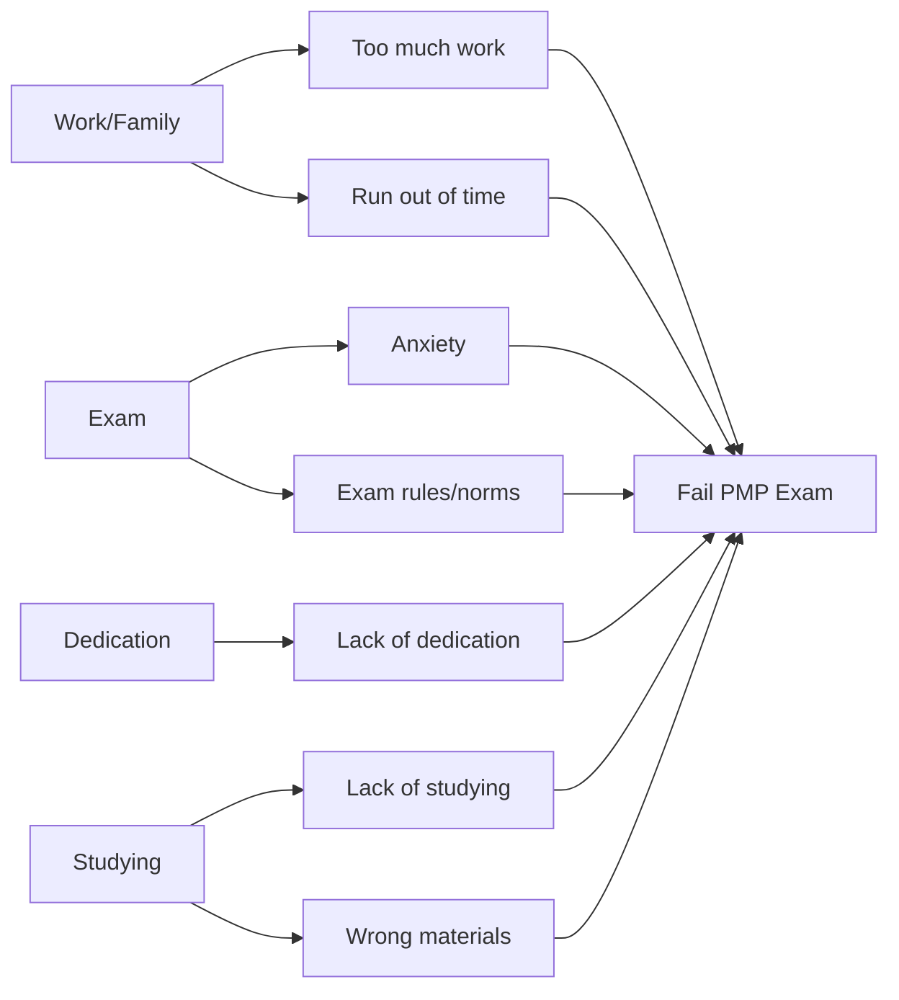

## Retrospectives

- 在每個迭代（Iteration）結束後舉行的特別會議
    - 通常在 Sprint Review（衝刺檢視會議）之後進行
- **核心目的：持續改進（Continuous Improvement）**
    - 檢視並改進團隊的工作方法與團隊合作方式
    - 藉由分析以下面向來提供即時價值：
        - 做得對的地方（What went right）
        - 做錯的地方（What went wrong）
        - 想要增加的做法（What to do more of）
        - 想要減少的做法（What to do less of）
- 建議應設有 2 小時的時間限制

### 回顧會議的階段 (Retrospectives Stages)

- 一場典型的回顧會議大約需要 2 小時
- **[建議流程與時間分配]**：
    - 1. 建立場景 (Set Stage)：約 6 分鐘
        - 讓所有參與者了解會議的目的與要做的事
    - 2. 收集數據 (Gather Data)：約 40 分鐘
        - 從該次衝刺（Sprint）中整理相關資訊
    - 3. 產生洞察 (Generate Insights)：約 25 分鐘
        - 分析數據，探討問題發生的原因
    - 4. 決定行動 (Decide What to Do)：約 20 分鐘
        - 針對發現的問題制定具體的改善方案
    - 5. 結束回顧 (Close Retrospective)：約 20 分鐘
- **注意**：這些步驟與時間分配並非僵化的規定，可以根據實際情況調整

### 回顧會議的時間管理

- **[為什麼要限制時間？]** 因為會議如果拖得太長，隨著時間推移會損失大量的生產力
- **核心原則**：會議應該是「精簡且有效率的 (short and sweet)」
- **建議時長**：大約 2 小時對於完成大量工作已經綽綽有餘

### 階段 1：建立場景 (Set the Stage)

- 回顧會議的開端
- **主要目標**：
    - 幫助參與者集中注意力於當前任務
    - 讓大家進入準備貢獻資訊的心態
    - 概述討論的方法與主題
- **鼓勵早期參與的重要性**
    - 必須在會議開始時就鼓勵每個人參與
    - **[原因]**：如果參與者沒有在早期開始說話，他們之後可能就永遠不會開口了
- **常見活動**：
    - **Check-In**：簡短介紹
    - **Focus On/Focus Off**：確認大家的專注度
    - **ESVP**：讓參與者識別自己的角色（Explorer 探索者、Shopper 購物者、Vacationer 度假者、Prisoner 囚犯）

### ESVP 角色定義

- 透過讓成員誠實識別自己的角色，引導者能更清楚了解整體的參與氛圍
- **四種角色類型**：
    - **Explorer (探索者)**：積極尋求價值，試圖從會議中獲得實質的收穫或改進點
    - **Shopper (購物者)**：隨機參與，看看有沒有感興趣的東西，若沒發現也覺得無妨
    - **Vacationer (度假者)**：純粹想逃離日常工作，把會議當作休息或放空的時間
    - **Prisoner (囚犯)**：被迫參加，手頭還有大量工作，覺得待在會議中是一種束縛，只想趕快結束

### 階段 2：收集數據 (Gather Data)

- **核心目標**：
    - 描繪出前一個衝刺（Sprint）期間發生的完整情景
    - 開始收集可用於後續改進工作的資訊
- **[重要性]**：這是整個回顧流程的基石
    - 必須正確執行此步驟，因為後續階段的所有改進建議都建立在這些數據之上
    - 如果數據收集錯誤，後續產生的洞察與行動方案將會失去意義
- **建議活動 (Activities)**：
    - **Timeline (時間軸)**
    - **Triple Nickels**：將團隊分成 5 組，每組花 5 分鐘收集 5 個想法
    - **Mad, Sad, Glad**：探討團隊在衝刺期間的情緒狀態（憤怒、難過、快樂）

### 收集數據的品質與後續影響

- **[關鍵因果關係]**：數據收集的準確性決定了改進的成效
    - 如果收集的數據不足或不正確，在進入下一個階段時，團隊將會基於錯誤的資訊進行討論
    - 這會導致最終產生的改善方案無法帶來實質的進步

### 階段 2 建議活動：時間軸 (Timeline)

- 這是一個非常重要的活動，用於梳理衝刺期間的事件軌跡
- **執行方式**：
    - 按時間順序排列（例如：第一週、第二週，或第一天、第二天...）
    - 記錄在特定時間點發生的事項，包括：
        - 出現的問題 (Issues)
        - 改進計畫 (Improvement initiatives)
        - 做得正確的事情 (Things that went right)
- **[核心原則]：僅記錄，不分析**
    - 此階段的重點是「寫下發生了什麼事」
    - **不要**在此階段進行過多的分析或探討原因，以免偏離收集數據的初衷

### 階段 2 建議活動：Triple Nickels

- 一種快速收集想法的活動方式
- **執行規則**：
    - 將團隊分成 5 個小組
    - 每組花 5 分鐘的時間
    - 每人收集 5 個想法（例如：在索引卡上寫下衝刺期間發現的 5 個問題）
- **關於分組的彈性**：
    - 「5 組」並非絕對規定，應根據團隊人數調整
    - 例如：若有 10 人，可分成 2 組；若只有 7 人，則可作為單一小組進行

### 階段 2 建議活動：Triple Nickels (運作流程)

- **[操作方式]**：
    - 每個人在索引卡上寫下 5 個在衝刺期間發現的問題
    - 設定 5 分鐘的寫作時間
    - 時間結束後，將卡片傳給右邊的人
    - 接手的人會分析內容，並根據自己的觀察進行補充
- **[輪替機制]**：
    - 這個過程會重複進行 5 次
    - 透過這種「5 人、5 分鐘、5 個想法、重複 5 次」的循環，確保每個人都有機會審視並擴充想法

### 階段 2 建議活動：Mad, Sad, Glad

- **核心目的**：讓團隊識別在衝刺進行期間的情緒狀態
- **內容範疇**：
    - **Mad (憤怒)**：哪些事情讓團隊感到挫折或不滿？
    - **Sad (難過)**：哪些事情讓團隊感到遺憾或失望？
    - **Glad (快樂)**：哪些事情讓團隊感到開心或有成就感？

### 階段 2 建議活動：Mad, Sad, Glad

- 探討團隊在衝刺期間的情緒狀態
- 透過情緒反應來發現可能需要進一步討論的潛在問題

### 收集數據階段的小結

- **Timeline** 與 **Triple Nickels** 是描繪迭代期間具體情況的有效工具

## 階段 3：產生洞察 (Generate Insights)

- **核心目標**：分析在前一個階段（收集數據）中所獲得的數據
- **目的**：幫助團隊理解所發現的事實背後的意義，找出「為什麼」會發生特定問題（例如：為什麼某個專案的軟體會不斷崩潰）

### 建議活動 (Activities)

- **腦力激盪 (Brainstorming)**
    - 讓所有成員坐下來進行集體討論
    - 不同的形式包括：
        - **Free for all**：自由發言形式
        - **Round robin**：輪流詢問每個人，確保每位成員都有發言機會
- **五個為什麼 (Five Whys)**
    - 透過連續追問五次「為什麼」來挖掘問題的根本原因
- **魚骨圖分析 (Fishbone analysis)**
- **點選投票法 (Prioritize with dots)**
    - 使用點選投票技術來進行優先級排序

### 五個為什麼 (Five Whys)

- 一種透過連續追問五次「為什麼」來挖掘問題根本原因的方法
- **[實例演示]：程式功能持續失敗**
    - **問題**：程式功能不斷失敗
    - **為什麼 (1)**：因為我不確定寫法是否正確
    - **為什麼 (2)**：因為我正在參考說明文件，但不確定回傳值是否正確
    - **為什麼 (3)**：因為我只能找到這些說明文件
    - **為什麼 (4)**：因為我沒能找到更多資訊
    - **為什麼 (5)**：因為我沒有權限獲取其他資源
- **[核心價值]**：透過這種方式，團隊可以發現問題並非單純的「程式碼寫錯」，而是背後的「資源獲取限制」等更深層的根本原因

### 五個為什麼 (Five Whys) 的核心價值

- **[最終目標]**：挖掘問題的**根本原因 (Root Cause)**
    - 不僅僅是停留在「程式碼寫錯」這種表面現象
    - 透過不斷追問，可能會發現更深層的組織問題（例如：公司提供的資源不足或員工培訓不完善）

### 魚骨圖分析 (Fishbone Analysis)

- 一種用於分析問題發生原因的工具
- **[運作邏輯]**：
    - 將要解決的問題放在圖表的末端（類似魚頭）
    - 將各種可能導致該問題的因素分類並列出（類似魚骨）
- **[實例演示]：為什麼會考試失敗 (Fail Exam)**
    - 透過魚骨圖可以系統性地列出各種干擾或致敗因素，例如：
        - **工作/家庭 (Work/Family)**：工作過多、缺乏時間
        - **考試本身 (Exam)**：考試焦慮、考場環境（如房間太冷）
        - **投入程度 (Dedication)**：缺乏投入
        - **學習 (Studying)**：缺乏學習、教材不佳

#### 魚骨圖分析實例：考試失敗 (Exam Failure)

- 透過魚骨圖系統性地分析導致特定問題（如考試失敗）的所有可能原因
- **[分析架構範例]**：
    - **工作與家庭 (Work/Family)**
        - 工作過多 (Too much work)
        - 時間不足 (Run out of time)
    - **考試本身 (Exam)**
        - 焦慮 (Anxiety)
        - 考試規則/規範 (Exam rules/norms)
    - **投入程度 (Dedication)**
        - 缺乏投入 (Lack of dedication)
    - **學習狀況 (Studying)**
        - 缺乏學習 (Lack of studying)
        - 使用錯誤的教材 (Wrong materials)

## 階段 4：決定要做什麼 (Decide what to do)

- **核心目的**：針對在前一個階段（產生洞察）中所發現的問題，制定具體的解決方案
- **[目標]**：思考「我們能做什麼來改善下一個迭代」，以確保不再遇到同樣的問題
- **建議活動 (Activities)**：
    - **Short Subjects**
    - **Smart Goals**

### Short Subjects

- 一種讓團隊決定在下一個迭代（Iteration）中採取哪些具體行動的方法
- **[運作方式]**：將討論內容填入四個象限中：
    - **Start doing** (開始做)：新嘗試的行動
    - **Stop doing** (停止做)：應停止的不良習慣或無效流程
    - **Do more of** (多做點)：目前有效且應增加頻率的行為
    - **Do less of** (少做點)：目前存在但應減少的行為
- **[實例演示]**：
    - **Start doing**：開始進行我們的 [某項活動]
    - **Stop doing**：停止進行超過 15 分鐘的每日站立會議 (Daily stand-up meetings)
    - **Do more of**：增加知識共享 (Knowledge sharing)
    - **Do less of**：減少各自為政/孤島作業 (Working in silos)

### Short Subjects 的應用範例

透過四個象限來識別團隊行為的調整方向：

- **減少不當行為**：例如減少與當前工作無關的個人閒聊，避免浪費團隊時間。
- **增加有效行為**：例如發現某些小型會議非常有成效，應將其列入「開始做」或「多做點」的清單中。

### Smart Goals

在制定下一個迭代（Iteration）的行動目標時，目標必須符合「SMART」原則，不能太過籠統：

- **具體 (Specific)**：目標必須明確，避免設定過於寬泛的目標。
- **可衡量 (Measurable)**：目標必須是可以被量化的，以便評估是否達成。

### Smart Goals (續)

為了確保下一個迭代的目標是有效的，除了具體與可衡量之外，還必須符合以下原則：

- **Attainable (可達成)**
    - 目標必須是團隊能夠實現的
    - **[風險]**：如果設定了無法達成的目標，成員會感到挫敗，進而失去嘗試的動力
- **Relevant (相關性)**
    - 目標必須與目前的工作內容或專案目標直接相關
- **Timely (時效性)**
    - 目標必須有明確的時間限制
    - **[錯誤範例]**：「在 10 秒內變成億萬富翁」並非一個具有時效性的目標，因為這在現實中是不可能的

#### 敏捷專案經理的角色

- 在引導團隊制定目標的過程中，敏捷專案經理應扮演引導者 (Facilitator) 的角色
- **[核心任務]**：在團隊提出任何目標時，經理應不斷自我檢視並詢問：「這是一個符合 SMART 原則的目標嗎？」

## 階段 5：結束回顧會議 (Close the Retrospective)

- **核心目的**：正式結束回顧會議，並對「回顧會議本身」的過程進行反思
- **[重要性]**：確保團隊成員真正感受到這次會議對他們是有益且有價值的
    - 由於回顧會議是週期性的（通常在下一個 Sprint 結束後，約 1 到 4 週後再次進行），確保每次會議的品質至關重要

### 建議活動 (Activities)

- **Plus/Delta (加號/增量分析)**
        - 建立兩個欄位來進行反思：
                - **Plus (+)**：團隊應該「多做點」什麼 (What the team will do more of)
                - **Delta (**$\Delta$**)**：團隊應該「少做點」什麼 (What the team will do less of)

### 確保回顧會議的價值轉化

- **[關鍵策略]**：在結束會議時，必須讓團隊成員感受到這次會議是有益且有價值的
    - 如果團隊能看到回顧會議帶來的實質改變，他們在下一次（通常是 1 到 4 週後）會更期待參與
- **落實 Plus/Delta 的重要性**
    - 在進行 Plus/Delta 活動（劃分「多做點」與「少做點」兩個欄位）後，**下一個 Sprint 的執行力是關鍵**
    - 必須確保團隊在下個階段確實落實了這些決策
    - **[因果關係]**：落實行動 $\rightarrow$ 看見效益 $\rightarrow$ 認可回顧會議的價值 $\rightarrow$ 提升未來參與度

### 回顧會議的正向循環

- **[關鍵成功因素]**：引導過程 (Facilitation) 與 價值的體現
- **[理想狀態]**：當團隊成員能從會議中看見實質價值時：
    - 他們會主動思考下一次回顧的內容
    - 可能在 Sprint 還沒結束（例如進行到一半）時就開始期待下一次會議
    - 會參與得更愉快，並從此形成每輪迭代都在持續改進的良性循環