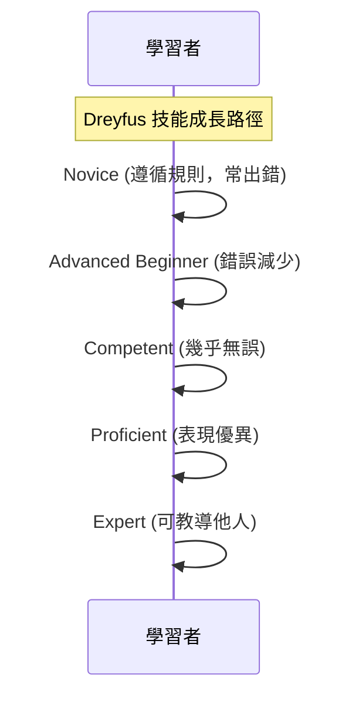

## 技能掌握模型

### Shu-Ha-Ri 模型 (Shu-Ha-Ri Model of Skill Mastery)

- **Shu (守)**: 遵循與服從
    - 在學習新技能（例如程式設計）的初期，會嚴格遵守所有規則與語法
    - 完全依照教材、教學影片或他人的指示來操作，不自行變動

### Dreyfus 成人技能習得模型 (Dreyfus Model of Adult Skill Acquisition)

- 描述技能隨時間演進的階段：
    - **Novice (新手)**: 學習初期，嚴格遵守規則
    - **Advanced Beginner (進階初學者)**
    - **Competent (勝任者)**
    - **Proficient (精通者)**
    - **Expert (專家)**
- **Ha (破)**: 開始脫離規則
    - 嘗試新事物，例如組合不同的功能
- **Ri (離)**: 找到自己的路徑
    - 發展出屬於自己的方法或使用特定程式語言的方式來撰寫程式

## Dreyfus 成人技能習得模型 (Dreyfus Model of Adult Skill Acquisition)

描述技能隨時間獲得的過程，包含五個階段：

1. **Novice (新手)**

    - 嚴格遵循所有規則
    - 對如何處理事情不太確定，可能會出錯幾次

2. **Advanced Beginner (進階初學者)**

    - 錯誤率開始降低

3. **Competent (勝任)**

    - 工作中幾乎不再出錯

4. **Proficient (精通)**

    - 表現優異，被他人視為高手

5. **Expert (專家)**

    - 達到最高境界，甚至可以開始教導他人

### 成人技能習得模型 (Dreyfus Model of Adult Skill Acquisition)

- **Dreyfus 模型**: 描述成人如何從初學者成長為專家
    - **Novice (初學者)**: 剛開始學習，依賴規則
    - **Advanced Beginner (高級初學者)**: 開始有少量經驗
    - **Competent (勝任者)**: 能獨立處理問題
    - **Proficient (熟練者)**: 具備整體視野
    - **Expert (專家)**: 憑直覺操作，無需刻意思考規則