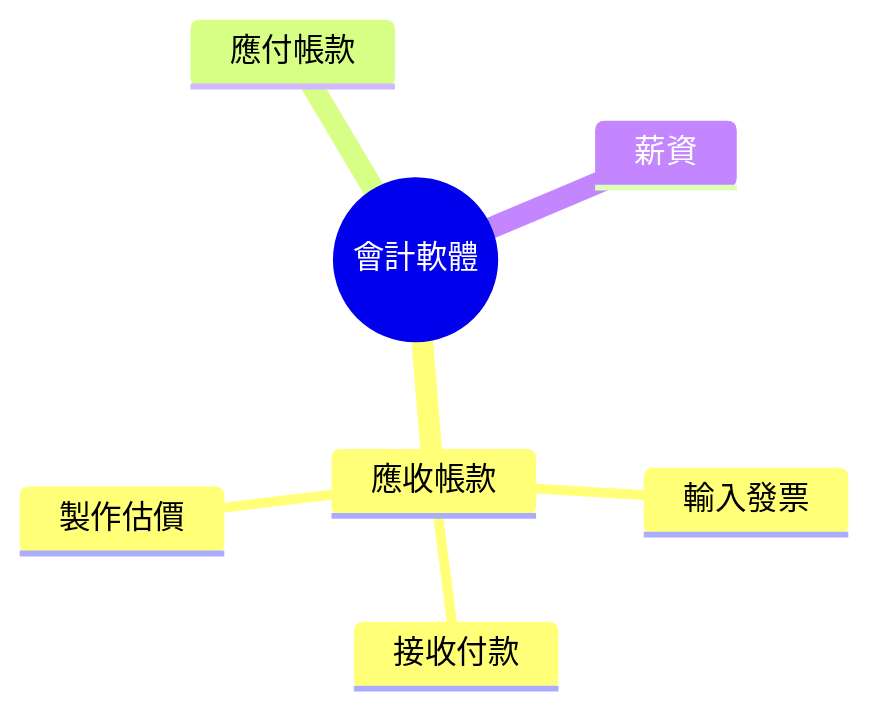

### 收集需求的重要性

- **在專案詳細規劃前必須先正確收集需求**
    - 規劃包括：時程、預算、資源管理、採購、風險等
    - 目的：真正了解利害關係人想要什麼
- **沒有需求就無法進行後續工作**
    - 無法建立時程
    - 無法設定預算
    - 無法評估可能影響的風險
    - 無法決定聘請供應商
    - 甚至無法確定與利害關係人互動方式
- **範例**：翻新廚房專案
    - 若不知具體需求，所有規劃皆無法進行

### 收集需求（Collect Requirements）

- **流程定義**：確定、記錄和管理利害關係人需求與要求，以達成專案目標
    - 對專案整體成功扮演關鍵角色
- **為何重要**：專案時程、預算、風險因素、品質規格與資源規劃皆與需求緊密連結
    - 需透過本流程工具確定需求：如與利害關係人對話、腦storm、展示原型等
- **收集原則**：必須蒐集正確且詳細的需求
    - 越詳細的需求越能確保後續規劃準確

### 收集需求（Collect Requirements）ITTO

- **輸入（Inputs）**：專案章程、專案管理計畫、專案文件、商業文件、協議、企業環境因素、組織程序資產
- **工具與技術（Tools and Techniques）**：
    - 專家判斷（Expert Judgment）
    - 資料蒐集（Data Gathering）
    - 資料分析（Data Analysis）
    - 決策（Decision Making）
    - 資料呈現（Data Representation）
    - 人際與團隊技能（Interpersonal and Team Skills）
    - 上下文圖（Context Diagram）
    - 原型（Prototypes）
- **輸出（Outputs）**：
    - **需求文件（Requirements Documentation）**：記錄需求細節
    - **需求追溯矩陣（Requirements Traceability Matrix）**：追蹤需求來源，非常重要

### 收集需求（Collect Requirements）ITTO（續）

- **工具與技術（Tools and Techniques）**（續）
    - **資料收集（Data Gathering）**
        - **標竿分析（Benchmarking）**：用於涉及效能的專案
            - 基準為必須達成的效能數字，例如 **0.5 秒**
            - 範例：手機指紋辨識登入，從放置指紋到解鎖的時間
    - **資料分析（Data Analysis）**
        - 分析文件、協議、政策、提案或商業計畫
- **工具與技術（Tools and Techniques）**（續）
    - **資料收集（Data Gathering）**（續）
        - **標竿分析（Benchmarking）**：用於涉及效能的專案
            - 基準為必須達成的效能數字，例如 **0.5 秒**
            - 範例：手機指紋辨識，從放置指紋到解鎖的時間
                - 若達 **0.3 秒** 則優於基準
                - 基準如同最低要求，至少需達到
    - **資料分析（Data Analysis）**
        - 分析文件、協議、政策、提案或商業計畫
- **工具與技術（Tools and Techniques）**（續）
    - **資料分析（Data Analysis）**
        - 分析文件、協議、政策、提案或商業計畫
        - **目的**：從這些文件中提取需求
            - 範例：作為供應商收到客戶提案
                - 客戶提案、組織政策、未來商業計畫皆可提供需求資訊
- **工具與技術（Tools and Techniques）**（續）
    - **資料呈現（Data Representation）**
        - **思維導圖 / 心智圖（Idea / Mind Mapping）**：腦力激盪收集的想法繪製在一起
            - 目的：發現新的考量與概念變體
        - **親和圖（Affinity Diagram）**：將大型想法分組並分類
            - 目的：便於進一步審查與分析
- **資料來源延伸**：客戶提案、協議、商業計畫皆可提供需求
    - 範例：作為供應商收到客戶提案，即可從中提取客戶想要的內容
    - 協議如已簽訂合約、商業計畫指開發產品的方式
- **工具與技術（Tools and Techniques）**（續）
    - **資料表示（Data Representation）**
        - **心智圖 / 想法圖（Idea / Mind Mapping）**：透過腦力激盪聚集想法，並連結起來發現新考量與概念變異
            - **目的**：將散亂想法組織成流程路徑
            - **範例**：開發會計軟體
                - 應收帳款（Accounts Receivable）：輸入發票、接收付款、製作估價
        - **親和圖（Affinity Diagram）**：將大型想法分組並排序，以便進一步審查與分析
            - 顯示階層結構：頂層標籤 → 次層標籤 → 單點

- **工具與技術（Tools and Techniques）**（續）
    - **人際與團隊技能（Interpersonal and Team Skills）**
        - **觀察/對話（Observations/Conversations） - 工作影子（Job Shadowing）**：觀察個人在環境與工作場所的表現
            - 記錄工作、雜務與任務的執行方式
        - **情境圖（Context Diagrams）**：視覺化展示業務流程、其他系統與人員之間的互動
        - **原型（Prototypes）**：產品的工作模型
            - 利害關係人可互動並提供回饋，說明如何更改產品以更好滿足需求
            - 提供專案完成時最終產品的檢視與感覺
- **親和圖提醒**：親和（affinity）代表分組，將大型想法分組排序以利審查分析
    - 腦力激盪後用以組織想法
- **工具與技術（Tools and Techniques）**（續）
    - **人際與團隊技能（Interpersonal and Team Skills）**（續）
        - **觀察/對話（Observations/Conversations） - 工作影子（Job Shadowing）**：實際範例
            - 專案經理安裝**電話系統**，觀察銷售或會計部門人員工作
            - 會計部門**Mary**抱怨：「我沒辦法合併這兩個通話」
            - 由此提取需求：電話系統需具備**合併通話**功能
- **工具與技術（Tools and Techniques）**（續）
    - **人際與團隊技能（Interpersonal and Team Skills）**（續）
        - **情境圖（Context Diagrams）**：視覺化展示業務流程、其他系統與人員之間的互動
            - 顯示業務流程如何運作與流動
        - **原型（Prototypes）**：產品的工作模型
            - 利害關係人可互動並提供回饋，說明如何更改以更好滿足需求
            - 提供專案完成時最終產品的視野與感受
            - **考試重點**：常見考題
- **原型（Prototypes）**（續）
    - **實際範例**：汽車製造
        - 製作**概念車**給利害關係人檢視
        - 回饋：太大、太長、太快、太慢、座椅舒適度、方向盤大小
    - **軟體開發範例**
        - 展示軟體外觀與功能
        - 客戶回饋：不喜歡畫面設計、移動按鈕位置、調整標誌位置
        - **目的**：透過互動調整以更好滿足需求，提供最終產品預覽
- **原型優點**：讓利害關係人實際操作產品，提供改變意見
    - 非常適合收集客戶需求
- **產出（Outputs）**
    - **需求文件（Requirements Documentation）**：記錄個別需求如何執行，以及每個需求為何必要
        - 最少用 **Excel 表格** 記錄所有需求
        - **範例**：廚房翻新，不能只寫「硬木地板」，需詳細說明
        - **組件包括**：
            - 利害關係人與業務需求
            - 驗收標準
            - 品質需求
            - 專案目標
            - 組織影響
            - 法規或道德遵循
            - 需求假設與限制

### 需求文件詳細範例

- **廚房翻新硬木地板**
    - 不能只寫「**硬木地板**」，需詳細說明
        - 材質：竹子？花崗岩？大理石？瓷磚？
        - 厚度：一英寸？半英寸？四分之一英寸？
    - **原則**：越詳細越能確保專案成功
- **需求文件（Requirements Documentation）**（續）
                - **驗收標準（Acceptance Criteria）**：專案完成時，利害關係人確認「已做好」或「已完成」的條件
                    - 可能為視覺檢查
                    - 可能為效能測試，例如電子商務網站能否執行一系列交易
                    - 利害關係人需簽署文件確認工作完成
                - **注意**：清單為「可能包含」（may），非一定包含，最低限度記錄需求
- **驗收標準（Acceptance Criteria）**（續）
    - 客戶指定的**測試**，團隊需達成以確認「已完成」
        - **電子商務網站範例**：能將商品**加入購物車**、**結帳付款**，款項存入帳戶
            - 驗證**庫存系統**、**付款結帳**、**信用卡系統**運作
    - **超級跑車範例**：達到**每小時 300 英里**即滿足**最低要求**
    - **原則**：團隊查看並達成此標準，即知專案完成
- **需求文件（Requirements Documentation）**（續）
    - **品質需求（Quality Requirements）**：若未呈現或呈現草率會讓人感到不滿的項目
        - **範例**：油漆房間時，不要滴漆到地板、一邊顏色比另一邊深
    - **品質之父**：**愛德華·戴明（Edward Deming）**
        - **品質終極測試**：客戶滿意度（customer satisfaction）
- **需求文件（Requirements Documentation）**（續）
    - **品質需求（Quality Requirements）**（續）
        - 若不存在或執行不當時，讓客戶不開心的項目
        - **範例**：
            - 手機運行**太慢**，破壞品質 → 需求為**快速效能**
            - 電子郵件系統**太慢** → 影響發送郵件範圍
    - **專案目標（Project Objectives）**：專案要達成什麼
    - **組織影響（Organizational Impacts）**：對組織的正面或負面影響
    - **法規或道德遵循（Legal or Ethical Compliance）**
    - **需求假設與限制（Requirements Assumptions and Constraints）**
- **法規或道德遵循（Legal or Ethical Compliance）**
    - 組織中特定領域專案（如**醫療保健**、**金融**）需遵守大量法規
        - 幾乎所有醫療保健專案需經**監管流程**批准
        - **範例**：開發產品或藥物需監管批准
    - **建築業範例**：需經過**建築師**審核並獲得批准
    - **目的**：確保專案符合法律與道德要求
- **需求文件（Requirements Documentation）**（續）
    - **需求假設與限制（Requirements Assumptions and Constraints）**
        - **範例**：安裝網路時，假設現有網路線路良好，不需升級
        - **目的**：列出假設與限制，避免範圍問題
- **需求追溯性矩陣（Requirement Traceability Matrix）**
    - 一旦建立需求，即建立表格連結需求回其**來源**
    - **用途**：協助管理**專案範圍變更**
    - **追蹤項目**（不限於）：
        - 提供該需求的**原始利害關係人**
        - **為何加入該需求**
        - **需求描述**
        - **目前狀態**：已完成、進行中、延遲、已取消等
- **需求追溯性矩陣（Requirement Traceability Matrix）**（續）
    - **實際製作**：使用 **Excel** 表格
        - 列出所有需求
        - 記錄**來源**：誰提供的原始利害關係人
            - **範例**：Bob 給的、Mary 給的、Jane 給的
            - 或來自**文件**
    - **最低要求**：寫下需求及其來源，即完成基本連結
    - **矩陣形式**：表格（matrix generally means table），也可直接寫出
    - **目的**：連結需求回來源，幫助管理範圍變更
- **需求追溯性矩陣（Requirement Traceability Matrix）**（續）
    - **追蹤項目細節**（不限於前述）：
        - **為何加入該需求**：即使非利害關係人直接提供
            - **範例**：安裝**伺服器軟體**需額外**硬體**或**伺服器軟體** → 衍生成新需求
        - **需求描述**：詳細說明
        - **目前狀態**：追蹤專案進度（如已完成、進行中）
    - **文件作用**：揭示需求**來源**（誰給、為何加、從何來）
        - **重要性**：管理專案範圍變更
    - **製作方式**：**Excel**表格，記錄所有需求及其來源
        - **最低要求**：需求 + 來源（如 Bob、文件）
- **收集需求實際執行者**
    - 通常**不是**專案經理獨力完成，而是與**業務分析師（Business Analyst）**合作
        - **業務分析師角色**：從**業務角度**分析需求，並透過流程完成需求
    - **合作流程範例**：
        - 共同收集所有需求
        - 制定**需求文件**
        - 建立**需求追溯矩陣**
        - 全程追蹤需求，並驗證**需求是否已完成**
- **收集需求流程重要性**
    - **正確執行**：詳細收集需求 → **專案100%成功**
    - **錯誤執行**：未收集正確需求 → **專案幾乎注定失敗**
    - **原因**：需求決定專案成敗，需花時間強調
- **業務分析師（續）**
    - 與專案經理**合作**執行收集需求
    - 後續課程將深入業務分析