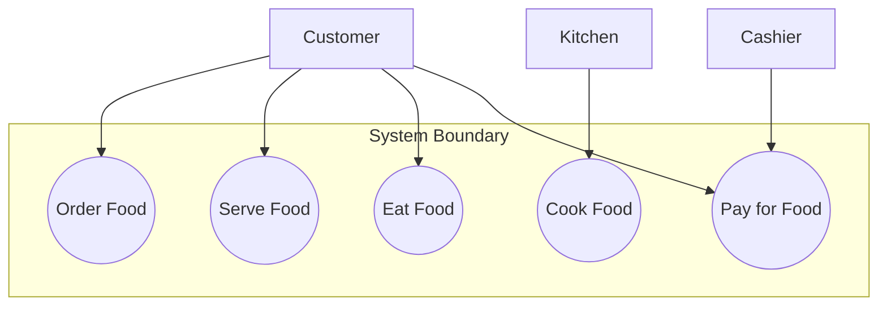

## 敏捷建模 (Agile Modeling)

- 目的：使用不同的建模技術來建立「共同願景 (shared vision)"
    - 幫助開發團隊與客戶達成共識
    - 明確定義「完成的定義 (definition of done)"
    - 確保團隊理解客戶真正的需求
- 核心原則：應保持輕量化 (lightweight)
    - 追求「僅維持足夠 (barely sufficient)" 的程度
    - 避免過於複雜的建模過程

### 使用案例圖 (Use case diagrams)

- 用途：視覺化呈現使用者將如何使用某個應用程式
- 範例結構：

### 使用案例圖的特性

- 核心概念：一種「低技術、高接觸 (low tech, high touch)」的視覺化呈現方式
    - 透過圖表直觀地展示使用者如何操作特定的應用程式
- 適用範圍廣泛
    - 例如在餐廳系統中，可以定義服務生點餐、廚師製作食物、顧客用餐以及收銀員收款的流程
    - 在會計系統中，可以定義會計人員或應收帳款員如何建立發票、發送發票或接收付款

### 資料模型 (Data Models)

- 用於展示資料如何在表格中進行結構化，以及這些表格之間的關係
- **組成要素**：
    - **表格 (Tables)**：儲存資料的容器
    - **欄位 (Fields/Columns)**：表格中的特定屬性（例如：姓名、地址、電話號碼等）
    - **關聯 (Relationships)**：定義不同表格之間的連結方式
- **範例說明**：
    - 在客戶與訂單的系統中，一個「客戶」記錄可以對應多個「訂單」記錄（一對多關係）
    - 根據提供的視覺範例，資料結構如下：

| Customer (客戶表) | Address (地址表) |
| --- | --- |
| Customer Number | Street |
| Social Security Number | City |
| First Name | State |
| Surname | Country |
| Salutation | Zip Code |
| Phone Number |  |
|  | 註：兩表之間存在關聯 (has) |

> **提示**：資料模型對於資料庫設計師 (Database Designers) 與資料庫程式設計師 (Database Programmers) 來說非常重要，但在一般的考試中可能不會深入考查細節。

### 畫面切換：螢幕設計 (Screen Design)

### 螢幕設計 (Screen Design)

- 透過視覺化方式展示應用程式或報表的呈現樣貌
- **實作方式**：
    - 可以非常簡單，例如直接在紙上進行手繪草圖
    - 也可以使用專門的應用程式來設計完整的螢幕介面
- **核心價值**：
    - 使用者通常是視覺導向的，他們關注的是介面呈現，而非後端的程式碼
    - 提供簡單的螢幕截圖（Simple screen shots）能幫助客戶更直觀地理解最終產品的樣子

### 線框圖 (Wireframes)

- 被稱為「低保真原型 (low-fidelity prototyping)」
- 產品的快速模型 (Quick mock-up)
- **主要用途**：
    - 釐清「完成 (done)」後的樣子
    - 在正式執行開發前，先驗證設計方法與方向
- **特性**：
    - 不需要實際的程式碼 (no coding)
    - 僅用於展示介面結構與按鈕配置等基本元素

### 互動流程模擬 (Interaction Flow Simulation)

- 透過展示點擊特定按鈕後會出現什麼畫面，來呈現頁面間的轉換
    - 例如：點擊按鈕 A $ightarrow$ 出現畫面 B $ightarrow$ 點擊按鈕 B $ightarrow$ 出現畫面 C