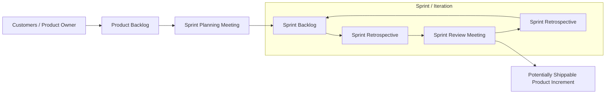

## Agile Terms

- **Product Owner**: Designated person that represents the customer on the project
- **Agile Project Manager/Scrum Master**: Manages the agile project
- **Product Backlog**: Project requirements from the stakeholders
- **Sprint Planning Meeting**: Meeting done by the agile team to determine what features will be done in the next sprint
- **Sprint Backlog**: Work the team selects to get done in the next sprint
- **Sprint**: A short iteration where the project teams work to complete the work in the sprint backlog (1-4 weeks typical)
- **Daily Stand Up Meeting**: A quick meeting each day to discuss project statuses, led by the Scrum Master. Usually 15 minutes
- **Sprint Review**: An inspection done at the end of the sprint by the customers
- **Retrospective**: Meeting done to determine what went wrong during the sprint and what when right. Lesson learned for the sprint.
- **Partial Completed Product**: Customers Demo the product and provides feedback. This feedback adjust the next Sprint priorities
- **Release**: Several Sprints worth of work directed to operations for possible rollout and testing

> Sprint = Iteration

## Exam Tip: Agile Roles

- 考試時，`Agile Project Manager` 與 `Scrum Master` 常被視為同義詞，可互換使用。

### Scrum 與 Extreme Programming (XP) 的術語對應

- **Sprint** (Scrum) 與 **Iteration** (Extreme Programming) 為可互換的術語
- 相關術語的對應關係：
    - Sprint Backlog = Iteration Backlog
    - Sprint Planning = Iteration Planning
    - Sprint Review = Iteration Review

### Scrum 與 Extreme Programming (XP) 術語對照

- 考試時，Scrum 與 Extreme Programming (XP) 的術語可能會互換使用
- **核心概念對照表**:

| Scrum 術語 | Extreme Programming (XP) 術語 |
| --- | --- |
| Sprint | Iteration |
| Sprint Backlog | Iteration Backlog |
| Sprint Planning | Iteration Planning |
| Sprint Review | Iteration Review |

- **術語來源**:
    - `Sprint` 是來自於 Scrum 的說法
    - `Iteration` 是來自於 Extreme Programming 的說法

### Agile 流程圖解

- **Agile 流程循環**:
    - 從 **Product Owner** 提供需求（Product Backlog）開始
    - 經過 **Sprint Planning** 決定工作內容（Sprint Backlog）
    - 進入 **Sprint / Iteration** 的循環週期
    - 週期結束後包含 **Sprint Review** 與 **Retrospective**
    - 最終產出 **Potentially Shippable Product Increment** (潛在可交付的產品增量)

### 實例：會計軟體開發與 Product Backlog

- **情境**
    - **目標**：為會計部門開發一套新的會計軟體。
    - **原因**：取代現有的 Excel 表格，提供完整且有效的管理功能。
- **Product Backlog（產品待辦清單）**
    - **定義**：由 **Product Owner**（代表客戶/會計部門）撰寫。
    - **內容**：包含客戶想要的所有功能與需求（例如：會計軟體應具備的各項特性）。
    - **角色**：作為後續 Sprint 規劃的輸入來源。

### Product Backlog 實例：會計系統

- **情境**：開發一套會計軟體系統。
- **產品待辦事項清單 (Product Backlog)**：將利益相關者提出的所有功能需求加入清單中，例如：
    - **應收帳款系統**：
        - 建立發票 (Enter an invoice)
        - 支付發票 (Pay invoices)
        - 接收付款 (Receive payments)
    - **應付帳款系統**：
        - 輸入帳單 (Enter bills)
        - 支付帳單 (Pay bills)
    - **銀行帳戶管理**：
        - 追蹤支票帳戶與儲蓄帳戶 (Track checking and savings accounts)
        - 對帳 (Reconcile them)
    - **報表功能**：
        - 列印報表 (Print reports)
        - 產生損益表 (Produce profit and loss statements)

### Agile 流程實例分析：會計軟體開發

- **情境設定**：為會計部門開發一套新的會計軟體，以取代目前不夠完善的 Excel 工作表。
- **建立 Product Backlog**：
    - 由 **Product Owner**（代表客戶）收集所有功能需求並記錄在 Product Backlog 中。
    - **範例需求**：
        - 應收帳款系統 (Accounts Receivable)：處理發票與帳單。
        - 應付帳款系統 (Accounts Payable)：輸入並支付帳單。
        - 銀行帳戶追蹤與對帳系統 (Checking/Savings Account Tracking & Reconciliation)。
        - 報表列印功能 (Reporting)。
    - 在此實例中，假設 Product Backlog 中共有 20 個不同的功能需求。
- **Sprint Planning Meeting**：
    - Agile 團隊會針對 Product Backlog 中的需求進行會議。
    - **目的**：決定在下一個 Sprint 中，團隊有能力完成多少項功能需求。
    - 經過會議後，選出的工作內容將轉化為 **Sprint Backlog**。

### Sprint 的執行細節

- **Sprint 的持續時間**
    - 通常為 1 到 4 週的工作量
    - 因為時間有限，團隊無法在單個 Sprint 中完成 Product Backlog 中的所有功能（例如實例中的 20 個功能）
- **Product Backlog 的排序邏輯**
    - **依價值優先排序 (Prioritized by Value)**
    - 排序基準是客戶認為最具價值的特性
    - 這種優先順序決定了哪些功能會先被納入 Sprint Planning 並執行

// 延續前文關於會計軟體開發實例的討論

### Product Backlog 的排序與角色

- **依價值優先排序 (Prioritized by Value)**
    - Product Backlog 中的功能並非隨機列表，而是根據客戶認為的價值高低進行排序
    - **範例**：在會計軟體中，「應收帳款系統 (Accounts Receivable)」可能被排在最前面，因為它是公司賺錢的核心功能（例如：處理發票與收款）
    - 這種排序確保團隊在每個 Sprint 中優先處理對客戶最有價值的需求
- **Product Owner 的核心職責**
    - **優先級決定者**：Product Owner 負責對 Product Backlog 進行優先順序的排序 (Prioritize)
    - **考試重點**：若題目問「誰負責決定 Product Backlog 的優先順序？」，答案就是 **Product Owner**

### Sprint Planning Meeting 的執行邏輯

- **工作選擇方式**
    - 團隊會從 Product Backlog 的**頂端 (Top)** 開始查看功能
    - 這是因為 Product Backlog 已根據價值進行了排序，頂端即為最具價值的需求
    - 團隊會評估每個功能的規模（例如：某個功能很大，某個功能較小），並決定在下一個 Sprint 中能承擔多少工作量
- **Team Velocity (團隊速率)**
    - **定義**：團隊用來預測自己在一個 Sprint 中實際能完成多少工作的指標
    - **用途**：在 Sprint Planning 時，團隊根據過去的經驗（之前的 Sprint/Iteration）來判斷本次可以承擔的工作量範圍

### Daily Stand-up Meeting 核心問題

- 每位團隊成員必須回答以下三個關鍵問題：

    1. **昨天做了什麼？** (What did you do yesterday?)
    2. **今天計畫做什麼？** (What do you plan to do today?)
    3. **是否有任何阻礙？** (Do you have any impediments?)

- **Agile 團隊規模**
    - 避免過大的團隊（例如 50 人）
    - **原因**：團隊人數過多會導致會議耗費過長時間，降低效率
    - 理想的團隊規模應維持在較小的範圍內（具體數字將在後續內容討論）

// 延續前文關於 Sprint 執行細節的討論

### Sprint 結束後的流程

- **Sprint 的完成**
    - 在 Sprint 週期內（例如 4 週），團隊成員持續進行開發並透過每日站立會議（Daily Stand-up Meeting）保持溝通。
    - 當 Sprint 週期結束且開發工作完成後，接下來的步驟是與客戶進行互動。
- **客戶檢視 (Customer Inspection)**
    - 隨著 Sprint 即將結束，團隊會邀請客戶參與，以便對開發成果進行檢視。

// 延續前文關於 Sprint 執行細節的討論

### Sprint Review Meeting (Sprint 檢視會議)

- **目的**：在 Sprint 週期結束時，向客戶展示已完成的工作成果。
- **運作方式**：
    - 團隊向客戶展示（Demo）在該 Sprint 中開發出的功能或產品增量。
    - **範例**：展示會計軟體中的應收帳款功能、客戶資料表單或發票佈局。
- **獲取回饋 (Feedback Loop)**：
    - 客戶會根據展示內容提供意見，例如：「看起來不錯」、「佈局不喜歡」或「按鈕位置需要調整」。
    - **核心價值**：透過客戶的直接回饋，團隊可以調整下一個 Sprint 的優先順序，確保開發方向符合客戶需求。

---

### Sprint Retrospective (Sprint 回顧會議)

- **執行時機**
    - 在 Sprint 結束，且客戶離開（完成 Sprint Review）之後進行
- **核心目的：經驗教訓 (Lessons Learned)**
    - 團隊成員坐下來進行內部討論，檢視開發過程中的表現
    - **討論重點**：
        - 我們哪些地方做得對？ (What did we do right?)
        - 我們哪些地方做得不夠好？ (What did we do wrong?)
        - 在下一個 Sprint 中，我們應該增加哪些做法？ (What do we want to do more of?)
        - 在下一個 Sprint 中，我們應該減少哪些做法？ (What do we want to do less of?)
- **價值**
    - 透過反思，團隊可以不斷改進工作流程、設計方式或溝通模式，以提升未來的開發效率。

### 潛在可交付產品增量與發行 (Release)

- **單個 Sprint 產出的侷限性**
    - 在單個 Sprint 中完成的功能可能不足以構成一個完整的、可立即使用的產品
    - **實例說明（會計系統）**：
        - **Sprint 1**：僅完成客戶資料表單 (Customer Form) 與資料表。雖然可以輸入客戶，但還無法進行任何後續業務，因此**不可發行 (Not Shippable)**。
        - **Sprint 2**：完成發票設計 (Invoice Design) 與發票系統。雖然有了客戶與發票，但還無法處理收款，因此**依然不可發行**。
        - **Sprint 3**：完成收款功能 (Receive Payment)。
- **發行 (Release)**
    - **定義**：將多個 Sprint 的工作成果組合在一起，形成一個可以交付給營運部門進行部署與測試的版本
    - **關係**：一個 Release 可能需要結合 2 個、3 個甚至更多個 Sprint 的成果才能達成

### Product Backlog 的動態特性

- **清單長度並非單向遞減**
    - 常見誤解：如果原本有 20 個需求，執行完 2 個 Sprint 後，清單應該只剩 18 個。
    - **實際情況**：清單長度可能會增加。
- **需求持續增加的原因**：
    - 在團隊執行 Sprint 的過程中，**Product Owner** 或**客戶**會不斷加入新的功能需求或調整需求。
    - **範例**：原本有 20 個需求，執行完 2 個需求後，若客戶又新增了 4 個需求，Product Backlog 的總量反而會變成 22 個。

// 延續前文關於發行 (Release) 的討論

### Agile 流程的靈活性與持續改進

- **允許變更 (Allows Changes)**
    - Agile 流程的核心優勢在於能夠因應需求的變化而調整
    - **範例**：在執行過程中，Product Owner 可能發現了 4 個新的需求
        - 原本的 Product Backlog 有 20 個項目，加入新需求後變為 22 個
        - Product Owner 會對這 22 個項目重新進行**優先級排序 (Reprioritize)**
- **循環往復的開發模式**
    - 團隊在新的 Sprint Planning Meeting 中，會再次從 Product Backlog 的頂端開始評估
    - 由於之前的 Sprint 可能已經完成了較大的功能，下一個 Sprint 可能會承接不同數量（例如 4 個）的需求
    - 這種「規劃 $\rightarrow$ 執行 $\rightarrow$ 檢視 $\rightarrow$ 回顧 $\rightarrow$ 重新規劃」的循環會不斷重複，直到產品完成為止

// 延續前文關於發行 (Release) 的討論

### Agile 專案何時結束？

- **常見問題**：由於 Product Backlog 可以不斷加入新需求，人們常問「Agile 專案到底什麼時候才算完成？」
- **結束的標準**：Agile 專案並非在功能全部完成時結束，而是當**時間與預算耗盡時** (When you've run out of time and money)
    - 例如：專案預計執行一年，一年期滿且預算用罄時，專案即告結束
    - 這種特性強調了 Agile 在固定資源限制下，優先交付最高價值功能的重要性
- **結束的標準**：Agile 專案並非在功能全部完成時結束，而是當**時間與預算耗盡時** (When you've run out of time and money)。
    - 當專案資源（時間/預算）有限，且後期功能的**邊際價值**（Marginal Value）不再顯著時，專案即告結束。