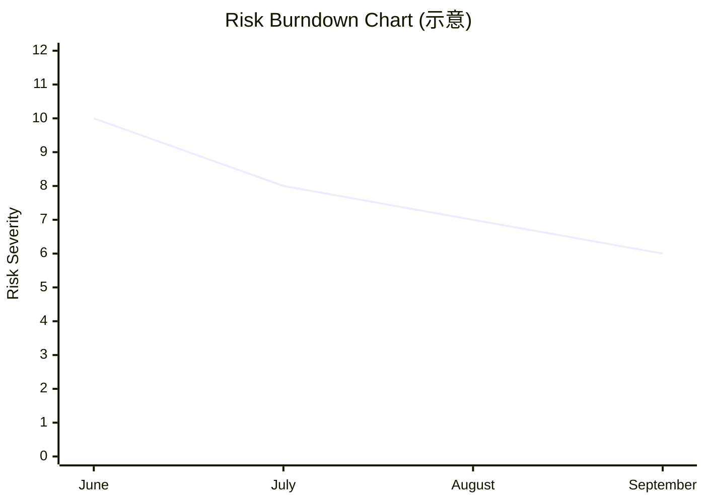
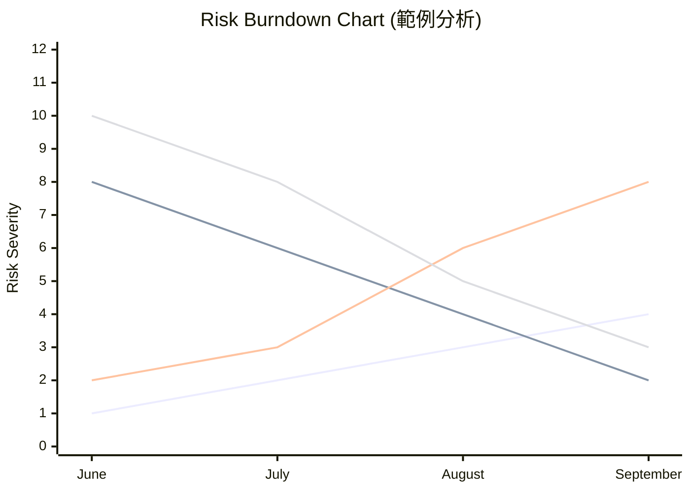

Risk

### 風險量化與評估

- **風險嚴重程度 (Risk Severity)**
    - 計算方式：`Risk Probability x Risk Impact` (風險機率 $\times$ 風險影響)
    - 通常使用數字量表進行評估 (例如 1-5 分)
- **期望貨幣價值 (Expected Monetary Value, EMV)**
    - 計算方式：\`Impact($) x Probability(%)` (金額影響$\\times$ 機率)
- **風險調整後待辦清單 (Risk Adjusted Backlog)**
    - 在完成風險應對 (Risk Response) 後，根據風險情況對待辦清單進行調整

### 期望貨幣價值 (Expected Monetary Value, EMV)

- 計算方式：\`Impact($) x Probability(%)` (金額影響$\\times$ 機率)
- 用途：評估潛在的財務影響成本
- 備註：此公式在 PMP 考試中較少出現，但仍需了解其概念

### 期望貨幣價值 (Expected Monetary Value, EMV) 的應用

- **[用途]** 用於對風險進行排名 (Ranking)
- **範例比較**
    - **風險 A**
        - 影響 (Impact): 10,000 dollars
        - 機率 (Probability): 10%
        - EMV: 1,000 dollars
    - **風險 B**
        - 影響 (Impact): 50,000 dollars
        - 機率 (Probability): 5%
        - EMV: 2,500 dollars
- **結論**
    - 雖然風險 B 的影響金額較小（機率較低），但其 EMV (2,500 dollars) 高於風險 A (1,000 dollars)，因此在風險排名中，風險 B 的優先級更高。

### 風險排名方法 (Ranking Risks)

- 除了使用 EMV，也可以使用**數字量表 (Number Scale)** 來進行評估與排名
    - 例如使用 1 到 5 的評分制
    - 計算方式：`Probability (1-5) x Impact (1-5)`
- **[範例比較]**
    - **地震 (Earthquake)**
        - 機率 (Probability): 1
        - 影響 (Impact): 5
        - 風險評分: $1 \\times 5 = 5$
    - **大雪暴 (Big Snowstorm)**
        - 機率 (Probability): 3
        - 影響 (Impact): 3
        - 風險評分: $3 \\times 3 = 9$
    - **結論**：雖然地震的影響力極大，但從評分來看，雪暴的風險排名 (9) 高於地震 (5)。
- **[總結] 敏捷風險管理的核心流程**

    1. 識別風險 (Identify Risk)
    2. 了解其對專案的影響 (Know the Impact)

### 風險燃盡圖 (Risk Burndown Chart)

- **定義**：一種用來顯示專案中風險嚴重程度 (Risk Severity) 隨時間變化的圖表
- **核心功能**：觀察風險水平如何隨著專案進度而降低或變化

- **[用途]** 追蹤風險管理的效果，確保風險總量在專案生命週期中趨於下降

### 風險燃盡圖 (Risk Burndown Chart) 的深度觀察

- **[核心觀察]** 風險嚴重程度 (Risk Severity) 的變化反映了不同風險在專案生命週期中的「影響力權重」
- **[圖表範例分析]** 觀察不同風險項隨時間的趨勢：
    - **離岸資源簽證 (Visa of offshore resources)**
        - 在專案初期具有最高的嚴重程度 (Severity)
        - 因為初期人員到位與否對專案進度有決定性影響
    - **伺服器準時交付 (Delivery of servers on time)**
        - 初期嚴重程度較低
        - 隨著專案推進，若伺服器未能如期抵達，其對專案的衝擊 (Impact) 會大幅上升
    - **開發人員到位 (Availability of Expert Developers)**
        - 專案初期的重要性極高
        - 隨著專案接近尾聲，開發人員不足對整體進度的影響相對減輕
- **[總結]** 風險燃盡圖不僅是追蹤風險總量，更揭示了**特定風險在不同專案階段對專案成功的關鍵影響力**

### 風險燃盡圖案例 (Risk Burndown Chart Examples)

- **核心概念**：不同風險在專案不同階段的嚴重程度 (Risk Severity) 會隨時間變化
- **圖表圖例解讀 (Legend Interpretation)**
    - **資金短缺 (Funds Shortage)**：在專案初期可能並非最嚴重的風險
    - **離岸資源簽證 (Visa of offshore resources)**：在專案初期可能具有極高的嚴重程度
    - **伺服器交付 (Delivery of servers on time)**：初期影響較小，但隨著時間推移，若伺服器未準時到達，其風險嚴重程度會大幅上升
    - **開發人員可用性 (Availability of expert developers)**：在專案初期對專案的影響極大，但到了專案後期，其影響力相對較小

- **[考試重點]** 必須理解此圖表是用來呈現風險如何隨時間影響專案的實際過程