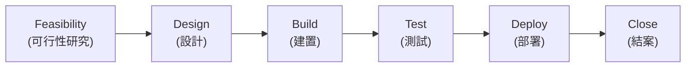

### 發展方法與生命週期績效領域

- 聚焦於交付工作時的**發展方法**選擇
    - 決定最適合交付該工作的**方法**與**生命週期**
- 範例選擇：
    - **敏捷方法** (Agile)
    - **傳統方法** (Traditional)
    - **混合方法** (Hybrid)
    - 依工作需求選擇何種最適合

### 領域定義與關鍵元素

- **領域處理**：開發方法、**交付節奏** (delivery cadence) 及專案生命週期階段相關活動與功能
    - **交付節奏**：專案可交付成果的時機與頻率
- **預期成果**：
    - 正確的**開發方法**
    - 從專案開始到結束連結業務與利害關係人價值的**專案生命週期**
    - 由各階段組成、促進所需交付節奏與開發方法的**專案生命週期**

### 交付節奏細節

- **開發方法類型**：**預測型** (Predictive)、**敏捷方法** (Agile)、**混合方法** (Hybrid)
- **交付節奏**定義：專案可交付成果的**時機**與**頻率**
    - 某些專案**一次性交付**可交付成果
    - 某些專案（如適應型敏捷專案）在一段時間內**分批次**或**增量**交付可交付成果
- **交付節奏範例**：依專案性質決定交付頻率
    - 造車專案：**無法分批交付**，須完整交付（如底盤、輪子、座椅、方向盤不能分開）
    - 軟體專案：**可分批交付**，先給一個模組讓團隊使用，再建第二模組
- **領域成果重點**：選擇**正確的發展方法**
    - 需**與團隊合作**決定
- **專案交付類型**：單一交付、多次交付或週期性交付
    - 依專案性質決定，如造車為單一，軟體可多次
- **開發方法定義**：專案生命週期中用於建立與演進**產品、服務或成果**的手段
- **三種常見開發方法**：
    - **預測型方法** (Predictive approach)
    - **適應型方法** (Adaptive approach)，包含**迭代式** (iterative) 與**增量式** (incremental)
    - **混合型方法** (Hybrid approach)
- **交付方式決定因素**：依製作內容決定能否分批交付
    - **房屋建造範例**：無法分批交付
    - 不能蓋一半房子就讓人入住，再蓋其餘樓層
    - 需完整結構才能取得許可證或入住證明（如紐約地區）
    - 對比先前軟體或造車：某些產品必須**一次性交付**
- **開發方法細分**：
    - **預測式方法** (Predictive approach)
    - **適應式方法** (Adaptive approach)
        - **迭代式** (Iterative)：持續建構交付物直到正確，**單次交付**
        - **增量式** (Incremental)：**分塊交付**多個區塊
    - **混合式方法** (Hybrid approach)：**預測式/傳統**與**適應式**的組合
- **後續學習**：第六章**敏捷實踐指南**深入探討敏捷方法
- **影響開發方法選擇的因素**：
    - **產品、服務或結果**：
        - 創新程度 (Degree of innovation)
        - 需求確定性 (Requirements certainty)
        - 範圍穩定性 (Scope stability)
        - 變更容易度 (Ease of change)
        - 交付選項 (Delivery options)
        - 風險 (Risk)
        - 安全要求 (Safety requirements)
        - 法規 (Regulations)
    - **專案**：
        - 利害關係人 (Stakeholders)
        - 時程限制 (Schedule constraints)
        - 資金可用性 (Funding availability)
    - **組織**：
        - 組織結構 (Organizational structure)
        - 文化 (Culture)
        - 組織能力 (Organizational capability)
        - 專案團隊規模與地點 (Project team size and location)

### 開發方法選擇因素範例

- **創新的程度**：
    - 高創新專案（如全新產品）需**多次迭代**，**敏捷專案**聞名於此
- **需求的確定性**：
    - **不確定性**導向**敏捷方法**
    - **確定性**導向**傳統方法**
- **範圍穩定性**：範圍穩定導向傳統方法
- **變更容易度**：
    - 軟體專案可接受**多變更**，適合敏捷
    - 摩天大樓建造**不易變更**
- **交付選項**：依需求決定交付方式
- **風險、安全需求**：
    - 高安全需求適合**傳統方法**，確保按計畫進行
- **法規**：
    - 嚴格法規選傳統
    - 寬鬆法規可選敏捷
- **專案因素**：
    - **利害關係人**
    - **時程限制**
    - **資金可用性**
- **組織因素**：
    - **組織結構**
    - **文化**
    - **組織能力**
    - **專案團隊規模與地點**
- **組織因素範例**：
    - **組織結構與文化**：有些組織只用**傳統方法**，不喜歡敏捷
    - **組織能力**：決定適合的方法
    - **專案團隊規模與地點**：多元化團隊可能適合傳統或敏捷，視團隊文化而定
- **專案生命週期階段**：階段的類型與數量依多項因素決定
    - **生命週期範例**：

        - 先評估**可行性**，再設計產品、建置、測試、部署，最後結案專案
- **生命週期階段決定**：由**專案經理與團隊**決定，依專案需求調整類型與數量
    - 每個專案生命週期**獨一無二**
- **軟體專案適用範例**：先前流程（可行性 → 設計 → 建置 → 測試 → 部署 → 結束）
- **建築專案範例**（如摩天大樓） :
    - 收集**需求**
    - **設計**建築
    - **建置**結構
    - 取得**入住許可**
    - **專案完成**
- **績效領域檢查表格**：用來驗證領域執行正確性
    - **成果1**：**開發方法對專案交付項目是可靠的**
        - **檢查點**：交付項目的開發方法（**預測式**、**混合式**或**適應式**）反映了**產品變數**，並且適合該**專案和組織**
    - **成果2**：**專案生命週期包含從專案開始到結束，將業務和利害關係人連結至價值的各個階段**
        - **檢查點**：專案從開始到結束的工作在專案階段中有所體現
    - **成果3**：**專案生命週期階段，有助於建立交付項目所需的交付節奏和開發方法**
        - **檢查點**：開發、測試和部署的節奏在生命週期階段中有所體現
- **沒有絕對對錯**：無論哪種專案，都需自問**最佳開發方法**（**敏捷**、**傳統**、**混合**）及內含**生命週期**為何
    - 同一產品A，我選**敏捷**、你選**傳統**，最終皆可完成相同成果
- **最佳方式**：依專案特性決定，無標準答案
- **沒有絕對對錯**：同一產品不同人可選**敏捷**或**傳統**，最終皆達相同結果
- **最佳方法標準**：使**利害關係人滿意**、**產生價值**、**交付成果**
    - 勿詢問「最佳方式」，而是選擇**利害關係人視為有價值**的方法
- **原則提醒**：**聚焦價值**，選能提供價值的開發方法
- **重要性**：選錯開發方法會導致**不足**（inadequate），對任何專案至關重要