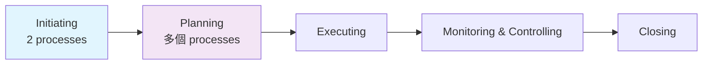
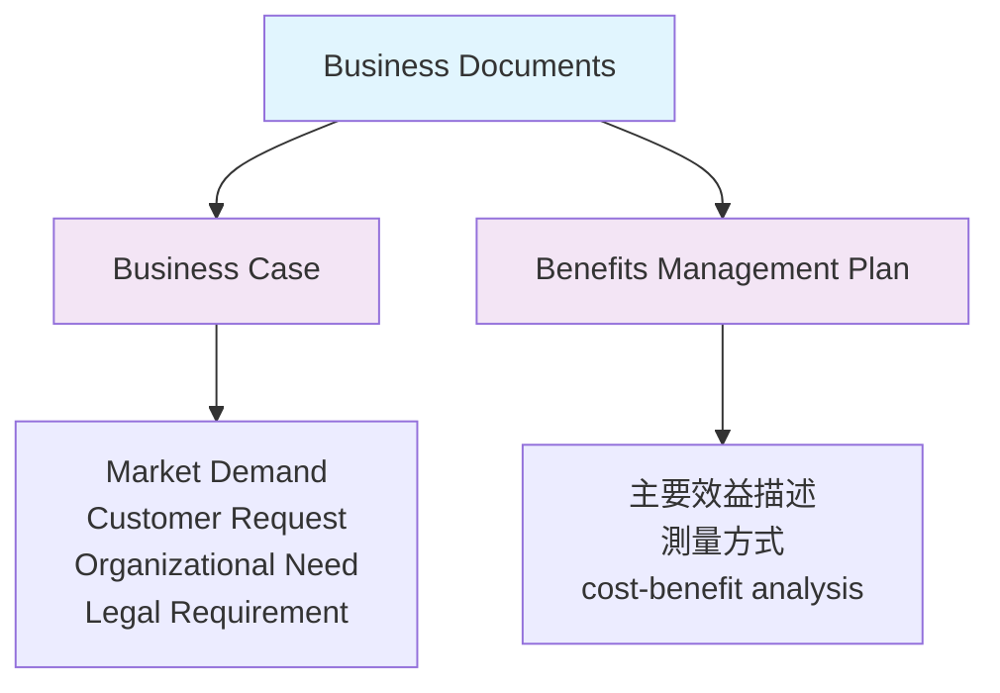
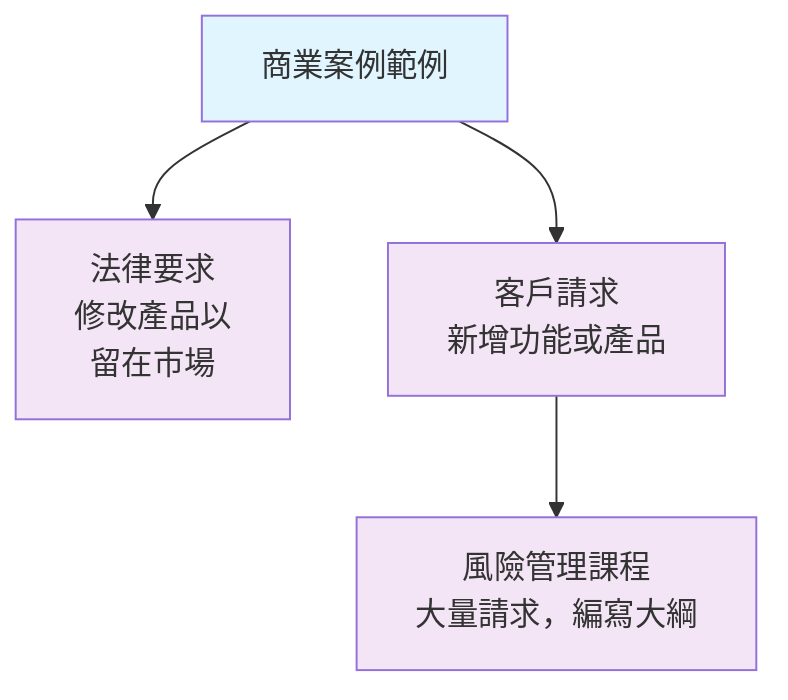
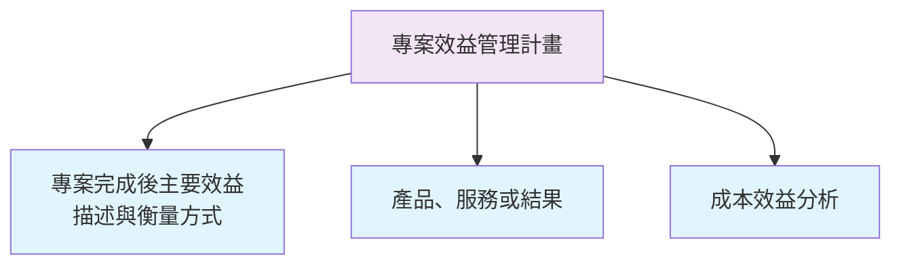
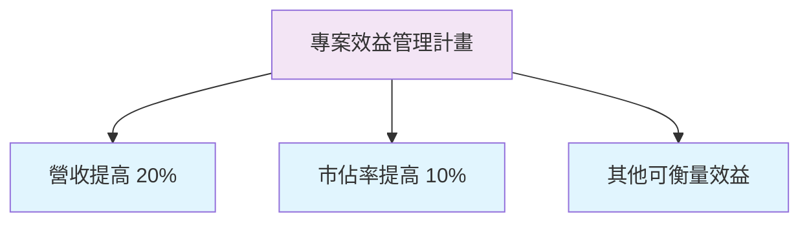
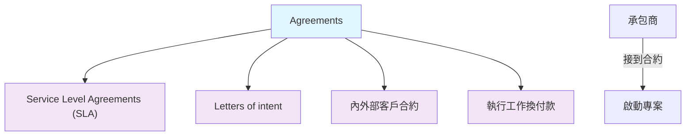
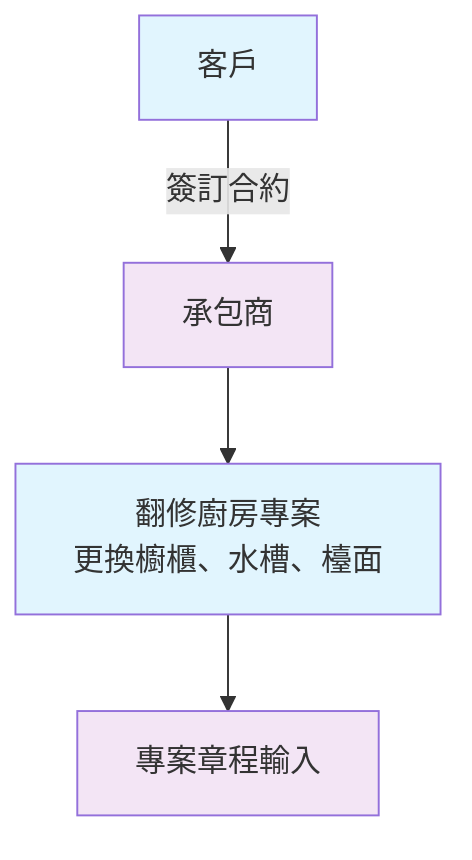
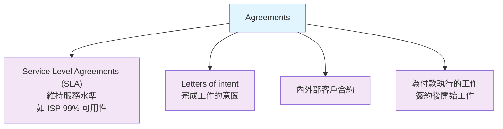
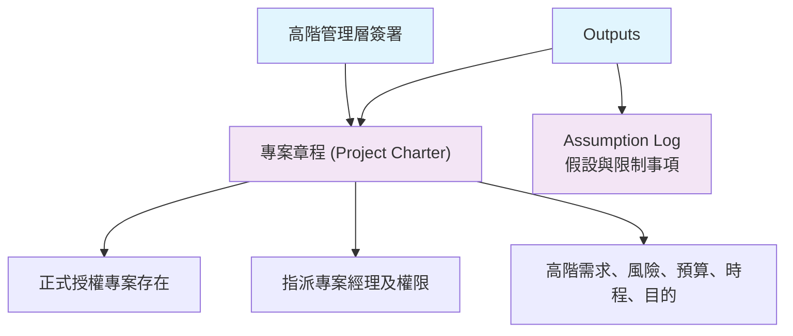

### 專案管理流程群概述

- **啟動階段 (Initiating)**：兩個流程
    - **發展專案章程 (Develop Project Charter)**：本影片重點
    - **識別利害關係人 (Identify Stakeholders)**：下一影片
- **規劃階段 (Planning)**：多個流程，逐一深入探討
    - Plan Scope Management
    - Collect Requirements
    - Define Scope
    - Create WBS
    - Plan Schedule Management
    - Define Activities
    - Sequence Activities
    - Estimate Activity Durations
    - Develop Schedule
    - Plan Cost Management
    - Estimate Costs
    - Determine Budget
    - Plan Quality Management
    - Plan Resource Management
    - Estimate Activity Resources
    - Plan Communications Management
    - Plan Risk Management
    - Identify Risks
    - Perform Qualitative Risk Analysis
    - Perform Quantitative Risk Analysis
    - Plan Risk Responses
    - Plan Procurement Management
    - Plan Stakeholder Engagement
- **總流程數**：49個，涵蓋執行 (Executing)、監控與控制 (Monitoring & Controlling)、結束 (Closing) 階段

### ITTO 涵蓋原則

- 不會完整列出每個流程的所有 **輸入（Inputs）**、**工具與技術（Tools & Techniques）**、**輸出（Outputs）**
    - 只聚焦 **主要輸入**、**主要工具**、**主要輸出**
- 共同項目不重複說明
    - 例如 **expert judgment**（專家判斷）：找 **subject matter expert**（主題專家）協助
        - 不論用在 **develop schedule**（制定排程）、**develop project charter**（制定專案章程）或其他流程，都一樣
        - 目的：用專家幫助完成該流程

### 開發專案章程 (Develop Project Charter)

- **流程定義**：開發一份文件以正式授權專案或階段
    - 概述 **專案目標**
    - 定義 **專案經理的權威**
    - 授權專案經理整合資源到專案活動中
    - 批准後正式啟動專案
- **實際意義**：獲得管理層許可後，才能消耗組織資源（如資金、人力、工程師時間）
    - 無許可即不能使用企業資源
- **專案章程內容**：概述專案將完成的事項
    - 例如「paint this room」（粉刷房間）、「build this building」（建樓）或「develop this application」（開發應用程式）
- **專案經理權威**：章程定義其權限
    - 明確賦予整合資源到專案活動的能力

### 開發專案章程 (Develop Project Charter) - 權限與啟動細節

- **指定專案經理權威**：例如指明「Bob負責此專案」或「Mary負責此專案」，並定義其權限
    - 賦予專案經理將資源整合到專案活動的能力
- **資源消耗條件**：無管理層批准，不能在組織中花錢或使用資源
    - 批准的專案章程正式啟動專案

### 開發專案章程 ITTO

- **輸入 (Inputs)**
    - Business Documents
    - Agreements
    - Enterprise Environmental Factors
    - Organizational Process Assets
- **工具與技術 (Tools & Techniques)**
    - **Expert Judgment**
    - Data Gathering
    - Interpersonal and Team Skills
    - Meetings
- **輸出 (Outputs)**
    - Project Charter
    - Assumption Log

### 開發專案章程 ITTO - 獨特輸入說明

- **共同ITTO不重複**：組織程序資產 (**Organizational Process Assets**)、**Expert Judgment**、**Data Gathering**、**Interpersonal and Team Skills**、**Meetings** 等已在先前說明
    - 重溫相關影片即可
- **此流程獨特輸入**：聚焦 **Business Documents** 和 **Agreements**
    - 這些是開發專案章程特有的，接下來詳細涵蓋

### 開發專案章程 ITTO - Business Documents 詳細說明

- **Business Documents**：包含啟動專案的具體資訊，解釋「為何該做此專案」
    - 目的是說服組織提供資源（如資金），因為企業內有多個專案競爭
    - 兩個主要文件：
        - **Business Case**（商業案例）：判斷專案是否值得投資的必要資訊
            - 來源包括 **Market Demand**（市場需求）、**Customer Request**（客戶請求）、**Organizational Need**（組織需求）、**Legal Requirement**（法律要求）
        - **Benefits Management Plan**（效益管理計畫）：描述專案完成後的主要效益、測量方式
            - 效益可能是產品、服務或結果
            - 可透過 **cost-benefit analysis**（成本效益分析）建立
- **Assumption Log**：每個專案都應有的輸出，記錄專案假設

### 開發專案章程 ITTO - 業務文件 (Business Documents)

- **業務文件**：包含特定資訊，說明為何應啟動專案
    - 主要兩份文件：**商業案例 (Business Case)** 和 **專案效益管理計畫 (Project Benefits Management Plan)**
- **商業案例**：決定專案是否值得所需投資的必要資訊
    - 考量因素：**市場需求**、**客戶請求**、**組織需求**、**法律要求**
    - 範例：因新法規要求，產品需增加安全措施，故需啟動專案
- **專案效益管理計畫**：描述專案完成後將產生的主要效益，以及如何衡量這些效益
    - 專案效益可為**產品**、**服務**或**結果**
    - 創建方式：進行**成本效益分析**

### 開發專案章程 ITTO - 商業案例範例

- **商業案例範例**：證明專案值得投資的具體情境
    - **法律要求**：新法規要求修改現有產品，才能繼續留在市場上
    - **客戶請求**：大量客戶要求新增特定功能到現有產品，或加入產品組合
        - 例如公司內多人要求開發**風險管理課程**，正編寫課程大綱並啟動專案
- 這些範例顯示**Business Case**如何說服組織選擇此專案，提供資源

### 開發專案章程 ITTO - 專案效益管理計畫詳細說明

- **專案效益管理計畫 (Project Benefits Management Plan)**：描述專案完成後將產生的主要效益，以及如何衡量這些效益
    - 效益可為**產品**、**服務**或**結果**
    - 創建方式：進行**成本效益分析 (cost-benefit analysis)**

- **效益管理計畫具體效益範例**：記錄專案完成後可衡量的主要效益
    - 營收提高 **20%**
    - 產品市佔率提高 **10%**
    - 這些量化指標用於說服組織理解投資價值
- 無明確效益描述，組織不願提供資金或資源

### 開發專案章程 ITTO - 效益文件化與 Agreements 輸入

- **效益需具體文件化**：記錄專案完成後可衡量效益，說服組織投資
    - 營收提高 **20%**
    - 產品市佔率提高 **10%**
    - 提高客戶滿意度
- **Agreements**：合約類文件，為啟動專案的輸入
    - **Service Level Agreements (SLA)**：服務水準協議
    - **Letters of intent**：意向書
    - **Contract between internal and external customer**：內外部客戶合約
    - **Work required to be performed for Payment**：需執行工作以換取付款
- **Agreements 作用**：如承包商接到客戶合約，即啟動專案
    - 範例：建築承包商接到建房合約

### 開發專案章程 ITTO - Agreements 範例說明

- **Agreements 範例**：廚房翻新合約
    - 客戶聘請承包商翻修廚房：更換所有**櫥櫃**、**水槽**、**檯面**
    - 簽訂合約後，承包商需啟動完整專案履行
    - 合約成為**專案章程輸入**，因為需啟動專案來完成工作

- **合約類型細節**：包含
    - **Service Level Agreements (SLA)**：服務水準協議
    - **Letters of intent**：意向書
    - **內外部客戶合約**：Contract between internal and external customer
    - **執行工作換付款**：Work required to be performed for Payment
- **Agreements 各合約類型詳細說明**
    - **Service Level Agreements (SLA)**：提供特定服務並維持一定水準
        - 範例：**ISP** (網際網路服務供應商) 合約確保網路 **99% 可用性**
    - **Letters of intent**：意向書，表示完成此工作的意圖
    - **Contract between internal and external customer**：內部與外部客戶之間的合約
        - 合約總在企業內部與外部之間
    - **Work required to be performed for Payment**：為付款而需執行的工作
        - 簽訂合約並實際開始工作後才付款

### 開發專案章程 ITTO - 輸出 (Outputs)

- **Project Charter**（專案章程）：正式授權專案存在
    - 指派**專案經理**及其**權限等級**
    - 由**組織高階管理層**或資深利害關係人簽署
        - 包含**高階需求**與**風險**
        - **初步專案預算**與**時程**
        - **專案目的或理由**
    - 簽署後專案正式批准
- **Assumption Log**（假設紀錄）：列出
    - 認為為真的事項（**assumptions**）
    - 可能限制專案的事項

- **專案章程高階特性**：所有內容皆為**高階**（high level）
    - 不包含詳細細節
        - 範例：粉刷房間不會指定顏色、底漆一層加兩層油漆
        - 開發應用程式不會列出特定模組或功能
    - 只給高階描述，如「粉刷房間」或「開發粉刷房間應用程式」
    - **原因**：維持高階視野，避免細節過早鎖定
- **專案章程高階內容範例**：
    - **高階風險**：可能讓專案脫軌的事，如**延遲**或**成本風險**
    - **高階預算與時程**：快速估計，非精確值
        - 範例：開發帳號應用程式需**100萬美元**、**2年**
    - **進入規劃階段**：依據專案工作新資訊**精煉估計值**
    - **專案目的**：說明**為何執行此專案**（purpose or justification）與其**成本效益**

### 專案章程文件製作與範本

- **無標準範例**：PMI不提供具體文件範例
    - 出版**Forms of the PMBOK Guide**（PMBOK指南範本）書
    - 說明文件**應包含內容**
- **自製章程**：依書中要求撰寫，即成有效文件
- **業務特定性**：章程**非常具體**，依特定業務需求
- **PMO範本**：組織專案管理辦公室提供模板
- **假設 (Assumptions) 定義**：認為為真但**稍後可能限制專案**的事物
    - 範例：升級公司所有電腦至 **Windows 11**
        - 假設所有機器**符合硬體需求**
        - 因此專案**不包含硬體升級的時間與預算**
- **假設日誌 (Assumption Log)**：記錄
    - 所有**認為真實的事物（假設）**
    - **可能限制專案的事物**
- **假設日誌用途**：記錄不確定是否為真的假設（只是希望成真）
    - 持續更新
    - **為何需要**：規劃與執行中若假設被證偽，可主張「我只是假設，不是事實」
- **假設 vs. 事實區別**：
    - **假設**：感知為真的事（如假設所有機器能處理 **Windows 11**）
    - **事實**：經實際檢查驗證（如逐一比對 **Windows 11** 最低硬體需求，全數通過）
        - 一旦驗證，即非假設轉為事實