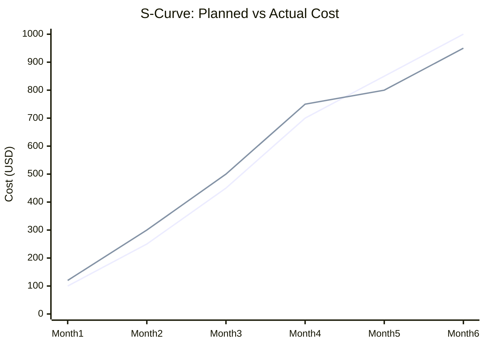
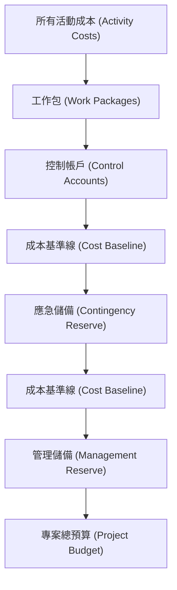

### 確定預算 (Determine Budget)

- **核心定義**：將所有個別活動或工作包 (Work Packages) 的估算成本進行**聚合 (Aggregating)** 的過程
    - 目的是為了建立專案獲得授權的總成本
    - 例如：若專案有 10 個活動，每個活動成本為 50 美元，則透過聚合得出總預算為 500 美元
- **成本基準線 (Cost Baseline) 的重要性**
    - 基準線是專案監控與控制 (Monitor and Control) 時的**衡量標準**
    - **[為什麼需要基準線？]** 因為要判斷專案是否「在預算內」或「超出預算」，必須有一個對照的基準點
    - 就像評估「今天表現如何」時，必須先有一個基準來進行比較

### 確定預算 (Determine Budget) 的執行邏輯

- **成本聚合 (Cost Aggregation)**
    - 這是建立預算的首要步驟，其本質是將成本由下而上進行「向上彙整 (Roll up)"
    - **彙整路徑**：
        - 從最細層級的**活動 (Activities)** 開始
        - 透過加總活動成本，彙整至**工作包 (Work Packages)**
        - 最後形成整個專案的總預算
    - **[為什麼要這樣做？]** 因為成本是根據分解後的細項（如 WBS 中的工作包與活動）進行估算的，必須透過層層加總才能得出授權的總金額
- **儲備分析 (Reserve Analysis) 的應用**
    - 在確定預算時，不能只計算精確的估算值，必須加入額外的資金作為緩衝
    - **目的**：為了應對專案執行過程中可能發生的風險 (Risk)
    - **範例**：若專案活動估算成本為 1,000 美元，在制定預算時應考慮加入一定的儲備金，以應對不可預見的支出

### 儲備類型：應急儲備與管理儲備

- **應急儲備 (Contingency Reserve)**
    - **應對對象**：應對「**已知未知 (Known Unknowns)**」的風險
        - 指的是專案團隊「知道」某種風險可能存在，但「不確定」是否真的會發生（例如：施工期間可能遇到惡劣天氣，但無法預知具體時間或強度）
    - **管理權限**：由專案經理 (PM) 決定、管理並控制，通常包含在成本基準線 (Cost Baseline) 內
- **管理儲備 (Management Reserve)**
    - **應對對象**：應對那些完全無法預見、無法事先評估的風險（即「未知未知」）
    - **目的**：作為專案預算之外的額外緩衝，用以應對極其罕見或完全出乎意料的突發狀況

### 儲備金的實際累加與應用範例

- **預算累加邏輯**
    - 透過逐層加入儲備金，最終形成專案的總預算。這反映了從「估算成本」到「確定預算」的完整過程。
    - **範例演示**：
        - **原始預算**：$1,000 (基於活動與工作包的估算)
        - **加上應急儲備 (Contingency Reserve)**：+$200 (為了應對已知風險，如天氣不佳或材料短缺)
        - **此時的成本基準線 (Cost Baseline)**：$1,200
        - **加上管理儲備 (Management Reserve)**：+$200 (為了應對完全無法預見的風險，如全球性大流行病或極端天災)
        - **最終專案總預算**：$1,400
- **儲備類型的管理權限與風險性質對比**

| 特性 | 應急儲備 (Contingency Reserve) | 管理儲備 (Management Reserve) |
| --- | --- | --- |
| 應對風險 | 已知未知 (Known Unknowns)\n\n知道可能發生，但不確定是否會發生 (例如：天氣、材料耗盡) | 未知未知 (Unknown Unknowns)\n\n完全無法預測的突發事件 (例如：全球疫情、極端自然現象) |
| 控制權 | 專案經理 (PM)\n\n由 PM 決定、管理並控制 | 組織管理層 (Management)\n\n由公司高層決定並控制 |
| 包含範圍 | 通常包含在成本基準線 (Cost Baseline) 內 | 包含在專案總預算中，但不屬於成本基準線 |

### 儲備金的使用權限與操作差異

- **應急儲備 (Contingency Reserve)**
    - **操作方式**：若需要使用，可以直接動用（Just use it）
    - **[原因]**：因為它已經包含在**成本基準線 (Cost Baseline)** 之中，屬於 PM 的控制範圍內
- **管理儲備 (Management Reserve)**
    - **操作方式**：若需要使用，必須提交**變更請求 (Change Request)**
    - **[原因]**：它不屬於成本基準線，不屬於 PM 的直接控制權，必須經過正式程序向管理層申請

---

### 確定預算的工具與技術 (Tools & Techniques)

#### 歷史回顧 (Historical Review)

- **核心概念**：在制定預算時，參考過往類似專案的數據與經驗
- **目的**：透過比較來驗證預算的合理性
    - 例如：兩年前蓋一棟 20 層大樓花費 2,000 萬美元，現在預算卻要 3,000 萬美元，PM 必須透過歷史回顧來分析這 50% 的成本增幅是否有合理的理由

#### 資金限制協調 (Funding Limit Reconciliation)

- **核心概念**：對比專案的「實際支出速率 (Run Rate)」與「計畫支出速率 (Planned Rate)」
- **目的**：確保專案的資金需求符合組織所能提供的資金限制
- **[潛在風險]**：若專案目前的支出速率 (Run Rate) 超過了計畫中的支出額度，組織可能會限制專案的資金供應，導致資金不足

### 成本基準線 (Cost Baseline) 的組成與結構

- **定義**：在專案管理中，當人們提到「專案預算」時，絕大多數情況下指的就是「成本基準線」。
- **聚合路徑 (Aggregation Path)**：成本是透過由下而上的方式彙整而成的：

    1. **活動 (Activities)**：最底層的成本單位。
    2. **工作包 (Work Packages)**：活動的成本被聚合至此。
    3. **控制帳戶 (Control Accounts)**：工作包的成本進一步聚合至控制帳戶，最終形成成本基準線的總和。

### 專案績效監控工具：S 曲線 (S-curve)

- **核心功能**：作為衡量專案績效的對照標準，用來判斷專案是「在預算內 (On Budget)」還是「超出預算 (Off Budget)」。
- **圖表組成要素**：
    - **計畫成本 (Planned Value / Budget)**：預期在特定時間點應該花費的金額，在圖表上呈現一條曲線。
    - **實際成本 (Actual Cost)**：專案執行過程中實際已經花費的金額。

- **[觀察重點]**：透過對比兩條曲線的差距，PM 可以直觀地看出目前的支出是高於還是低於原定計畫。

### 成本基準線與專案總預算的結構差異

雖然在日常對話中兩者常被混用，但在專案管理中它們有明確的層級區別：

- **成本基準線 (Cost Baseline)**
    - **組成**：所有活動成本的聚合 (Aggregated Activity Costs) + **應急儲備 (Contingency Reserve)**
    - **用途**：作為衡量專案績效、監控進度的核心基準線
- **專案總預算 (Project Budget)**
    - **組成**：成本基準線 + **管理儲備 (Management Reserve)**
    - **特性**：這是公司層級所看到的最終授權金額

---

### 資金需求 (Funding Requirements)

- **定義**：不僅要決定「花多少錢」，還必須明確說明「什麼時候」需要「多少錢」
- **核心任務**：告訴組織資金的需求時程（例如：在特定里程碑或取得許可證後，需要立即撥款以啟動下一階段施工）
- **目的**：確保專案在每個時間點都有充足的資金來支應其活動需求

### 規劃階段的進度與後續重點

目前已完成以下三大基準線的建立，為專案啟動奠定了基礎：

- **範圍基準線 (Scope Baseline)**：明確了專案要做的內容。
- **時程基準線 (Schedule Baseline)**：確定了專案預計花費的時間。
- **預算基準線 (Budget Baseline)**：確定了專案需要的資金。

**[下一步規劃重點]**：雖然核心的「做什麼」、「何時做」與「花多少錢」已初步定案，但完整的規劃階段仍須涵蓋以下關鍵領域：

- **風險管理 (Risk)**：如何識別與應對潛在問題。
- **品質管理 (Quality)**：如何確保交付成果符合標準。
- **資源與人力配置 (Staffing)**：如何安排專案所需的人力資源。
- **溝通與利害關係人管理 (Communication & Stakeholder Engagement)**：如何與相關人員保持資訊同步與參與。
- **供應商管理 (Vendors)**：如何處理外部供應商與採購關係。