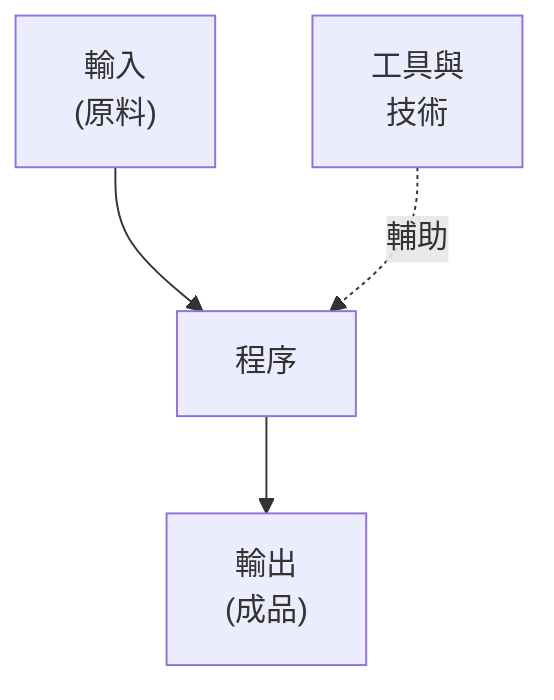
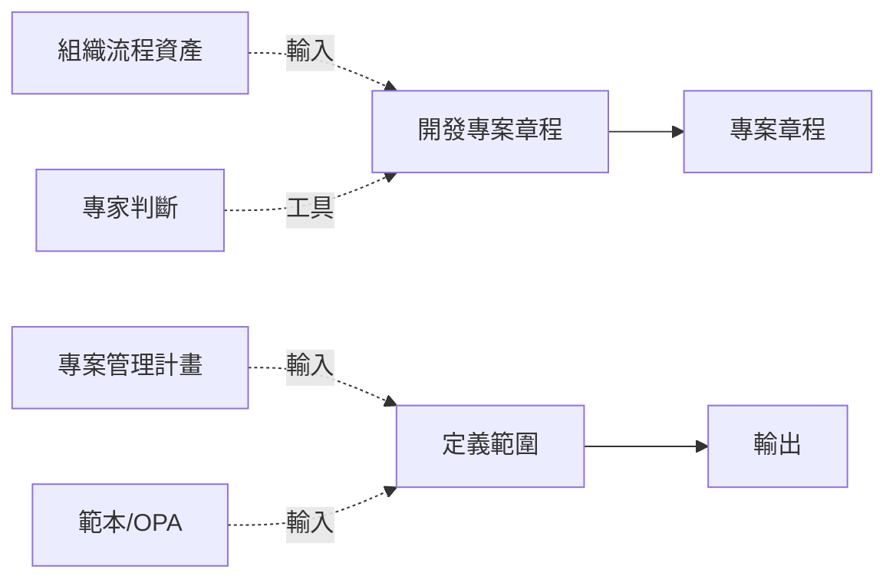
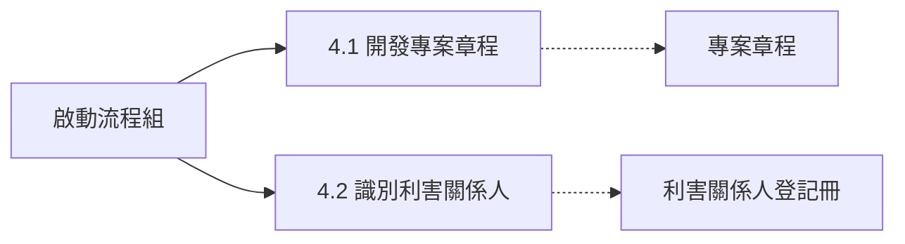
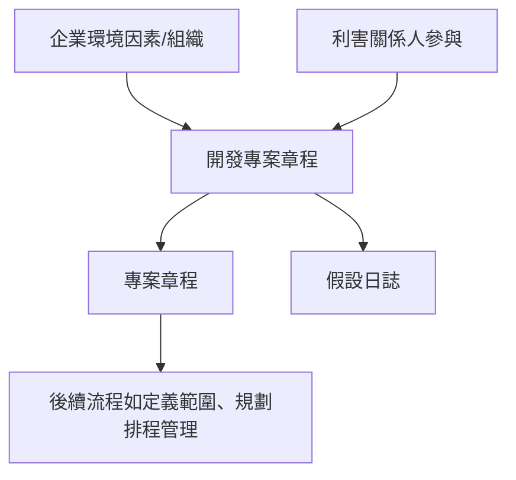

### 程序的基本概念 (Process ITTO)

- **程序定義**：為了完成特定目標而執行的活動
    - 生活中一切皆程序，例如**刷牙**
- **程序目的**：達成特定目標
    - 刷牙 → 擁有乾淨牙齒
- **ITTO 框架**：**輸入 (Inputs)**、**工具 (Tools)**、**技術 (Techniques)**、**輸出 (Outputs)**

### ITTO 各元素詳細說明

- **輸入 (Inputs)**：程序的起始點，提供執行所需的原料
    - 可為前一程序的輸出
- **工具與技術 (Tools and Techniques)**：轉換原料成輸出的動作或方法
- **輸出 (Outputs)**：努力的最終結果，如將原料加工成成品
    - 可能成為另一程序的輸入

- 專案管理有**49個程序**，每個皆有**ITTO**

### 刷牙程序的 ITTO 實例

- **輸入 (Inputs)**：牙膏、牙刷、水、漱口水、牙線
    - 共**五項**，為執行刷牙所需的起始原料
- **工具與技術 (Tools and Techniques)**：刷牙的特定技巧、使用牙膏的方法、牙線技巧、正確使用漱口水的技術
    - 用來轉換輸入成輸出
- **輸出 (Outputs)**：**乾淨牙齒**
    - 努力的最終結果

### ITTO 在專案管理中的應用

- **組織流程資產 (Organization Process Assets)**：如**專案管理範本**，作為輸入
    - 例如：組織總是使用的範本，提供給團隊製作**專案管理計畫**
    - 解決「不知道如何製作計畫」的問題
- **範例情境**：要求製作專案管理計畫時，提供範本作為輸入
    - 稍後會詳細討論組織流程資產

### 製作專案管理計畫的工具與技術與輸出

- **工具與技術 (Tools and Techniques)**：轉換輸入成輸出的動作或方法
    - **技術 (Techniques)**：做某事的特定方法，例如**專家判斷 (expert judgment)**
    - 情境：不確定如何製作計畫時，請教**主題專家 (subject matter expert)** 如 Peter 協助
    - **工具 (Tools)**：輔助執行的東西，例如**軟體**如 **Microsoft Project**
- **輸出 (Outputs)**：**專案管理計畫 (project management plan)**
    - 從輸入（如組織範本）經工具與技術轉換而得

### 製作專案授權書的輸入範例

- **專案授權書 (project charter)**：用來正式授權專案的文件
    - **輸入範例**：組織範本（再次使用）
        - 幫助製作授權書
    - **其他輸入**：法規要求
        - 新食品產品專案 → 食品產業所有法規
        - 新藥專案 → 藥品產業所有法規
        - 公司內部法規
- **EEF 與 OPA**：**企業環境因素 (Enterprise Environmental Factors, EEF)** 及**組織流程資產 (Organization Process Assets, OPAs)**
    - 涵蓋上述範本與法規
    - 稍後詳細討論

### 製作專案授權書的工具與技術與輸出

- **工具與技術 (Tools and Techniques)**：製作**專案授權書**時，使用**會議 (meetings)**與大量人員討論，以及**專家判斷 (expert judgment)**求助專家
    - 會議用來召集相關人士，專家提供專業協助
- **輸出 (Outputs)**：**專案授權書 (project charter)**
    - 用來正式授權專案
- **專案管理49個程序的ITTO總覽**：每個程序有特定數量的**輸入**、**工具與技術**（總是成對出現），以及特定**輸出**
    - 總ITTO數量**超過700項**
    - **工具與技術**永遠一起使用

### 專案管理49個程序的ITTO 學習策略

- **大多相同**：49個程序的ITTO很多重複
    - 理解一個 → 理解很多
    - 無太多獨特ITTO
- **學習方法**：單一部分涵蓋**所有常見ITTO**
    - 消除約**500-600項**

### 後續具體ITTO例子

- 回到先前**流程圖**
    - 每個程序皆依圖表結構

### 各程序特定 ITTO 範例

- **開發專案章程 (Develop Project Charter)**
    - **輸入**：**組織流程資產 (Organization Process Assets)** 如範本
    - **工具與技術**：**專家判斷 (expert judgment)**
    - **輸出**：**專案章程 (project charter)**
        - 程序名稱即暗示輸出
- **定義範圍 (Define Scope)**
    - **輸入**：**專案管理計畫 (project management plan)**
        - 包含定義範圍的計畫
    - **其他輸入**：範本工具、**EEF**、**OPA (組織流程資產)** 等
    - **工具與技術**：如**專家判斷 (expert judgment)**

- 每個**49個程序**皆有特定**ITTO**，依程序名稱推斷邏輯

### 專案管理程序群組與知識領域表格

- **程序群組 (Process Groups)**：
    - **啟動 (Initiating)**：開發專案章程、識別利害關係人
    - **規劃 (Planning)**：開發專案管理計畫、規劃範圍管理、收集需求、定義範圍、建立WBS、規劃排程管理、定義活動、排序活動、估計活動持續時間、開發排程、規劃成本管理、估計成本、決定預算、規劃品質管理、規劃資源管理、規劃溝通管理、規劃風險管理、識別風險、執行質性風險分析、執行量化風險分析、規劃採購管理、規劃利害關係人參與
    - **執行 (Direct and Manage Project Work)**：管理專案工作、管理專案知識、管理品質、取得資源、發展團隊、管理溝通、執行風險回應、執行採購、管理利害關係人參與
    - **監控 (Monitoring & Controlling)**：監控專案工作、執行整合變更控制、驗證範圍、控制範圍、控制排程、控制成本、控制品質、控制資源、監控溝通、監控風險、控制採購、監控利害關係人參與
    - **結束 (Closing)**：結束專案或階段

### 啟動流程組 (Initiating Process Group)

- **包含流程**：
    - **4.1 開發專案章程 (Develop Project Charter)**
    - **4.2 識別利害關係人 (Identify Stakeholders)**
- **目的**：定義新專案或現有專案新階段，透過取得授權啟動專案或階段
    - 對齊利害關係人預期與專案目標
    - 告知範圍與目標，並討論參與方式，確保預期滿足
    - 初始範圍定義初始資源承諾
- **關鍵效益**：僅與組織策略目標一致的專案（含業務案例、利益、利害關係人）才獲授權，並在專案開始時考慮
- **專案經理角色**：
    - 在專案章程與利害關係人登記冊中被指派
    - 專案章程批准後，專案正式授權，專案經理可應用組織資源於專案活動
- **組織情境**：
    - 某些組織中，專案經理參與業務案例開發與定義
    - 通常由專案經理編寫專案章程，或由**PMO**、投資組合指導委員會等負責
    - 本指南假設專案已獲發起人或組織審批，業務文件用作輸入

### 4.1 開發專案章程的完整 ITTO

- **輸入 (Inputs)**：
    - 商業文件 (Business documents)
    - 商業論證 (Business case)
    - 效益管理計畫 (Benefits management plan)
    - 協議 (Agreements)
    - **企業環境因素 (Enterprise environmental factors)**
    - **組織流程資產 (Organizational process assets)**
- **工具與技術 (Tools & Techniques)**：
    - **專家判斷 (Expert judgment)**
    - 資料蒐集 (Data gathering)
    - 商業分析 (Business analysis)
    - 商業敏銳度 (Business acumen)
    - 促進 (Facilitation)
    - 衝突管理 (Conflict management)
    - 人際與團隊技能 (Interpersonal and team skills)
    - **會議 (Meetings)**
- **輸出 (Outputs)**：
    - **專案章程 (Project charter)**
    - 假設日誌 (Assumption log)
- 書中未詳細解釋這些ITTO，直接進入下一個流程

### 4.2 識別利害關係人的 ITTO 介紹

- 識別專案利害關係人，分析並記錄其興趣、參與、依賴、影響及對專案目標的潛在衝擊
- **關鍵效益**：讓專案團隊能針對每個利害關係人或群組選擇適當參與焦點
- 全生命週期定期執行

- **輸入**包括專案章程、利害關係人登記冊、商業文件等（詳見圖4.4）
- **工具與技術**：專家判斷、資料分析、會議等
- **輸出**：利害關係人登記冊、變更日誌、計畫更新等

### 4.2 識別利害關係人的完整 ITTO

- **輸入 (Inputs)**：
    - **專案章程 (Project charter)**
    - **商業文件 (Business documents)**
    - **商業論證 (Business case)**
    - **利益管理計畫 (Benefits management plan)**
    - **溝通管理計畫 (Communications management plan)**
    - **利害關係人參與計畫 (Stakeholder engagement plan)**
    - **專案文件 (Project documents)**
    - **問題日誌 (Issue log)**
    - **需求文件 (Requirements documentation)**
    - **協議 (Agreements)**
    - **企業環境因素 (Enterprise environmental factors)**
    - **組織流程資產 (Organizational process assets)**
- **工具與技術 (Tools & Techniques)**：
    - **專家判斷 (Expert judgment)**
    - **資料收集 (Data gathering)**
    - 問卷調查與訪談 (Questionnaires and surveys)
    - 集思廣益 (Brainstorming)
    - **資料分析 (Data analysis)**
    - 利害關係人分析 (Stakeholder analysis)
    - 文件分析 (Document analysis)
    - **資料表述 (Data representation)**
    - 利害關係人繪製/表述 (Stakeholder mapping/representation)
    - **會議 (Meetings)**
- **輸出 (Outputs)**：
    - **利害關係人登記冊 (Stakeholder register)**
    - **變更請求 (Change requests)**
    - **專案管理計畫更新 (Project management plan updates)**
    - **需求管理計畫 (Requirements management plan)**
    - **溝通管理計畫 (Communications management plan)**
    - **風險管理計畫 (Risk management plan)**
    - **利害關係人參與計畫 (Stakeholder engagement plan)**
    - **專案文件更新 (Project documents updates)**
    - **假設日誌 (Assumption log)**
    - **問題日誌 (Issue log)**
    - **風險登記冊 (Risk register)**

### 規劃流程組 (Planning Process Group)

- **包含流程**：24 個流程，從 **5.1 開發專案管理計畫** 到 **5.24 規劃利害關係人參與**

### 5.1 開發專案管理計畫的 ITTO

- **輸入 (Inputs)**：
    - **專案章程 (Project charter)**
    - **其他流程的輸出 (Outputs from other processes)**
    - **企業環境因素 (Enterprise environmental factors)**
    - **組織流程資產 (Organizational process assets)**
- **工具與技術 (Tools & Techniques)**：
    - **專家判斷 (Expert judgment)**
    - **資料收集 (Data gathering)**
    - 集思廣益 (Brainstorming)
    - 核對表 (Checklists)
    - 焦點團體 (Focus groups)
    - 面談 (Interviews)
    - **人際與團隊技能 (Interpersonal and team skills)**
    - 衝突管理 (Conflict management)
    - 促進 (Facilitation)
    - 會議管理 (Meeting management)
    - **會議 (Meetings)**
- **輸出 (Outputs)**：
    - **專案管理計畫 (Project management plan)**

### 5.2 規劃範圍管理 (Plan Scope Management) 的 ITTO

- **輸入 (Inputs)**：
    - **專案章程 (Project charter)**
    - **專案管理計畫 (Project management plan)**
    - **品質管理計畫 (Quality management plan)**
    - **專案生命週期描述 (Project life cycle description)**
    - **企業環境因素 (Enterprise environmental factors)**
    - **組織流程資產 (Organizational process assets)**
- **工具與技術 (Tools & Techniques)**：
    - **專家判斷 (Expert judgment)**
    - **資料收集 (Data gathering)**
    - 集思廣益 (Brainstorming)
    - 面談 (Interviews)
    - 焦點團體 (Focus groups)
    - 問卷調查與訪談 (Questionnaires and surveys)
    - **資料分析 (Data analysis)**
    - 文件分析 (Document analysis)
    - **決策 (Decision making)**
    - 多準則決策分析 (Multicriteria decision analysis)
    - **資料表述 (Data representation)**
    - 親和圖 (Affinity diagrams)
    - **人際與團隊技能 (Interpersonal and team skills)**
    - 名義群組技巧 (Nominal group technique)
    - 觀察/對話 (Observation/conversation)
    - **促進 (Facilitation)**
    - **原型 (Prototype)**
    - 基準比較 (Benchmarking)
- **輸出 (Outputs)**：
    - **範圍管理計畫 (Scope management plan)**
    - **需求管理計畫 (Requirements management plan)**

### 5.3 蒐集需求 (Collect Requirements) 的 ITTO

- **輸入 (Inputs)**：
    - **專案章程 (Project charter)**
    - **專案管理計畫 (Project management plan)**
    - **範圍管理計畫 (Scope management plan)**
    - **需求管理計畫 (Requirements management plan)**
    - **利害關係人參與計畫 (Stakeholder engagement plan)**
    - **專案文件 (Project documents)**
    - **假設日誌 (Assumption log)**
    - **經驗教訓登記冊 (Lessons learned register)**
    - **商業文件 (Business documents)**
    - **商業論證 (Business case)**
    - **協議 (Agreements)**
    - **企業環境因素 (Enterprise environmental factors)**
    - **組織流程資產 (Organizational process assets)**
- **工具與技術 (Tools & Techniques)**：
    - **專家判斷 (Expert judgment)**
    - **資料收集 (Data gathering)**
    - 集思廣益 (Brainstorming)
    - 面談 (Interviews)
    - 焦點團體 (Focus groups)
    - 問卷調查與訪談 (Questionnaires and surveys)
    - **資料分析 (Data analysis)**
    - 文件分析 (Document analysis)
    - **決策 (Decision making)**
    - 多準則決策分析 (Multicriteria decision analysis)
    - **資料表述 (Data representation)**
    - 親和圖 (Affinity diagrams)
    - **人際與團隊技能 (Interpersonal and team skills)**
    - 名義群組技巧 (Nominal group technique)
    - 觀察/對話 (Observation/conversation)
    - **促進 (Facilitation)**
    - **原型 (Prototype)**
    - 基準比較 (Benchmarking)
- **輸出 (Outputs)**：
    - **需求文件 (Requirements documentation)**
    - **需求追溯矩陣 (Requirements traceability matrix)**
- **ITTO 重複性觀察**：多數規劃流程輸入包含**專案章程**、**企業環境因素**、**組織流程資產**；工具如**專家判斷**、**會議**、**資料收集**共通，幫助快速掌握49個流程。

### 5.4 定義範圍 (Define Scope) ITTO 概覽

- **輸入 (Inputs)**：
    - **專案章程 (Project charter)**
    - **專案管理計畫 (Project management plan)**
    - **範圍管理計畫 (Scope management plan)**
    - **假設日誌 (Assumption log)**
    - **企業環境因素 (Enterprise environmental factors)**
    - **組織流程資產 (Organizational process assets)**
- **工具與技術 (Tools & Techniques)**：
    - **專家判斷 (Expert judgment)**
    - **資料分析 (Data analysis)**
    - **決策 (Decision making)**
    - **多準則決策分析 (Multicriteria decision analysis)**
    - **促進 (Facilitation)**
    - **產品分析 (Product analysis)**
- **輸出 (Outputs)**：
    - **專案範圍陳述書 (Project scope statement)**
    - **需求追溯矩陣 (Requirements traceability matrix)**
- **流程關鍵效益**：描述產品、服務或結果的邊界與接受標準，通常執行一次或在專案預定義點。
- **本課程學習策略**：49個流程多數ITTO相同，將定義共通項目以簡化學習。
- **實際應用提醒**：ITTO概念不僅用於考試，更應應用於現實專案管理，提升專案執行能力。