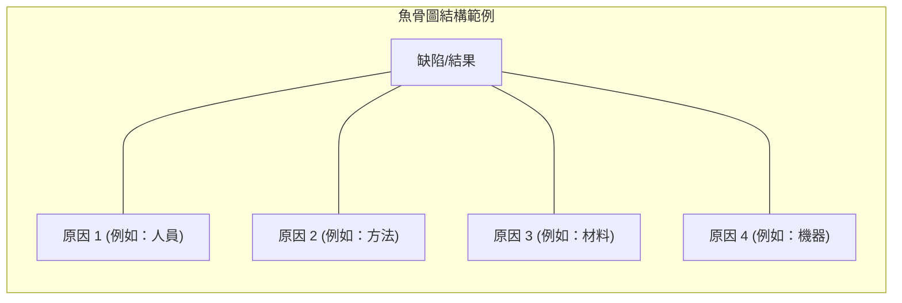
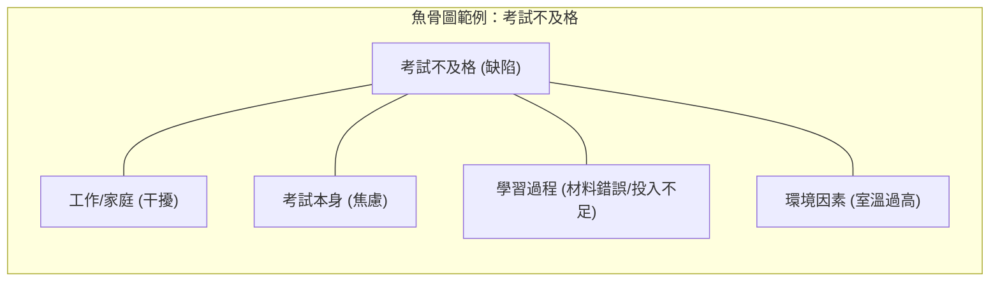

### 管理品質 (Manage Quality)

- 在過去的 PMI 教材中，此過程被稱為「品質保證」(Quality Assurance)
    - 現在的「管理品質」涵蓋了品質保證，並包含更多內容
- **核心目標**：確保團隊在執行過程中遵循正確的程序，以產出高品質的產品、服務或結果
- **關注點：程序而非僅僅是結果**
    - 當團隊正在執行工作（例如：刷牆、寫程式、安裝伺服器）時，管理品質的工作是檢查「過程」是否正確
    - **[檢查重點]**：
        - 工作人員是否遵循了預設的品質標準與政策？
        - 執行的方法與程序是否符合既定的規範？
- **實際案例說明**：
    - **油漆工**：檢查其刷牆的方式是否符合我們設定的品質標準，而非僅看牆面顏色
    - **程式設計師**：檢查其編寫程式碼時是否遵循了正確的標準與方法，以避免產出低品質的程式碼

### 管理品質 (Manage Quality) 的執行核心

- **將計畫轉化為行動**
    - 將「品質管理計畫」中的活動，轉化為專案執行階段中實際可操作的品質活動
    - 確保在執行專案時，團隊確實遵循預先設定的步驟與程序
- **提升品質目標達成率**
    - 透過落實品質程序，增加達成既定品質目標的機率
- **識別無效程序 (Identifying Ineffective Processes)**
    - **[關鍵功能]**：不僅是檢查結果，更要發現導致低品質的「根源程序」
    - 如果發現目前的執行方式（例如：某種刷牆技術或編碼邏輯）會導致錯誤或不良結果，必須及時修正程序
    - **核心邏輯**：發現無效程序 $\rightarrow$ 修正程序 $\rightarrow$ 防止產出低品質結果

### 管理品質的工具 (Quality Tools)

- **數據表示工具 (Data Representation Tools)**
    - 雖然在規劃階段也曾提及，但在管理品質時仍是重要的參考工具
    - **親和圖 (Affinity Diagram)**：用於將大量數據進行分類與分組
    - **矩陣圖 (Matrix Diagram)**：用於展示不同程序或變數之間的關聯性
- **因果圖 (Cause-and-Effect Diagram)**
    - 又稱為 **石川圖 (Ishikawa Diagram)** 或 **魚骨圖 (Fishbone Diagram)**
    - **[核心用途]**：找出導致「缺陷」(Defects) 或「客戶不滿意」的所有潛在原因
    - 它能幫助團隊不只是看到問題的表面，而是深入挖掘導致問題的根源

### 管理品質的工具 (Quality Tools) 續

- **因果圖 (Cause-and-Effect Diagram)**
    - 又稱 **石川圖 (Ishikawa Diagram)** 或 **魚骨圖 (Fishbone Diagram)**
    - **[核心用途]**：找出導致「缺陷」(Defects) 或「客戶不滿意」的所有潛在原因
    - **結構與應用**：
        - 「魚頭」代表要解決的問題或產出的缺陷（例如：考試不及格）
        - 「魚刺」代表各種分類的潛在原因（例如：工作、家庭、學習方法、環境）

- **流程圖 (Flowchart)**
    - 某個特定程序的圖形化表示
    - **[核心用途]**：展示如何遵循某個既定的程序或工作流程
- **直方圖 (Histogram)**
    - 本質上是一種**長條圖 (Bar Chart)**
    - **[核心用途]**：顯示數據出現的**頻率 (Frequency)**
- **柏拉圖 (Pareto Chart)**
    - 基於 **帕累托法則 (Pareto Law)**，即所謂的 **80/20 法則**
    - **[核心概念]**：80% 的結果通常是由 20% 的原因所造成的
        - 例如：80% 的公司營收可能來自 20% 的產品
        - 例如：80% 的問題可能僅由 20% 的關鍵因素引起
    - **[在品質管理中的應用]**：
        - 幫助團隊識別「關鍵的少數」(the vital few) 與「瑣碎的多数」(the trivial many)
        - 透過專注於那 20% 的核心原因，可以最有效地解決 80% 的問題，從而優化資源分配與改善品質

### 柏拉圖 (Pareto Chart) 續

- **[核心概念]：識別關鍵問題源**
    - 透過 80/20 法則，將注意力集中在少數幾個最主要的影響因素上
    - **生活化範例**：
        - 雖然導致死亡的原因有極多種，但 80% 的死亡可能僅來自 20% 的主要原因
        - 雖然遲到的理由千奇百怪，但 80% 的遲到次數通常是由 20% 的常見因素造成的
- **在專案管理中的應用**
    - **問題診斷**：專案中 80% 的問題通常源自於 20% 的根本原因（例如：人力資源問題或供應商問題）
    - **資源分配**：透過柏拉圖可以發現預算或資源的集中點
        - 例如：一個圖表可能顯示 80% 的專案預算僅消耗在「薪資」與「承包商費用」這兩項主要支出上

### 散佈圖 (Scatter Diagram)

- **[核心用途]**：觀察兩個變數之間是否存在相關性，藉此判斷是否正在形成某種**趨勢 (Trend)**
- **運作方式**：
    - 透過在兩個主要軸（變數）上標記數據點來展示關係
    - 用於分析當一個變數改變時，另一個變數是否也隨之發生規律性的變化

### 散佈圖 (Scatter Diagram) 續

- **[核心用途]：識別趨勢 (Trend)**
    - 透過觀察兩個變數之間的關係，判斷是否正在形成某種規律或趨勢
    - **範例分析**：觀察「時間」與「缺陷數量」的關係
        - 如果數據點呈現上升趨勢（趨勢線向上），代表隨著時間推移，缺陷數量正在增加
        - **[管理意涵]**：這是一個警訊，顯示目前的專案管理方法可能失效，需要立即介入調整
- **品質稽核 (Quality Audits)**
    - 在團隊建構交付成果的過程中進行
    - **[核心目的]**：確認團隊是否正在遵循正確的程序，以及該程序是否符合產業最佳實務
    - **[關注重點]**：識別程序中的所有缺點或差距 (Shortcomings or Gaps)
- **面向 X 的設計 (Design for X)**
    - 其中 「X」 代表一個變數，根據設計目標的不同而改變
    - **[核心概念]**：設計必須針對特定的品質需求進行優化，這意味著在不同目標下，優先順序會完全不同
    - **範例分析**：
        - **面向安全性設計 (Design for Safety)**：例如設計高空作業用的安全吊帶，此時應優先確保符合法規與安全性，而非過度考量成本
        - **面向成本效益設計 (Design for Cost-effectiveness)**：若目標是降低成本，則可能需要尋找更便宜的材料

### 問題解決 (Problem Solving)

- **[定義]**：針對特定的品質問題尋找解決方案
- **[邏輯流程]**：當產品出現缺陷（即品質不佳）時，需進行以下步驟：

    1. **識別問題**：確定問題的核心是什麼
    2. **找出根源**：判斷品質不佳的原因（例如：是程序本身有缺陷？還是雖然程序正確但執行方式錯誤？或是人為失誤？）
    3. **尋求解決方案**：嘗試可能的對策以消除問題

### 品質改善方法 (Quality Improvement Methods)

- **[核心精神]**：優秀的專案經理應持續尋找改進程序的方法
- **[執行方式]**：透過不斷檢視並引入新的方法或技術，來提升現有的工作流程

### 品質管理過程中的專案經理角色

- **[核心思維]**：專案經理應主動觀察團隊執行工作的過程，而非僅看結果
- **[自我檢視問題]**：
    - 我們現在採用的流程，是否真的能產出高品質的產品？
    - 目前遵循的程序是否正確？
    - 是否有必要針對現有程序進行調整或優化？

### 品質報告 (Quality Reports)

- **[內容組成]**：
    - 專案中遇到的所有品質問題資訊
    - 針對如何解決這些問題的具體建議
- **[用途]**：紀錄品質流程中的缺陷，並提供改善方向

### 測試與評估文件 (Test and Evaluation Documents)

- **[定義]**：用於檢查交付成果品質的「檢核表 (Checklist)」
- **[運作邏輯]**：
    - 當被要求檢查某項成果（例如：牆面粉刷品質、應用程式功能）時，該文件定義了「該檢查什麼」以及「該尋找什麼樣的標準」
    - 它為評估交付成果是否符合預期品質提供了明確的衡量基準

### 管理品質 (Manage Quality) 的核心價值

- **[核心精神]**：品質管理並非僅在最後檢查結果，而是在交付成果產出的過程中，持續確保「程序」的正確性
- **[管理重點]**：
    - 確保團隊遵循正確的品質流程
    - 提早識別錯誤的流程或需要改進的機會
- **[預防勝於治療]**：
    - 如果未能及早發現程序問題，最終將導致產出品質低劣的產品、服務或結果
    - 專案經理應將品質檢視視為每日工作的常態，在專案執行期間持續觀察並介入