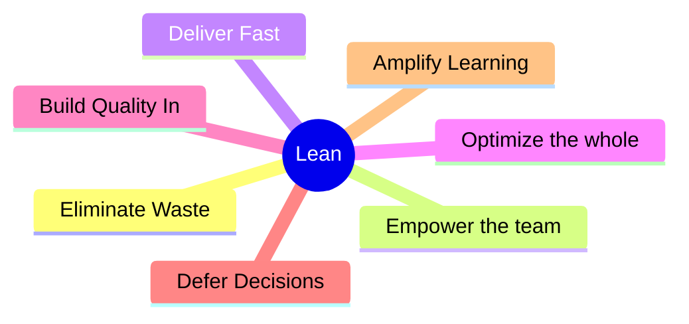

## 精實軟體開發 (Lean Software Development)

- 起源於豐田 (Toyota) 的製造方法
    - 最初是作為一種製造流程，隨後被應用於軟體開發領域
    - 核心目標在於將減少生產浪費的概念轉化並應用於軟體開發中
- 精實原則 (Principles):
    - 使用視覺化管理工具 (Using visual management tools)
    - 識別客戶定義的價值 (Identifying customer-defined value)
    - 建立學習與持續改進的機制 (Building in learning and continuous improvement)

### 精實原則的具體實踐

- 使用視覺化管理工具 (Using visual management tools)
    - 提倡「低科技、高接觸」(low tech, high touch) 的方式
    - 使用「資訊輻射器」(information radiators)，例如大型白板或大型圖表
    - **[目的]** 讓所有人都能立即看到進度與狀態
- 識別客戶定義的價值 (Identifying customer-defined value)
    - 價值是由客戶來定義的
    - **[核心目標]** 確保開發出的產品對客戶具有真正的價值
- 建立學習與持續改進的機制 (Building in learning and continuous improvement)
    - 承襲自豐田的理念，強調持續改進 (continuous improvement)

### 建立學習與持續改進 (Building in learning and continuous improvement)

- 產品的改進與業務的成長，本質上取決於「人」的改進
    - 產品本身不會自動進化
    - 是透過不斷學習的人才來驅動產品的改進
- 必須將學習機制融入流程中
    - 確保員工與管理層都能持續學習
    - 透過增加知識儲備來實現持續優化

### 精實開發的核心原則

- 精實開發包含以下七項關鍵原則：
    - 消除浪費 (Eliminate Waste)
    - 授權團隊 (Empower the team)
    - 快速交付 (Deliver fast)
    - 優化整體 (Optimize the whole)
    - 內建品質 (Build quality in)
    - 推遲決策 (Defer decisions)
    - 放大學習 (Amplify learning)

### 消除浪費 (Eliminate Waste)

- **[核心目標]** 為了極大化價值，必須將浪費降至最低
- 在軟體系統中，浪費可能以以下形式出現：
    - 未完成的工作 (Partially done work)
    - 延遲 (Delays)
    - 交接 (Handoffs)
    - 不必要的功能 (Unnecessary features)
- 精實開發將浪費歸納為七種不同的類型（後續將詳細討論）

### 消除浪費的來源與背景

- **起源背景**：源自汽車製造業（如豐田）
    - 在大量生產（數百萬輛）的情境下，微小的材料浪費累積起來會造成巨大損失
- **考試重點**：軟體開發中的浪費形式
    - 未完成的工作 (Partially done work)
    - 延遲 (Delays)
    - 交接 (Handoffs)

### 授權團隊 (Empower the team)

- **[核心觀念]** 避免對團隊進行微觀管理 (micromanagement)
    - 應該尊重團隊成員在專案技術步驟上所擁有的專業知識 (superior knowledge)
    - 讓團隊成員能夠運用他們的專業來執行任務
- **[為什麼不該微觀管理？]**
    - 因為開發人員在軟體編程與技術實作方面，通常比管理者擁有更深厚的知識
    - 對於比自己更專業的人進行微觀管理並不符合邏輯

### 快速交付 (Deliver fast)

- **[核心目標]** 盡快交付有價值的軟體
- 透過不斷地進行設計迭代 (iterating through designs) 來實現快速交付
- **[為什麼要快？]** 因為快速交付是客戶感知價值的關鍵方式

### 優化整體 (Optimize the whole)

- **[核心觀念]** 將整個系統視為「大於其組成部分之總和」
- 不應只專注於優化系統中的某個小部分或單一環節
- **[關鍵邏輯]** 系統的整體強度取決於其最薄弱的環節 (You are as strong as your weakest section)

### 優化整體 (Optimize the whole) 的深度理解

- **[核心邏輯]** 系統的強度取決於其最薄弱的環節 (You are as strong as your weakest section)
- **[汽車製造的類比]**
    - 假設目標是製造一輛時速可達 300 英里的跑車
    - 如果其中一個引擎支架或螺栓 (engine mount/bolt) 只能承受 200 英里的震動
    - 無論引擎、變速箱或車身其他 2000 個零件多麼強大，只要車速超過 200 英里，該螺栓就會斷裂
    - **[結果]** 引擎可能脫落，導致整輛車毀損或翻車
- **[結論]** 優化整體意味著不能只優化強大的部分，必須確保系統中每一個關鍵環節都能支撐起整體的目標需求

### 內建品質 (Build quality in)

- **[核心觀念]** 品質不應只是最後的檢查步驟，而應內建於產品中
- 必須在整個開發過程中持續確保品質 (continually assure quality)
- **[實踐方式]**
    - 持續整合 (Continuous Integration)
    - 測試 (Testing)
    - 嚴謹的產品測試 (Rigorous testing)

### 推遲決策 (Defer decisions)

- **[核心觀念]** 在決策與承諾之間取得平衡
- 在進行早期規劃的同時，應盡可能將正式的決策與承諾 (committing) 推遲到最後一刻
- **[為什麼要推遲？]** 為了保持靈活性，避免在資訊不足的情況下過早做出可能需要變動的決定

### 放大學習 (Amplify learning)

- **[核心觀念]** 透過促進溝通與回饋來擴大團隊的知識與學習成果
- **[實踐方式]**
    - 及早且頻繁地進行溝通 (facilitating communication early and often)
    - 盡快獲取回饋 (getting feedback as soon as possible)
    - 根據所學到的知識進行構建 (building on what we learn)

### 推遲決策 (Defer decisions) 的深度理解

- **[核心觀念]** 在早期規劃與正式承諾之間取得平衡，盡可能將決策推遲到最後一刻
- **[為什麼要推遲？]** 為了提高對變化的接受度 (willingness to accept change)
    - 如果立即做出決策，團隊會變得較難接受後續的變動
    - 若將決策推遲到較晚的時間點，團隊會更樂於歡迎與適應這些變化

### 放大學習 (Amplify learning)

- **[核心觀念]** 透過建立溝通與回饋的機制來擴大團隊的知識儲備
- **[實踐方式]**
    - 及早且頻繁地促進溝通 (facilitating communication early and often)
    - 盡快獲取回饋 (getting feedback as soon as possible)
    - 根據所學到的知識進行構建 (building on what we learn)

### 精實開發的七大方式 (The Seven Ways of Lean)

- 精實開發的核心架構由七個主要原則組成
- **第一個原則：消除浪費 (Eliminate Waste)**
    - **[核心目標]** 將浪費降至最低 (minimize waste)
    - **[待探討]** 究竟什麼才算「浪費」？

### 精實開發的七大浪費 (Seven Wastes of Lean)

- **[七大浪費清單]**

    1. 部分完成的工作 (Partially done work)
    2. 額外的流程 (Extra Processes)
    3. 額外的功能 (Extra features)
    4. 任務切換 (Task switching)
    5. 等待 (Waiting)
    6. 動作 (Motion)
    7. 缺陷 (Defects)

- **任務切換 (Task switching)**
    - 指人員同時處理多項任務（People working on multiple tasks）

### 精實開發的七大浪費 (Seven Wastes of Lean)

- **[七大浪費清單]**

    1. Partially done work (未完成的工作)
    2. Extra Processes (多餘的流程)
    3. Extra features (多餘的功能)
    4. Task switching (任務切換)
    5. Waiting (等待)
    6. Motion (動作/搬運)
    7. Defects (缺陷/瑕疵)

- **任務切換 (Task switching)**
    - 指人員同時處理多個不同的專案或任務
    - **[為什麼是浪費？]** 因為如果人員無法專注於單一特定任務，就無法有效地完成該任務
- **等待 (Waiting)**
    - 指任何需要等待某事發生的時間，例如等待核准 (approval) 或簽核 (sign off)
    - **[為什麼是浪費？]** 因為這會導致開發者在等待期間無所事事，白白浪費時間

### 動作與缺陷的浪費 (Motion and Defects)

- **動作 (Motion)**
    - 指為了完成工作而進行的、不增加價值的多餘動作或流程
    - **[例子]** 分散在全球的團隊為了開啟線上會議（如 GoToMeeting 或 WebEx）所進行的額外準備動作，這就是一種浪費
    - **[如何優化]** 若團隊能共同在同一個辦公室工作（co-located），就能消除這種動作浪費
- **缺陷 (Defects)**
    - 指產品中存在的錯誤或需要被修復的問題
    - **[為什麼是浪費？]** 因為修復錯誤需要消耗額外的時間與資源，且未能直接為客戶創造新價值
- **部分完成的工作 (Partially done work)**
    - 指那些已經開始但尚未完成的工作項目
    - 這些未完成的工作會佔用資源並增加複雜度，卻無法提供實際價值
- **額外的流程 (Extra Processes)**
    - 指那些並非必要、無法為客戶創造價值的繁文縟節或步驟
- **額外的功能 (Extra features)**
    - 指開發了客戶並未要求或不需要的功能
    - 這不僅浪費開發時間，還可能增加系統的維護負擔
- **動作 (Motion)**
    - 指人員在尋找資訊、切換視窗或進行不必要的物理移動
    - 這些動作會降低工作效率並造成疲勞
- **缺陷 (Defects)**
    - 指產品中的錯誤或瑕疵
    - 修復缺陷需要額外的時間與資源，並可能影響產品的穩定性