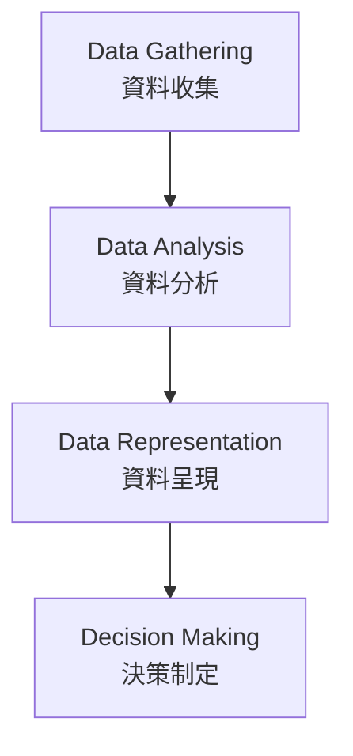

### 專案管理中的資料處理工具

- 介紹**四種常見工具**，貫穿整個專案流程
    - 專注於**資料獲取與收集**
    - **資料分析**
    - **資料呈現**
    - **決策制定**
- 專案各階段產生大量資料
    - 規劃、執行、管理、監控與結案
    - 範例：特定任務所需時間、排程製作方式

### 資料流程圖示

### 四種工具詳細說明

- **資料收集**：收集專案**目前狀態**與**過去情況**的資訊
- **資料分析**：檢查資料中的**趨勢**或**變異**
- **資料呈現**：以**圖表**和**圖形**呈現分析結果
- 最終**根據資料做出決策**

### 四種工具的粉刷房間範例

- 管理專案**時程**時的應用
    - **資料收集**：檢查房間粉刷進度（已完成一半）
    - **資料分析**：確認已粉刷**兩面牆**
    - 接著**資料呈現**與**決策制定**（流程延續）
- **資料呈現**：用**圖表**和**圖形**顯示粉刷進度（如是否準時）
- **決策制定**範例：
    - 增加專案時間？
    - 縮短時間（因畫得更快）？
    - 做得很好，什麼都不做（這也是一種選擇）

### 資料收集的詳細方法

- 收集特定流程的**資料**
    - 某些流程需在輸出前收集額外資料
- **方法**：
    - **腦力激盪**：聚集利害關係人產生想法，由專案經理協助
    - **訪談**：直接問特定利害關係人問題，討論想法
    - **焦點小組**：聚集主題專家了解觀點與解決方案
    - **檢查表**：組織提供給利害關係人識別需求與成功標準
    - **問卷調查**：了解利害關係人在專案的需求
- **腦力激盪**為收集資料的**最佳方法之一**
    - 聚集利害關係人產生想法並**分析**
    - 會議由**專案經理**協助進行
- **檢查表範例**：安裝電話系統專案
    - 列出功能清單供利害關係人選擇
    - 語音郵件轉 email（voicemail to email）
    - 視訊電話（video phone）
    - 軟體電話（soft phone）
    - 會議通話（conference in / call conferencing）
    - 利害關係人回饋：「我喜歡這個、這個和這個」
    - 幫助識別專案想要/不想要項目及成功標準
- **問卷調查**：提供給利害關係人，了解他們在專案中尋求什麼及需求
    - 幫助理解利害關係人**滿意度**
    - 常見形式：打電話詢問「你願意接受調查嗎？」
- **檢查表補充**：利害關係人可標記想要項目（打勾）、不想要項目（打X）
    - 包含**成功標準**或**接受標準**（後續詳述）

### 資料分析的詳細方法

- **資料分析**：分析已收集的**資料**
    - 找出**趨勢**或**變異**
- **方法**：
    - **替代分析**：查看不同**選項**或**方法**來完成某事
        - 範例：專案問題發生時，探索替代解決途徑
    - **根本原因分析 (RCA)**：識別特定事件的主要**潛在原因**
    - **變異分析**：找出不同事物之間的**確切差異**
        - 常用於比較實際與預期
    - **趨勢分析**：查看一段時間內的資料，了解是否形成特定**趨勢**
- **替代分析**詳細說明
    - 查看**不同選項**或完成某事的**方法**
    - 範例：專案問題發生時，不要只看一種解決方式，要考慮**多種選項**（如一法或五法）
- **根本原因分析 (RCA)**
    - 識別特定事件的主要**潛在原因**
    - 應用於專案問題：延遲、超支、未達成範圍
    - 範例：團隊編碼進度變慢，不是表面現象，要找出**真正原因**
        - 問自己「為什麼？」而非假設
- **根本原因分析 (RCA)** 範例：團隊編碼進度變慢
    - 表面現象：團隊**偷懶**，花太多時間上网、沒寫程式
    - 真正原因：團隊**不熟悉特定程式語言**
        - 他們上网是為了**學習**語言
    - 方法：與團隊成員**交談**、分析問題，找出**主要潛在原因**
    - 應用情境：專案**延遲**、**超支**、**未達範圍**等問題
- RCA 核心：不斷問**為什麼**，而非僅看表面假設
    - 找出事件背後的**主要潛在問題**
- **變異分析 (Variance Analysis)**：找出不同事物之間的**確切差異**
    - **變異**：與預期**偏離多遠**
        - 範例：上週三應完成**60%**工作，實際完成**50%**，變異為**10%**未完成
        - 範例：上週三應花費**200美元**
    - **與趨勢分析區別**：變異是**偏離程度**，趨勢是**發展方向**
- **趨勢分析 (Trend Analysis)**：查看一段時間內資料，判斷是否形成特定**趨勢**
- **變異分析**：找出不同事物之間的**確切差異**
    - 常用於比較**實際**與**預期**
    - 範例：預算應花**200元**，實際花**220元**
    - **變異**為**20元差異**（超支20元）
    - 單日變異僅顯示當天情況（好壞不明）
- **趨勢分析**：觀察一段時間內資料，判斷是否形成特定**趨勢**
    - 範例：時程延遲百分比
    - 週二：**10%**落後
    - 週三：**15%**
    - 週四：**20%**
    - 顯示延遲**惡化趨勢**（從10%→15%→20%）
- **趨勢分析**應用補充
    - 負向趨勢（如延遲從10%→15%→20%）表示**不佳**，需**介入修正**
    - 偶爾變異（如單日差異）可接受，若能**回歸時程**則無問題
    - 但持續惡化趨勢需**密切監控**

### 資料呈現的詳細方法

- **資料呈現**：用不同方式向利害關係人**展示資料**
    - 方法：**圖表**、**矩陣**、**各種圖式**
- **範例**：
    - **流程圖 (Flowcharts)**
    - **魚骨圖 (Fishbone diagrams)**
    - **直方圖 (Histograms)**
- **資料呈現**方法補充
    - 使用**圖表**、**矩陣**及**不同類型的圖式**
    - **範例**：
        - **流程圖 (Flowcharts)**：展示修復專案或完成特定活動的流程
        - **魚骨圖 (Fishbone diagrams)**
        - **直方圖 (Histograms)**：類似長條圖或表格
    - 目的：以客戶**能理解的方式**呈現資料給客戶

### 決策制定的詳細方法

- **決策制定**：決定如何處理資料
    - **方法**：
        - **投票 (Voting)**：團體決定是否前進、改變或拒絕
            - 類型：
                - **多數決 (majority)**：多數贏
                - **全體一致 (unanimity)**：全員同意
                - **複數決 (plurality)**：無多數但選定該決定
        - **多準則決策分析 (Multicriteria decision analysis)**：製作表格（矩陣），列出不同準則，依準則評估想法
        - **獨裁決策 (Autocratic decision making)**：一人為整個團隊做決定
- **投票 (Voting)** 詳細說明
        - 由群體決定是否**繼續**、**更改**或**拒絕**某事
        - 類型：
            - **多數決 (majority)**：多數獲勝
            - **全體一致 (unanimity)**：每人都同意
            - **複數決 (plurality)**：無多數但選定該決定
        - 方法：團隊**環顧四周**，就特定事項**投票**
- **多準則決策分析**應用：選擇時不會只基於**單一準則**
    - 範例：選擇**油漆工**的準則
        - **成本**、**經驗**、**認證**、**可用性**、**地點**、**評論**
    - 有些人只看**價格**和**可用性**
        - 他是否**可用**？是否位於**我們鎮上**？
    - **不同專案**使用**不同準則**
        - 選擇物品或執行任務時，常需**多重評估**

### 四種工具總結

- 本影片展示**最常用工具**
- 這些工具在**49個流程**中**廣泛使用**
- 後續將涵蓋**更多細節**
- **務必複習**以理解這些工具