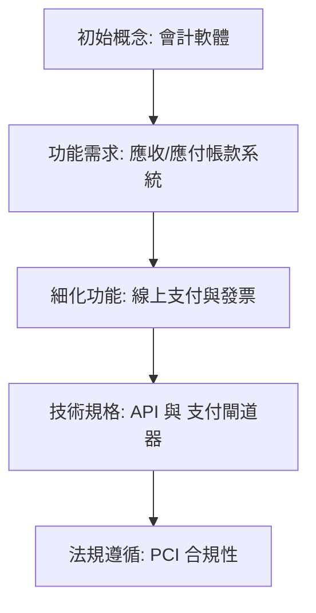

## Progressive Elaboration

- 隨著時間推移，資訊會變得更加詳盡
    - 隨著專案進展，會從現有的資訊中衍生出更多新的資訊
    - 此概念適用於傳統（Traditional）與敏捷（Agile）專案管理
- **包含內容**：
    - 計畫 (Plans)
    - 估算 (Estimates)
    - 設計 (Designs)
    - 測試情境 (Test scenarios)
- **滾動式規劃 (Rolling wave planning)**
    - 隨著數據變得可用，在不同的時間點進行規劃

### 會計軟體開發範例：需求的演進過程

- **初始階段 (高層級需求)**
    - 決定要建立一套會計軟體
    - 確定需要應收帳款 (Accounts Receivable) 與應付帳款 (Accounts Payable) 系統
- **進階階段 (功能細化)**
    - 發現應收帳款系統需要具備「發票功能」與「線上支付」能力
    - 進一步確定需要支援多種不同類型的信用卡
- **技術與合規階段 (深入細節)**
    - 確定應用程式中必須整合特定的支付閘道器 (Gateway) 與 API
    - 發現若要儲存信用卡資訊，必須符合特定的合規標準（例如 **PCI compliance**)

### 漸進式精煉對專案管理的影響

- **計畫的演變 (Plans)**
    - 隨著時間推移，計畫會變得更加詳盡且精確
    - 從最初的高層級構想轉向具體的執行步驟
- **估算的調整 (Estimates)**
    - 估算會隨著資訊的揭露而變得更具細節
    - 專案初期的估算通常較為粗略，隨著專案推進與資訊明確化，估算精度會隨之提升

### 漸進式精煉對設計與測試的影響

- **設計的演進 (Designs)**
    - 最初可能只是在白板上隨手畫下的草圖
    - 隨著進度推進，會演變成精確的螢幕畫面佈局 (Screen layout)
- **測試情境的演進 (Test scenarios)**
    - 隨著對產品功能的了解程度增加
    - 團隊會開發出更精細的方法來確保產品被正確測試