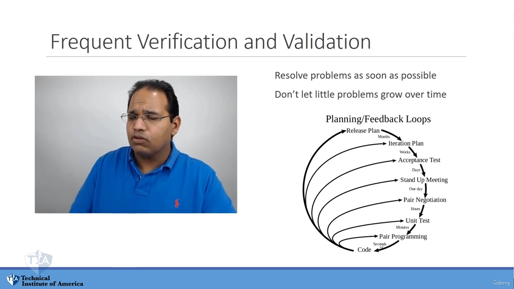
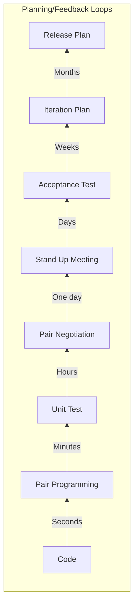
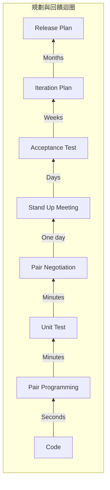

## 驗證與確認價值 (Verifying and Validating Value)

- **[為什麼要持續驗證？]** 因為存在所謂的「評估鴻溝」（Gulf of Evaluation）
- **評估鴻溝 (Gulf of Evaluation)**
    - 指的是一個人所描述的內容，與另一個人所詮釋的內容之間存在差異
    - 例如：當我描述工作室裡有燈光和一個大螢幕時，你腦中呈現的畫面可能與我實際描述的並不完全一致
- 人類感知的侷限性
    - 即使進行極其深入的描述（例如描述麥克風、各種奇怪的吸音材料等），所呈現的內容與他人實際看到的、或他人如何詮釋的，往往並不一致
- **[專案執行原則]** 不要在專案中僅僅依賴「描述」
    - 如果只靠描述而不實際動手做，很容易導致最終產出與預期產生落差
    - 必須透過實際的建構（Build）來確保價值被正確驗證

// 由於講者正在使用「傳聲筒遊戲」作為解釋「評估鴻溝」導致溝通失真的一個具體比喻，我將其整理如下：

### 溝通中的資訊失真 (Information Distortion)

- **傳聲筒遊戲 (Telephone Game) 的比喻**
    - 想像有 10 個人排成一列，第一個人的訊息傳給第二個人，以此類推
    - 每個人都會對接收到的訊息進行「詮釋」與「重新詮釋」
    - **結果**：當訊息傳到第 10 個人時，內容通常與最初的訊息完全不同
- **在軟體專案中的風險**
    - 絕對不要在軟體專案中依賴這種傳遞模式
    - **[為什麼？]** 因為僅靠「用戶的描述」或「口頭轉達的需求」極其不準確
    - 這種層層轉述的過程會放大「評估鴻溝」，導致開發出的功能與原始需求脫節

[00:02:52](https://www.udemy.com/course/pmp-certification-exam-prep-course-pmbok-6th-edition/learn/lecture/23858748#questions)

### 軟體開發中的角色傳遞風險

- **[失真路徑]** 需求在不同專業角色間轉換時，會不斷被重新詮釋：

    1. **用戶 (User)** $\rightarrow$ 描述需求給程式設計師
    2. **程式設計師 (Programmer)** $\rightarrow$ 轉達給設計師
    3. **設計師 (Designer)** $\rightarrow$ 以自己的方式進行詮釋
    4. **設計師** $\rightarrow$ 交回給程式設計師實作
    5. **程式設計師** $\rightarrow$ 以自己的方式進行編寫
    6. **測試人員 (Tester)** $\rightarrow$ 以自己的方式進行測試

- **結果**：當最終產出回到用戶手中時，往往與最初的需求完全不符

### 解決方案：頻繁的驗證與確認

- **核心策略**：透過「頻繁的驗證與確認工作」(Frequent validation and verifying the work) 來解決問題
- **目的**：確保開發過程中的每一個階段都能與預期價值保持一致，避免錯誤在傳遞鏈中被放大

### 頻繁的驗證與確認 (Frequent Verification and Validation)

- **核心原則**：盡快解決問題
    - 不要讓微小的問題隨著時間推移而擴大
    - **[目的]** 防止「評估鴻溝」失控，確保開發產出與用戶需求始終保持一致
- **規劃與回饋迴圈 (Planning/Feedback Loops)**
    - 透過不同頻率的機制來建立回饋，形成從宏觀到微觀的層次結構：

- **具體的驗證機制舉例**
    - **Sprint Review (衝刺檢視會議)**
        - 在每個 Sprint 結束時進行，讓利害關係人直接看到目前的進度
        - **[作用]** 確保團隊不會在錯誤的方向上走得太遠
    - **Daily Stand-up Meeting (每日站立會議)**
        - 每天進行，讓團隊成員與客戶保持同步
    - **Information Radiators (資訊輻射器)**
        - 在辦公室空間中放置可供客戶直接觀察的資訊看板或顯示器
    - **極限開發 (XP, Extreme Programming) 的持續驗證**
        - **Pair Programming (結對編程)**：程式碼在撰寫的瞬間即被檢查
        - **Unit Testing (單元測試)**：對每一個最小功能單元進行測試

### 頻繁的驗證與確認 (Frequent Verification and Validation)

- **核心原則**：
    - 盡可能及早解決問題
    - 不要讓微小的問題隨時間累積擴大
- **規劃與回饋迴圈 (Planning/Feedback Loops)**
    - 透過不同時間尺度的循環來確保開發方向正確，形成由內而外的多層次回饋機制：

- **具體實作方法與頻率**：
    - **同儕協商 (Pair Negotiation)**：頻率為每幾分鐘進行一次，確保即時修正
    - **每日站立會議 (Stand Up Meeting)**：每天進行，確保團隊同步
    - **驗收測試 (Acceptance Test)**：由用戶參與，確認功能符合需求
    - **迭代規劃 (Iteration Plan)**：以週為單位進行規劃
    - **發布規劃 (Release Plan)**：以月為單位進行較長期的規劃